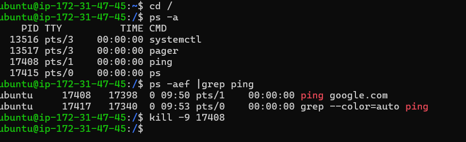
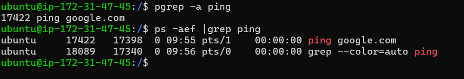
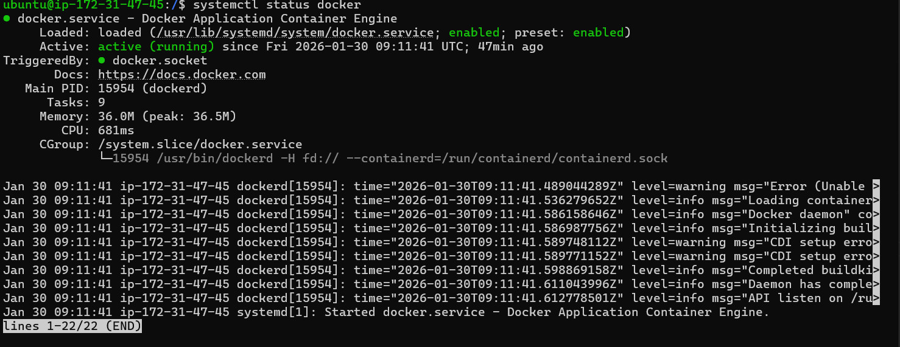
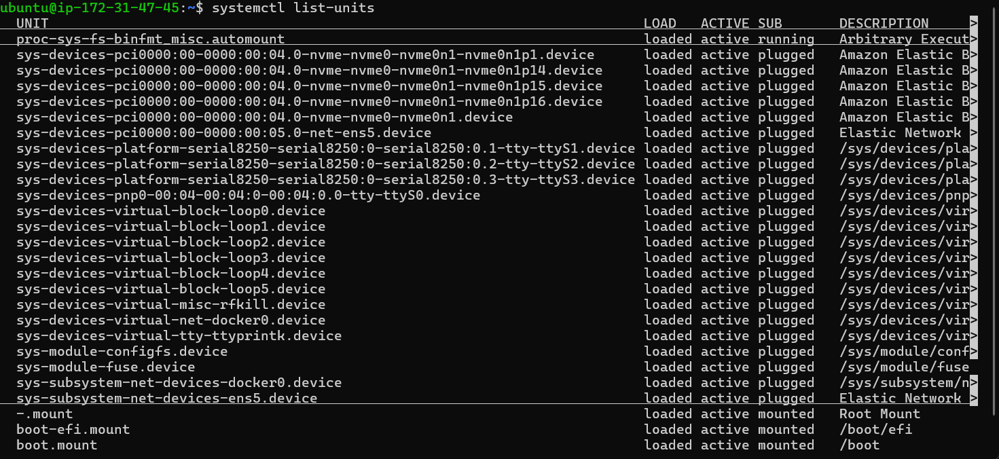
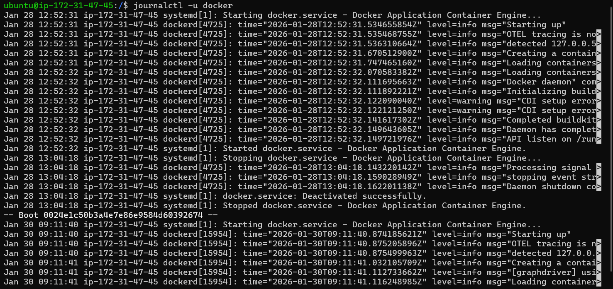
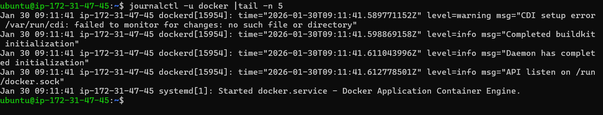

# Day 04 Task– Linux Practice: Processes and Services

---

## Process Commands
- `ps`

- `pgrep`

## Systemd commands 

- `systemctl status`

- `systemctl list-units`

- `journalctl`

- `journalctl -u docker |tail -n 15`

