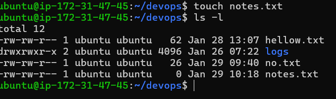
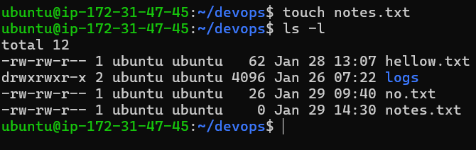
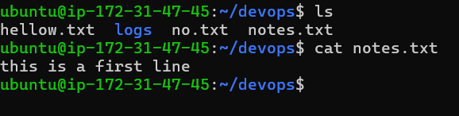
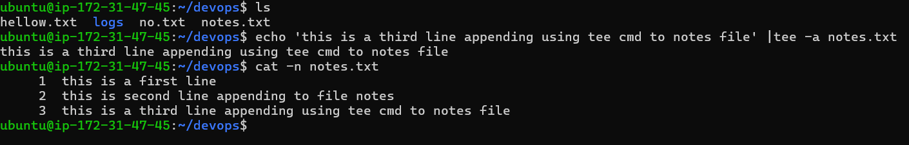
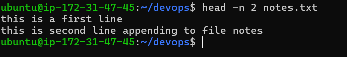
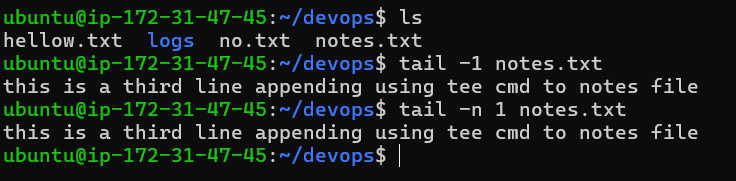

#Linux command

touch - used to create empty file 

> - used to save output of any cmd n file 

cat - used to read content of a file 

>> -is used to append output of any command to a file 

tee - used to display a output of any cmd on terminal & append to a file 

head - is used read a first 10 lines of a file by default if you want more line used -n no_of_line you want to read 

        
tail - is used read a last 10 lines of a file by default if you want more line used -n no_of_line you want to read

tailf - is used to monitor a file contineously if file is contineously increasing 

