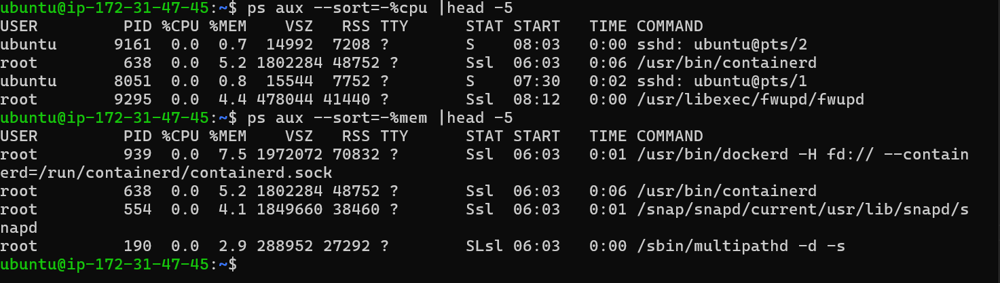

# Day 07 – Linux File System Hierarchy & Scenario-Based Practice

---

# `/ directory `

- it is the root directory & everying is inside / directory`

# /`home `

- home directory for normal user user`
- it conatins user folder inside home directory

# `/root ` or `~`
- it is home directory for root user conatins .bashrc , .bash_history ,.ssh 
- it contains .ssh file which contains authorised key file in which we have add a public key of other user 
- it also conatins .bashrc file which is used to add root user level alias 

# `/etc `
- it contains system configuration file`
- it contains passwd , group , shadow ,hosts files 

# `/var`
- its contains log folder which contains system & application logs 
- it aslo conatins mail folder 

# `/tmp`
- it contains termparary files & be auto cleaned on reboot 

# `/bin`
- it contains system cmds for system boot & recovey cmds

# `usr/bin`
- it contains user cmds

# `/opt`
- install external applications inside this directory 

# `/mount`
- is used to tempararily mount external storage blocks 

# `/media`
- it will shows external connected device files 

--- 

# largest log file in /var/log

`du -sh /var/log/* 2>/dev/null | sort -h | tail -5`

**du -sh**
- du → disk usage
- s → summary only (one line per file/dir)
- h → human readable

**2>/dev/null**
- 2> → redirect error output
- /dev/null → throw it away

**sort -h**
- sort output in human readeable format 

**tail -5**
- show last five lines only 

---

# Scenario

**Scenario 1: Service Not Starting**

- Step 1 - first check service status 
           `cmd : systemctl status myapp`

- Step 2 - Check is service enable on boot 
           `cmd: systemctl is-enabled myapp`

- Step 3 - Check logs for that service 
           `cmd : journalctl -u myapp |tail -5`

**High CPU Usage**
- Step 1 - run cmd top ,htop for checking which process taking max cpu %
- step 2 - sort the process which taking maximum cpu % 
- step 3 - mark a processid & monitor that process 
- step 4 - if that process is not necessary the kill process 

