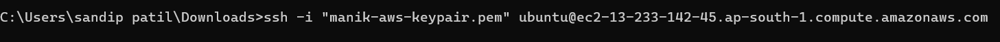
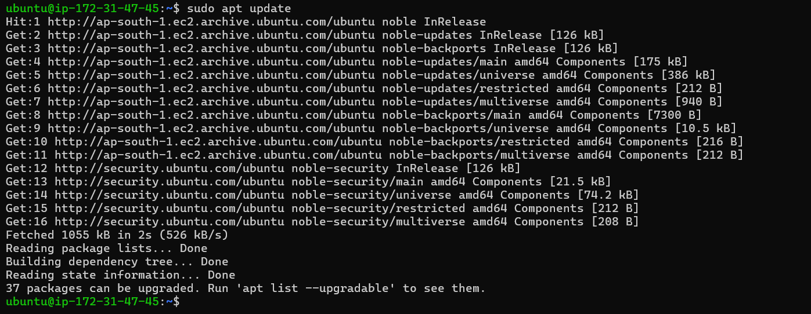
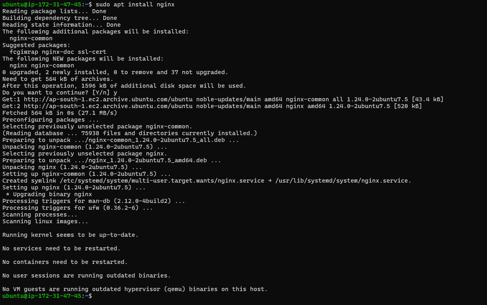
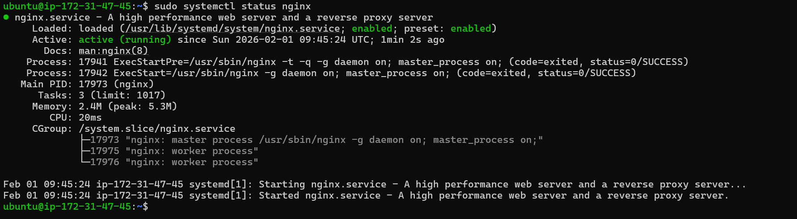
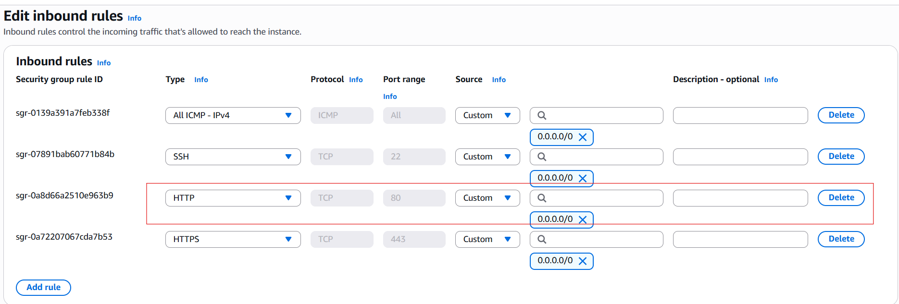
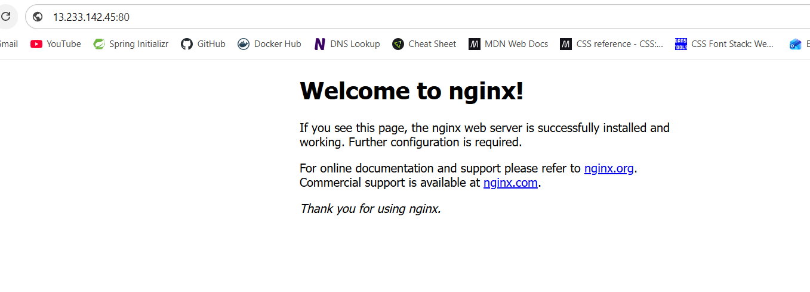
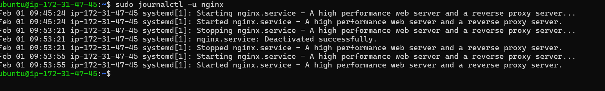
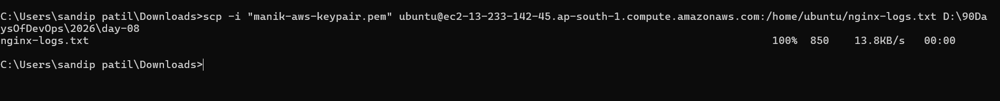

# Day 08 – Cloud Server Setup: Docker, Nginx & Web Deployment

- connect to EC2 instance via SSH 

- Update System

-  Install Nginx

- Check status 

- open port for Nginx

`nginx runs on http port 80`

- Test Web Access: 

- View Nginx Logs

- Save Logs to File 

- Download Log File to Your Local Machine

