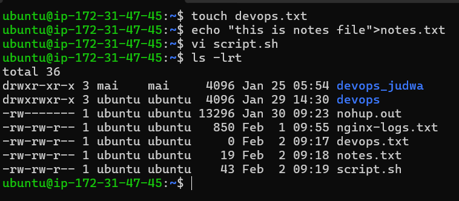
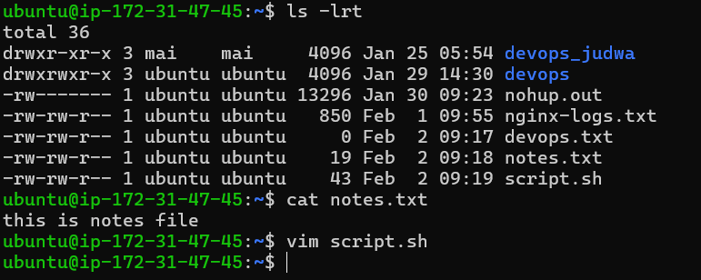
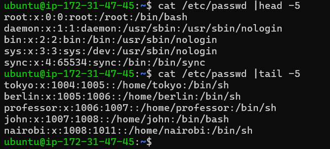
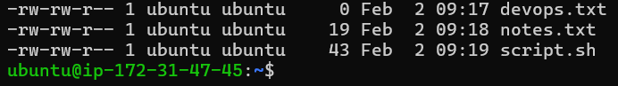
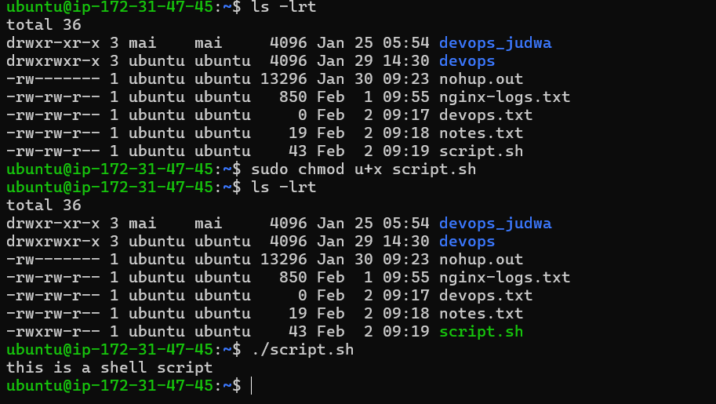
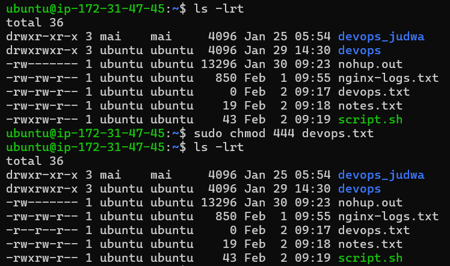
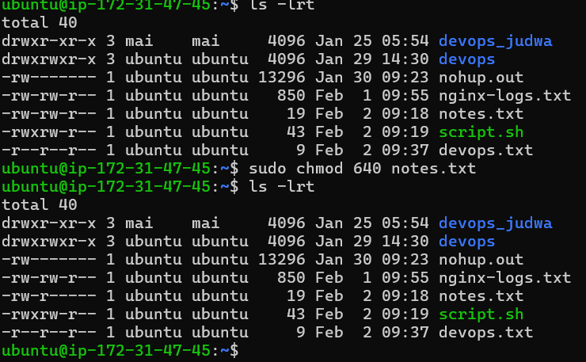

# Day 10 – File Permissions & File Operations Challenge

# File creation 

- Create file using touch , vi , echo 

# Read files 

- read file using cat & vim editor

# Understand Permissions
- notes.txt has permission as below 
    user- read ,write
    group - read ,write
    other - read 

# Modify Permissions

-1 Make script.sh executable

- 2 Set devops.txt to read-only for all 

- 3 Set notes.txt to 640

-4 Create directory project/ with permissions 755

# Try writing to a read-only file
- I am still able to edit a read only file because i am created a file using ubuntu user so file owner has still permission to edit if it read only

# Try executing a file without execute permission
- i am not able to execute a file without +x permission even execute with sudo 

# trying to enter home directory of other user 
- if ubuntu user has permission rwx-r-x-r-- & i am trying to using other user then i am not able to cd ,ls to ubuntu user home     directory still other user has read permission 
- you have need to given r-w permission to other to enter ubuntu user home directory