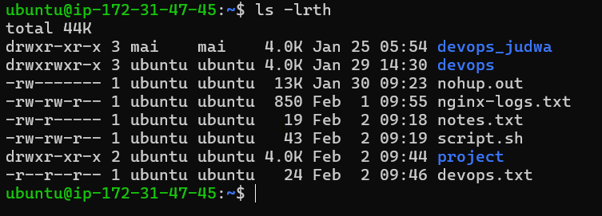
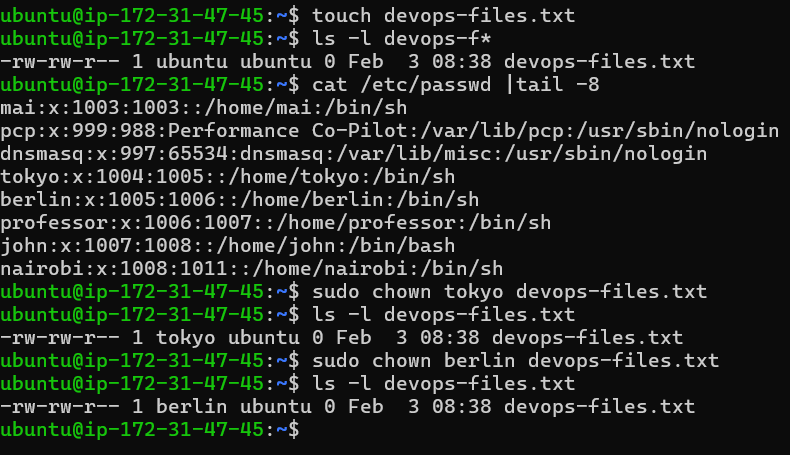
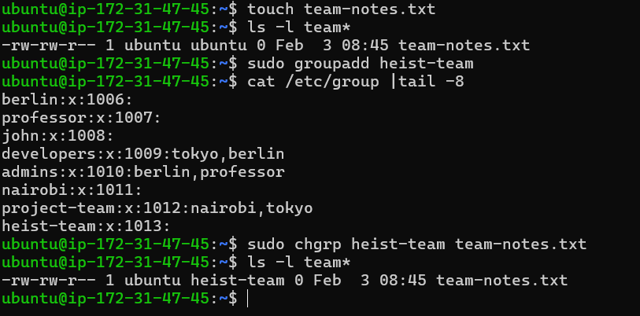
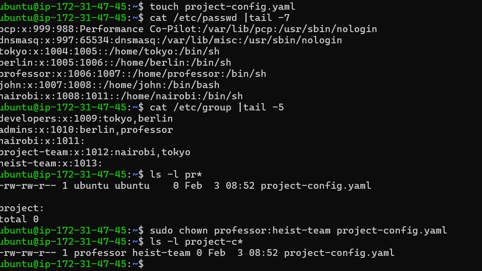
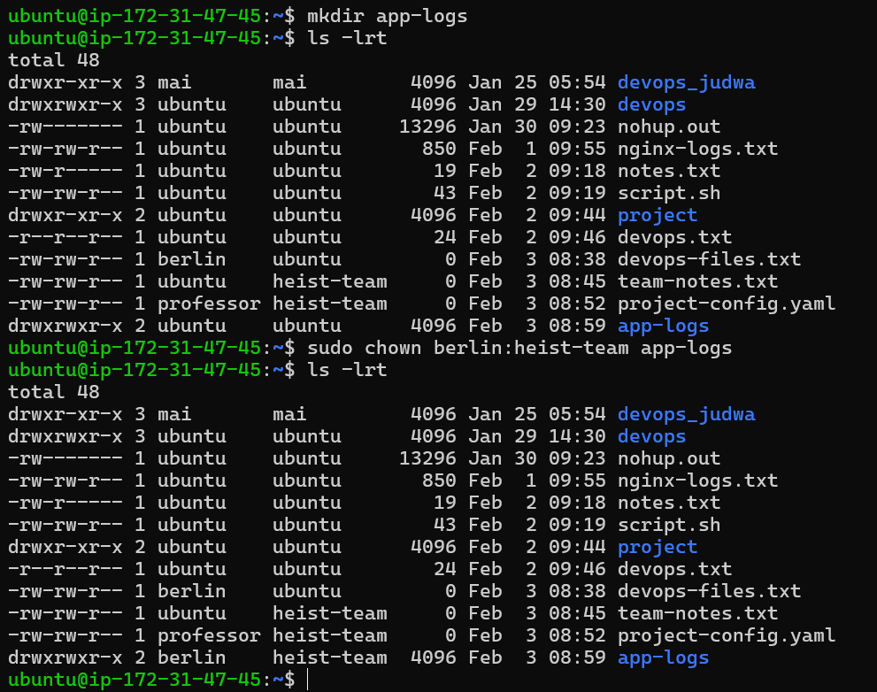
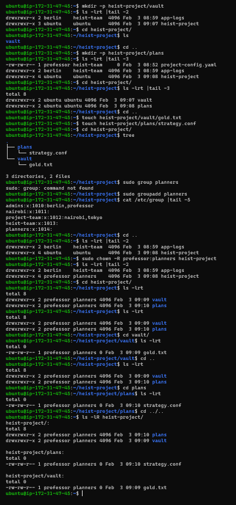
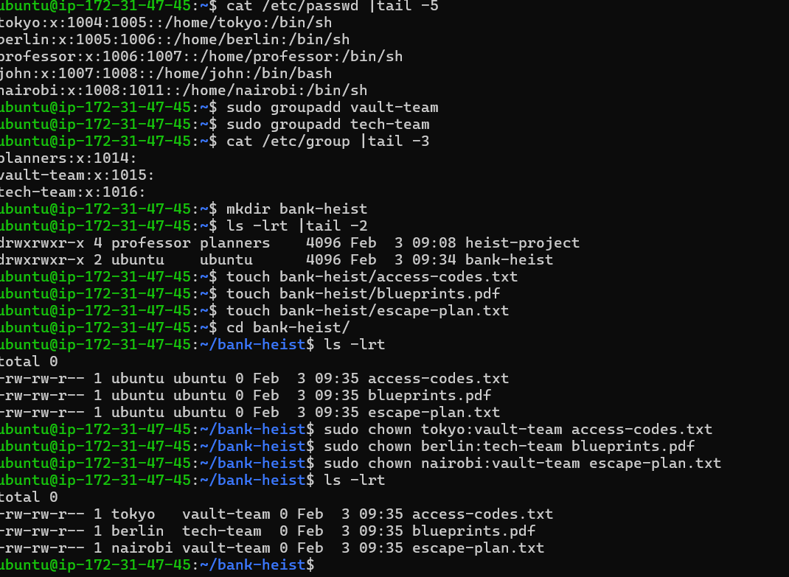

# Day 11 – File Ownership Challenge (chown & chgrp)

# Understanding Ownership

`owner `
- it is a single user who owns the file or directory 
- one owner exists only

`group`
- In a group there is multiple user 
- group permission apply to all user inside that group except owner 
- **Format: -rw-r--r-- 1 owner group size date filename**
- 1 represent number of hardlink

# Basic chown Operation

- Created a file devops-file.txt & check ownership 
- Change owner to tokyo later berlin to devops-file.txt

# Basic chgrp Operations 

- Created a file team-notes.txt & check group 
- Created a new group heist-team
- Changed a file group to heist-team

# Combined Owner & Group Change

- Craeted a file project-config.yaml & check owener & group 
- Changed owner to professor AND group to heist-team

- Created a directory app-logs/
- Changed its owner to berlin and group to heist-team

# Recursive Ownership

- Created a recursive directory & Check group & owner 
- Created a group planners
- Changed ownership of entire heist-project/ directory recursively 
- & verify its owener & group with `ls -lR heist-project/` 

# task 

