# Day 13 – Linux Volume Management (LVM)

# Create volume (Elastic Block) on AWS 

- Created a 4GB ,5GB ,10GB volume on aws 

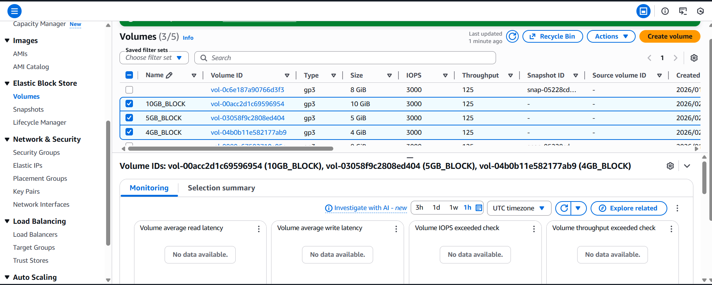

# Attched volume block to EC2 Instance 

- Attached all three blocks to EC2 instance as below 

`Recommended device names for Linux: /dev/sda1 for root volume.`
`/dev/sd[f-p] for data volumes.`

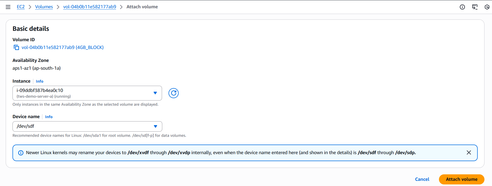

# Checked current storage 

- Switch to root user **sudo su**

`lsblk, pvs, vgs, lvs, df -h`

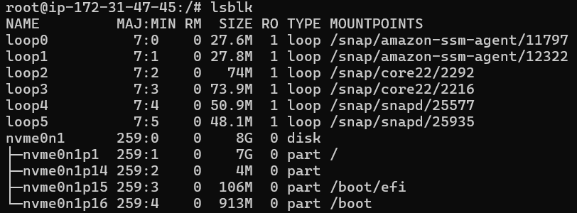

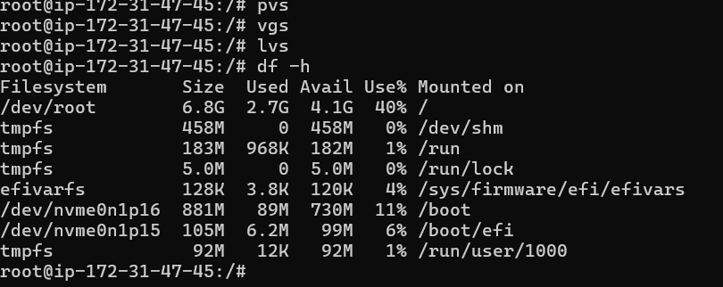

# Check volume blocked attached to instance or Not 

- run cmd `lsblk`

- these three block attached as **nvme1n1 , nvme2n1 , nvme2n1**

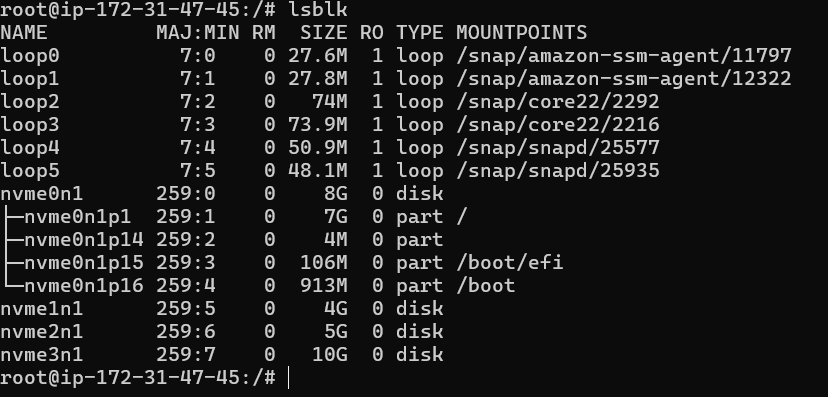

- These blocks attached to instance will show inside dev directory

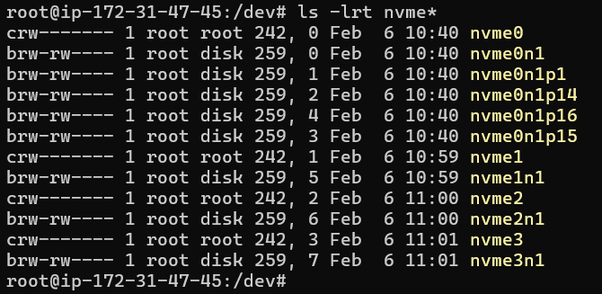

# Create physical volume 

- You need to create a physical volume of all these attached block 
- run commands these cmd created 3 physical volume for 3 blocks 
    - `lvm - to route to linux volume maneger`
    - `pvcreate blocks_names - - used to create physical volume`
    - `pvcreate /dev/nvme1n1 /dev/nvme2n1 /dev/nvme3n1 `
    - `pvs - to display physical volume`
    
   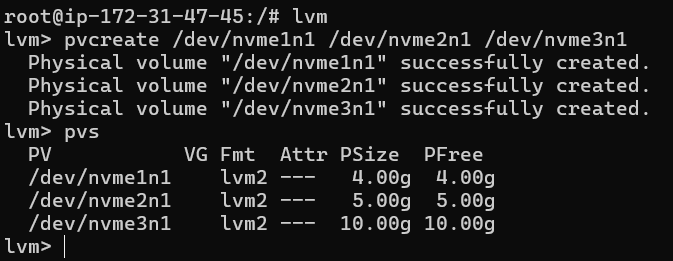

# Create Volume Group

- Run commands to create volume group 
    - `vgcreate groupname disknames - used to create volume group`
    - `vgcreate devops-vg /dev/nvme1n1 /dev/nvme2n1`
    - `vgs - used to display volume group`
- here i want to create a volume group of two blocks only 
- you can create a vg of any number of blocks i.e 1 or 2 or any 

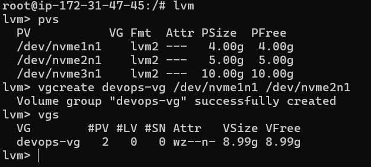

# Create Logical Volume

- `lvcreate lvname vgname - format`
- `lvcreate -L 6G -name app-data devops-vg`

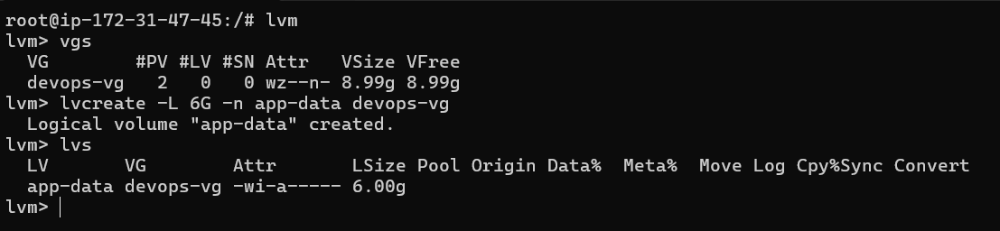

# Format a logical volume 
- `mkfs.ext4 /dev/devops-vg/app-data`

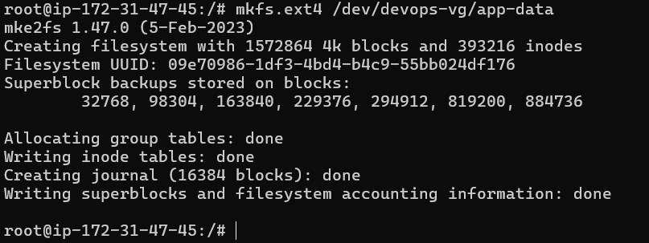

# Make a directory inside /mnt folder to mount logical vol`m tempararily.

- `mkdir -p /mnt/app-data`

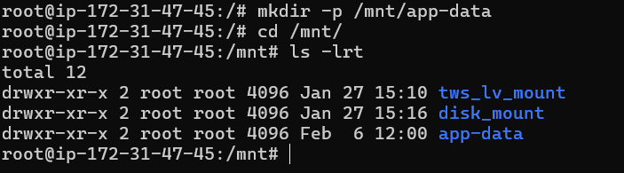

# Mount a logical volume to mount location - /mnt/app-data 

- `mount /dev/devops-vg/app-data /mnt/app-data`
- `df -h /mnt/app-data - used to check disk space`

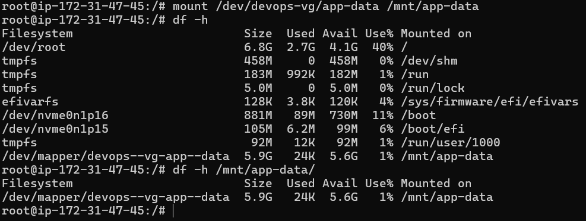

- Now the localtion /mnt/app-data is usable , you can create file repo inside that dirrectory

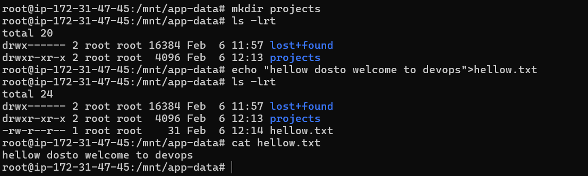

# Now extend a logical volume 

- Extend a logical volume by ruuning below cmd & run lsblk this will show increased size of lv 
    `lvextend -L +2G /dev/devops-vg/app-data`
- Run below cmd to resize file system without these command it will show old file system 
    `resize2fs /dev/devops-vg/app-data`
- To check disk space 
    `df -h /mnt/app-data`

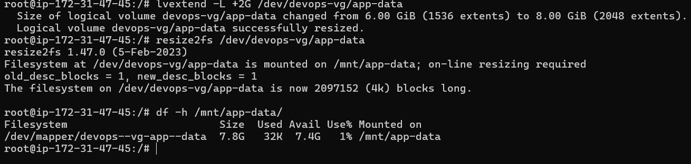

# To unmount disk 
- unmoun disk 
`umount /mnt/app-data`

- if you facing any issue while unmount run these command You’ll see PIDs and which users/processes are holding it.
`sudo lsof +D /mnt/app-data`

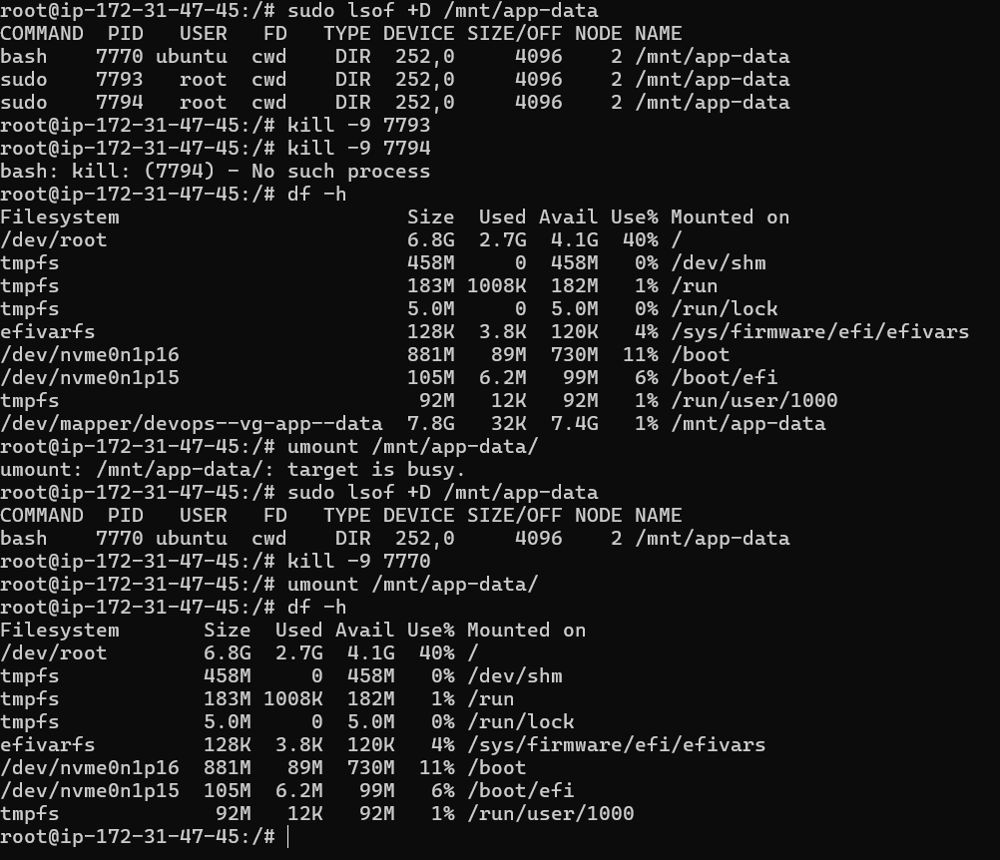

- after umnount data will not be lost if you again mount disk you will se all your details 

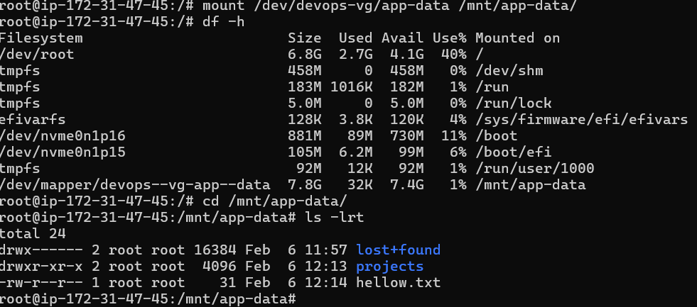

--- 

# Attached a AWS EBS directly to EC2 instance 

- Create a volume block in AWS 
- Attached AWS EBS block to EC2 instance 
- Then create a physical volume 

# Make a directory inside /mnt folder to mount volume block tempararily.

- `mkdir -p /mnt/app-data1`

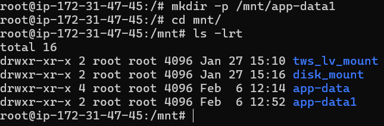

# Format a volume block  

- `mkfs -t ext4 /dev/nvme3n1`

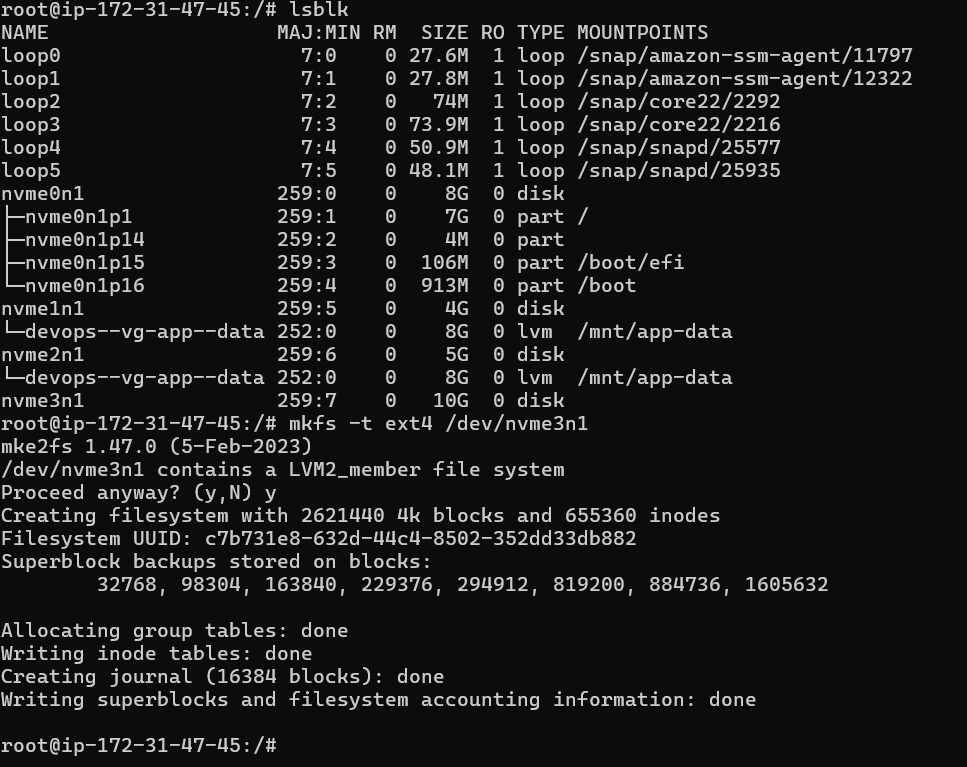

# Mount a pv block to  mount location - /mnt/app-data1

- `mount /dev/nvme3n1`

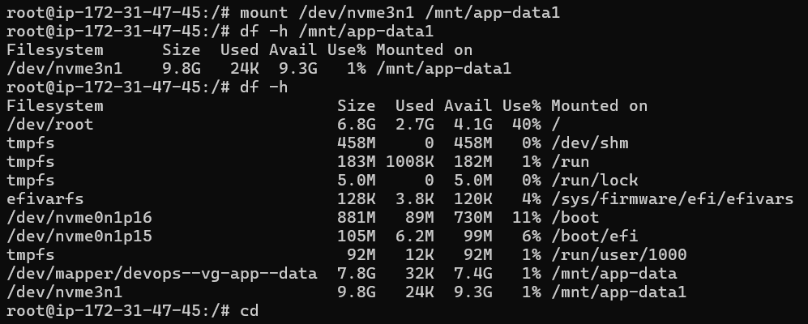

- You can aslo unmount pv block 

`umount /mnt/app-data1`

--- 

# Findings

-   Linux volume Maneger 
         ↓
    Physical volume
         ↓
    Volume Group
     ↓     ↓
    Lv1   LV2  ... Logical volume3 

- You can unmount these block 

- After unmount data will not be lost if we mount again data wiil be there 