# Day 14 – Networking Fundamentals & Hands-on Checks

# OSI Layer

- OSI stands for open system interconnection & OSI is therotical concept & it has 7 layer 

    - **Application layer**  - Layer7

        - It contains app like browser

    - **Presentation layer** - Layer 6 

        - This layer consists of data encryption ,decryption , compression 

    - **Session layer** - Layer 5
        
        - It responsible for maintaining a session like session maintaining,creation,termination

    - **Transport layer** - Layer 4 

        - it will transamit data through tcp/udp protocall 

    - **Network layer** - Layer 3

        - it consists of an internet connection & sends a packets to network using ip addresses 

    - **Data-link** - Layer 2 

        - it deliver data from end to end i.e from node to node  

    - **Physical** Layer 1

        - Signal transmitted through cables 

    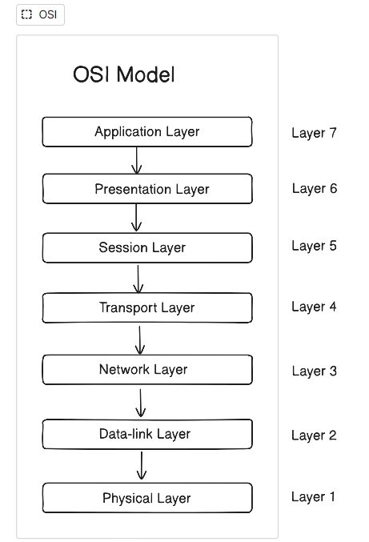

    # TCP/IP Model

    - This is practical concept & used to communicate over the network using internet ,It consists of an 4 Layer

        - **Application Layer**

            - It consists of an three layer of an OSI model app layer + presentation layer + session 
            - This layer consists of an HTTP ,HTTPS, SMTP , SFTP ,FTP , DNS protocall
        
        - **Transaport Layer**

            - it will transamit data through tcp/udp protocall
            - It has TCP/UDP protocall

        - **Internet Layer**

            - it consist of an internet & sends a packets to network using ip addresses 
            - it has IP protocall

        - **Network Layer**

            - Signal transmitted through cables , wifi 

        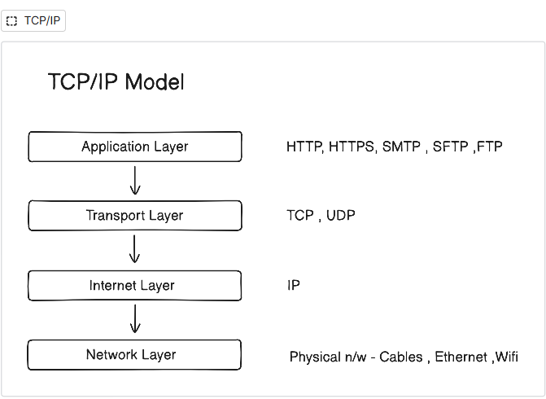

# Hands-on Checklist

- Identity `hostname -I or ip addr show`

    - Obesevations: 
                - **hostname -I** it shows private ip & is 172.31.47.45 & 2nd is virtual network interface 172.17.0.1
                - **ip addr show**  - it shows localhost address i.e 127.0.0.1/8 
                                    - Ethernet ip i.e 172.31.47.45/20 
                                    - & for docker virtual interface i.e 172.31.47.45/20
  

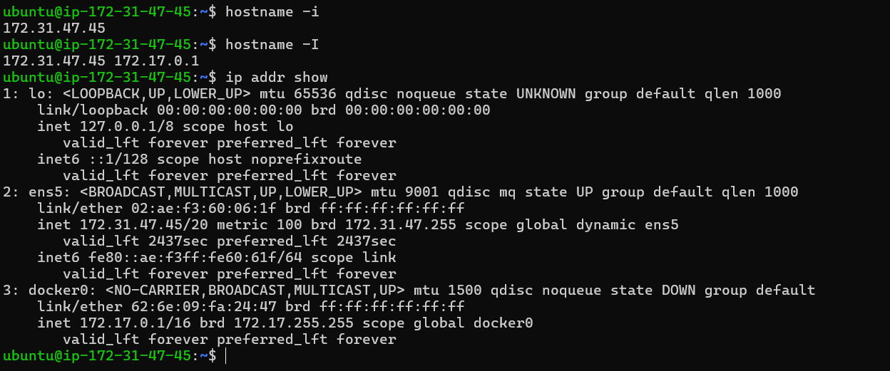

- Reachability: `ping google.com`

    - Obesevation: 0% packet loss & maximum latency is 2.176 ms 
    
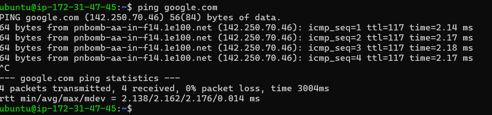

- Path:`traceroute trainwithshubham.com`

    - Obesevation: Maximum hops latency at hop 7 i.e 2.528 ms & at hop 3 & 5 icmp/firewall block 

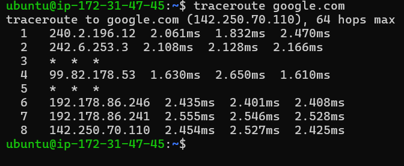

- Ports: `ss -tulpn (or netstat -tulpn) `

    - Obesevation: ngnix.service listening on port 80 

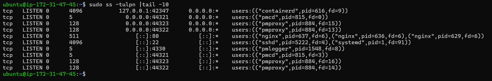

- Name resolution: `dig google.com or nslookup google.com`

    - Obesevation: Resolve ip is 142.250.70.110

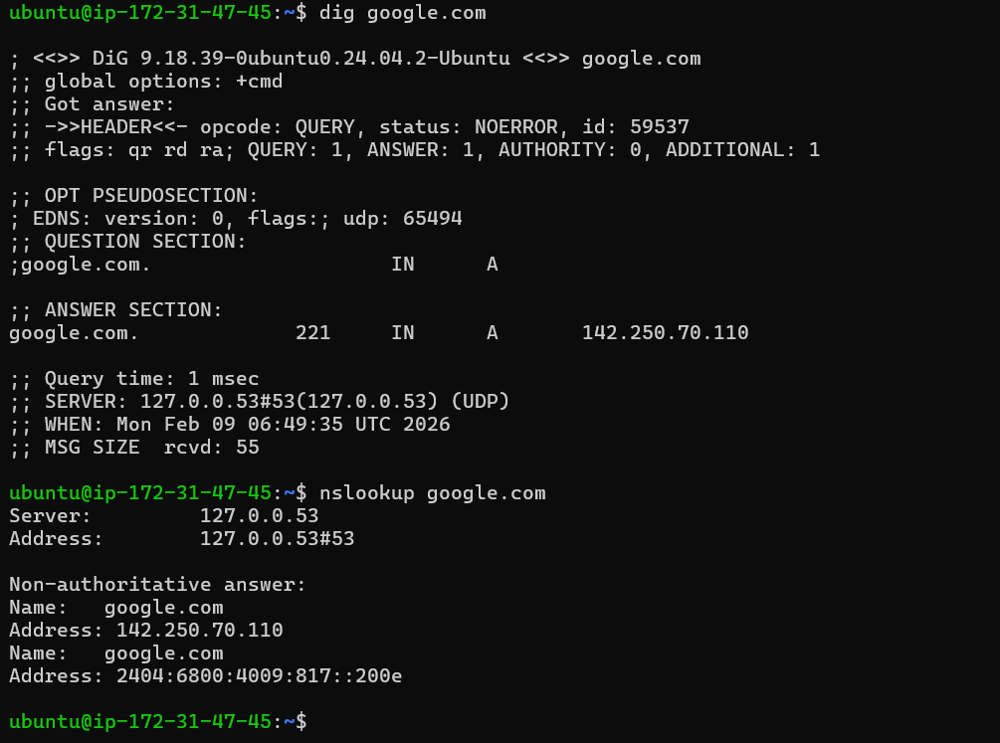

- HTTP check: `curl -I google.com`

    - Obesevation: status code 200 is ok & server successfully given a response .

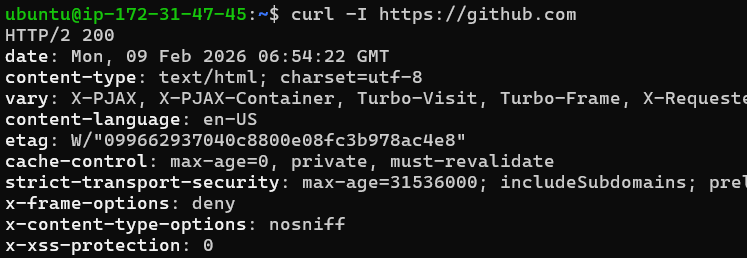

- Connections snapshot: `netstat -an | head`

    - Obesevation:There is 3 established connections all are ssh connections & there is 9 tcp listen connections 

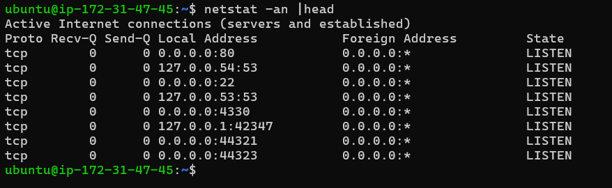

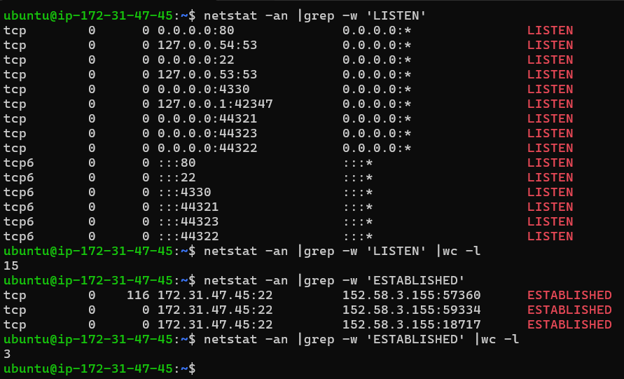

# Port Probe & Interpret

- `sudo ss -tulpn |grep ssh`

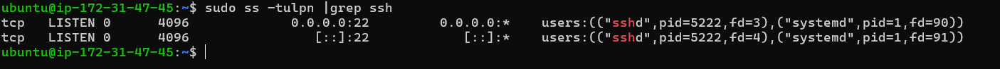

- `nc -zv localhost 22 or curl -I http://localhost:22`

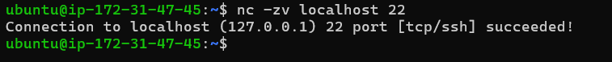

- If service not reacheable check service status & logs & firewall 
    
    - `systemctl status ssh`
    - `journalctl -u ssh`
    - `sudo ufw status`

# Reflection

- ping command gives fatest response if something is broken 

- DNS fails - DNS is an application layer protocall we check application layer 

    `ping ,dig , nslookup, ss -tulpn`

- HTTP 500 
    - it is an application layer protocall, 500 status code is internal server error 
    - request reaches to the server internet is working fine but problem is in application logic 
    - check applications logs for troubleshotting 
        - `systemctl status service`
        - `journalctl -u service`
        - `tail -f /var/log/service/error.log`

- Followups

    - use telnet command to check connectivity to host server and port
    `telnet ip port`

    - use netstat command to see a connection is established or not 
    `netstat -an |grep ip or port`
    

