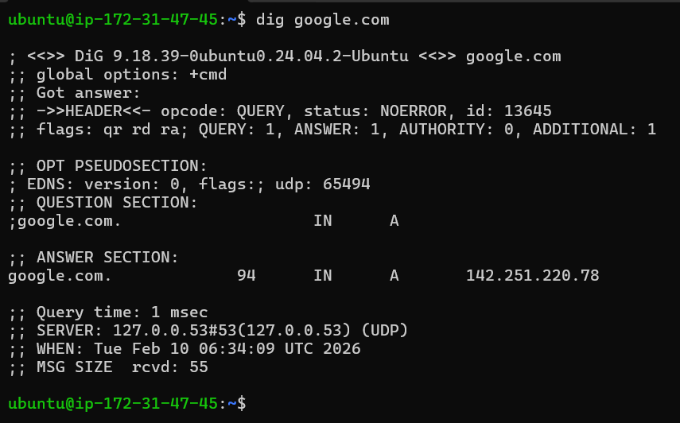

# Day 15 – Networking Concepts: DNS, IP, Subnets & Ports

# DNS How Names Become IPs

- if we type google.com request goes to isp (internet service provide) isp looks up & retrive ip from dns server for domain google.com & sent to you & then request goes to that host ip & you will get response .

- A :is used to map domain name to IPV4 address
- AAAA : is used to map domain name to IPV6 address 
- CNAME : points one domain name to another domain (used for alias)
- MX : specifies the mail server responsible for receiving email for domain 
- NS : it shows which DNS server is responsible for DNS query

- `dig google.com `— identify the A record and TTL 
    
    - Obeservation
        - Domain name - google.com
        - TTL - 94 
        - IN - internet 
        - A -  142.251.220.78 (i.e IPV4 address)

#  IP Addressing 192.168.1.10

- IPv4 address & it structured
    - IPV4 is an address which is used to uniquely indentifies each device 
    - It has an 4 numbers seperated by . & each number ranges from 0 to 255 
    - First number responsible for main network i.e address class
    - Second number responsible for sub-network inside main network 
    - Third number responsible LAN or VLAN
    - Fourth number indentifies each device individually

# Public and Private ip

- public ip is accessible to all over internet 
- private ip is not accessible to all over internet ,it is accessible within local network
- private IP ranges
- `10.0.0.0 - 10.255.255.255 ` - 10.0.0.0/8 
- `172.16.0.0 – 172.31.255.255` - 172.16.0.0/12
- `192.168.0.0 – 192.168.255.255` - 192.168.0.0/16

- This is my private ip 172.31.47.45

# CIDR & Subnetting

- **192.168.1.0/24**
    - Total IP addresses: 256
    - CIDR base IP: 192.168.1.0 
    - Broadcast address: 192.168.1.255
    - First Usable IP : 192.168.1.1
    - Last Usable IP : 192.168.1.254 
    - Total usable IP = 256-2 = 254 

- **Usable hosts in a /24? A /16? A /28?**
    - /24 
        - Usable IP  = 256 -2 i.e (brodcast & CIDR base ip ) = 254 
    - /16
        - Usable IP  = 65536 -2 i.e (brodcast & CIDR base ip ) = 65534 
    - /28
        - Usable IP  = 16 -2 i.e (brodcast & CIDR base ip ) = 14

- **Subnet**
    - To split larger network into smaller units & to use more ip address rather than main network we need to use subnet   

| CIDR | Subnet Mask    | Total IPs | Usable Hosts |
|------|-------------   |-----------|--------------|
| /24  | 255.255.255.0  | 256       | 254          |
| /16  | 255.255.0.0    | 65536     | 65534        |
| /28  | 255.255.255.240| 16        | 14           |

# Ports – The Doors to Services

- Port is used to route to correct service of the host 

| Port | Service |
|------|---------|
| 22   | SSH     |
| 80   | HTTP    |
| 443  | HTTPS   |
| 53   | DNS     |
| 3306 | MYSQL   |
| 6379 | REDIS   |
| 27017| MONGODB |

- port 22 listening for ssh service & 80 htttp 

# 

