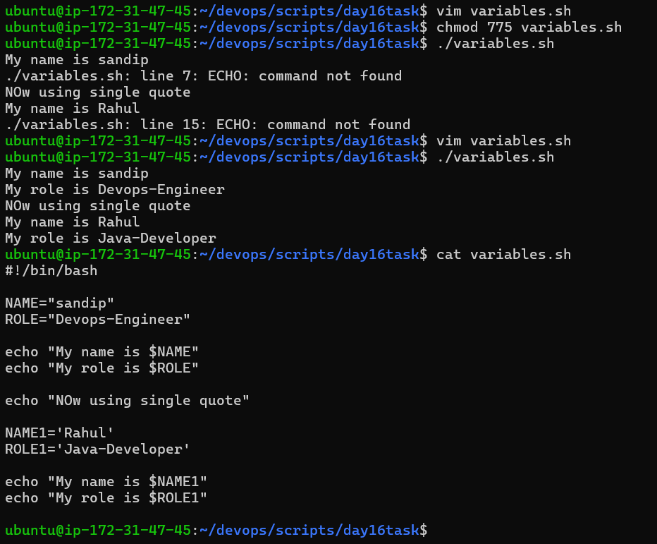
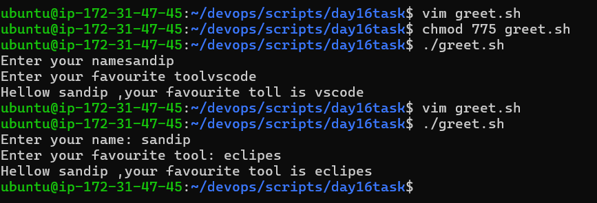
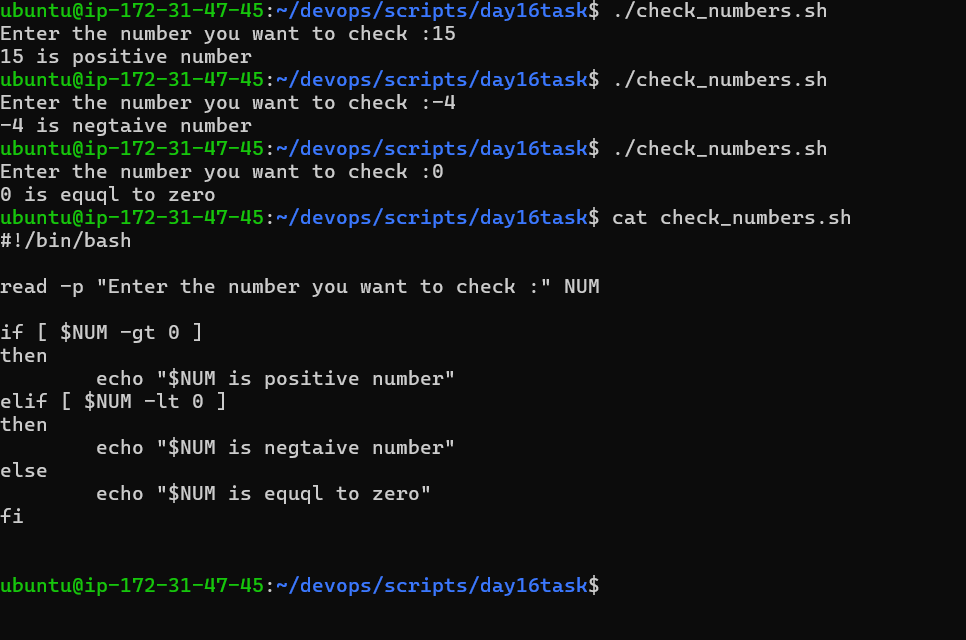
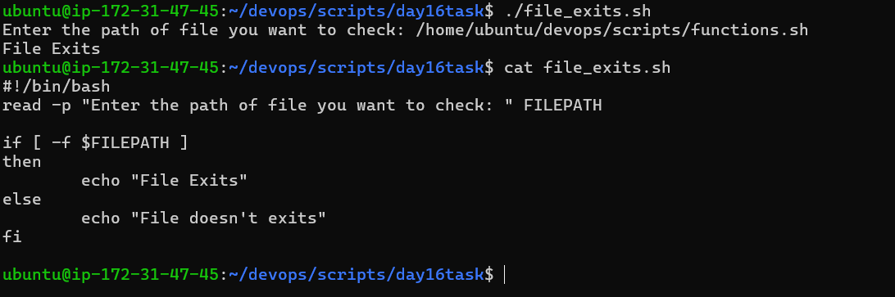
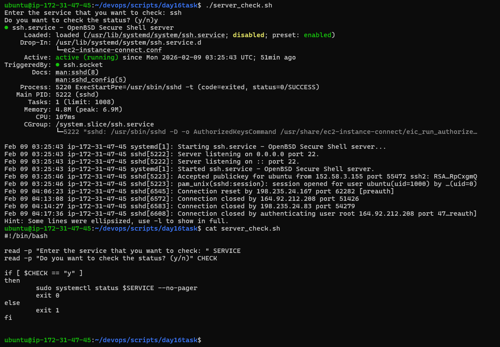

# Day 16 – Shell Scripting Basics

---

# Task 1 

- `If we remove shebang it doesn't affect to script it just shows script uses bash shell`

# Variables

- `If we use single quote or double quote for variable assignment it doesn't affect you can use any one of them`

# User Input with read

- `read -p is used to take the input from user`

# If-Else Conditions

- `Check number s posve or negative`

- `Check file exits or not`

- `Service status check `
    - if we use --no-pager prevents systemctl from opening less
    - Script prints output and exits immediately

 

# learning
- read -p is used to take input from user 
- -f used to check file exits or not 
- --no-pager use case 