# Day 18 – Shell Scripting: Functions & Slightly Advanced Concepts

# Basic Functions

- Argument passing 

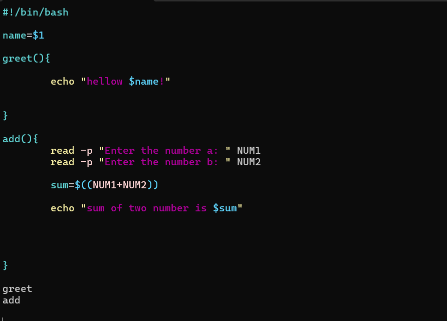

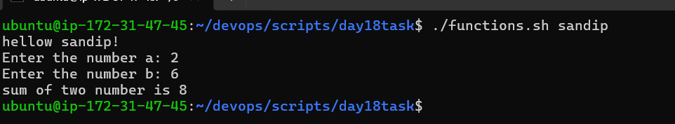

# Functions with Return Values

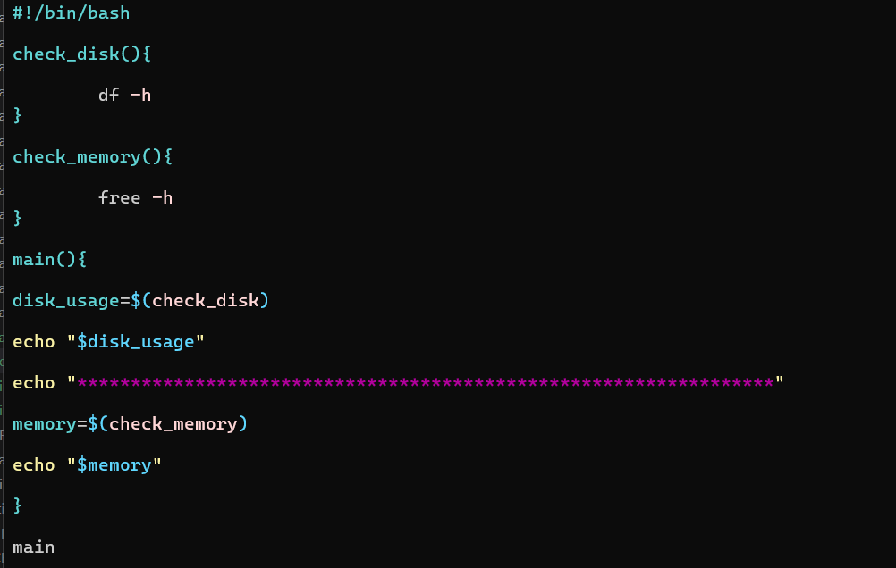

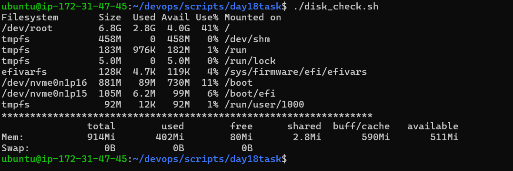

# Strict Mode — set -euo pipefail

- set -u : if any undefined variable found script stop from that points

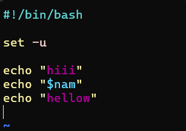

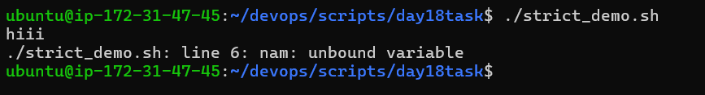

- set -e : if any error occur script exits immediately

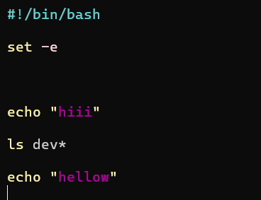

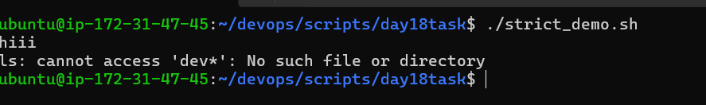

- set -o pipefail : scripts exits if command failed 

# Local Variables

- Local variable can't access outside function while regular variable access anywhere in script 

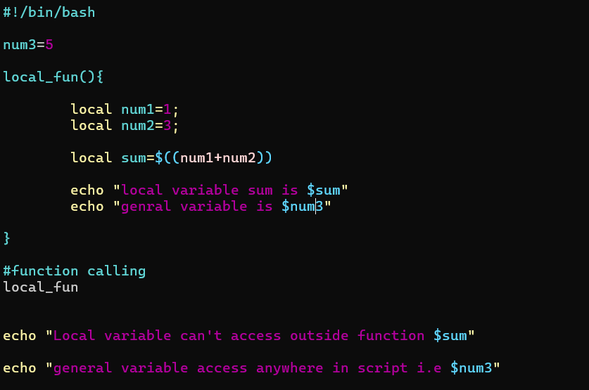

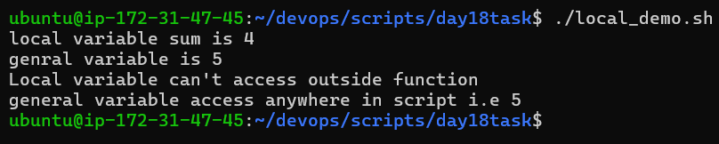

# System Info Reporter

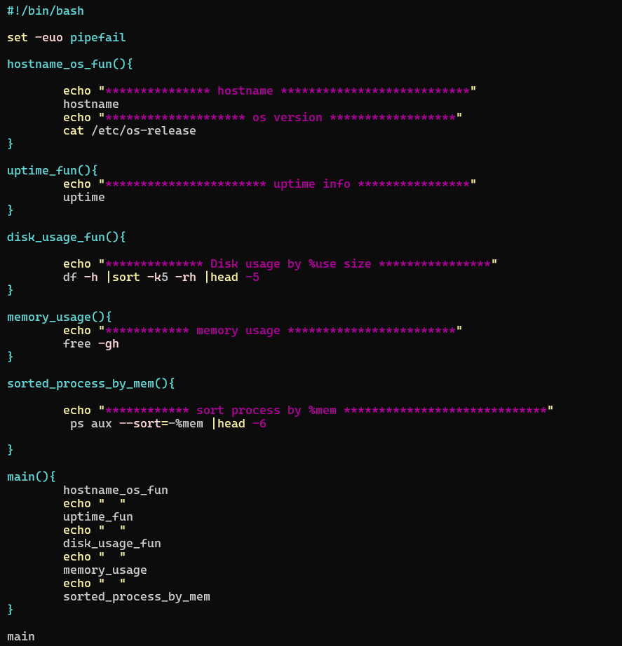

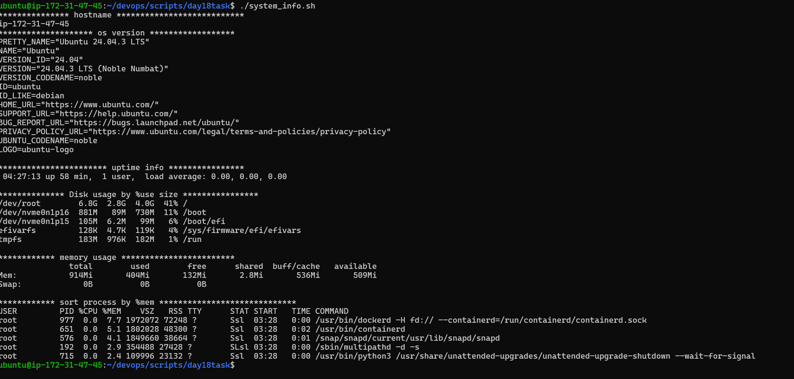

