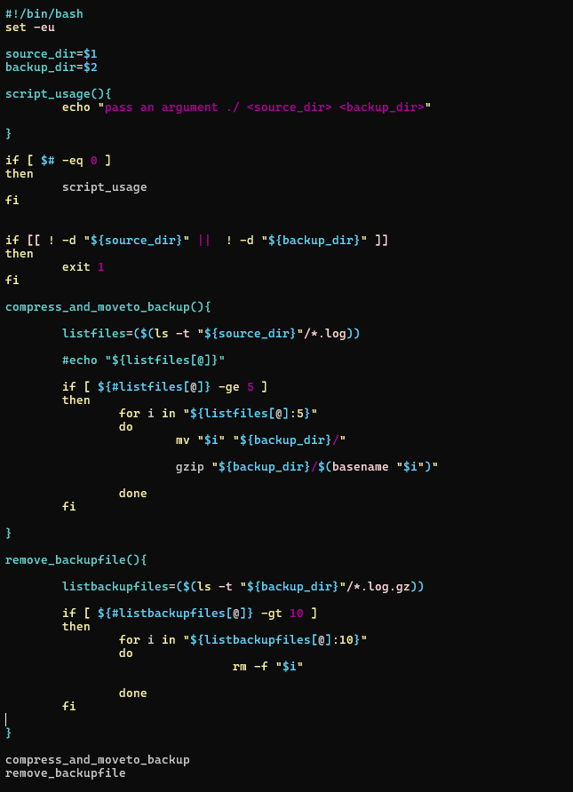
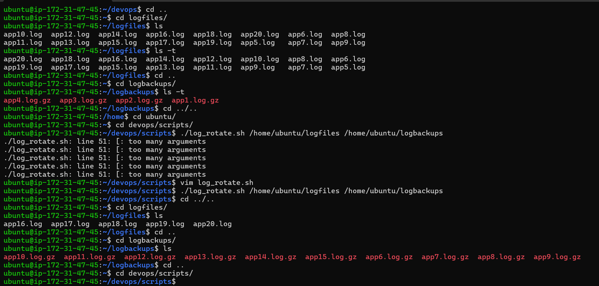
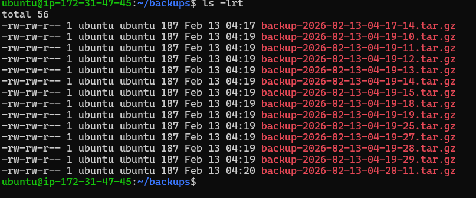
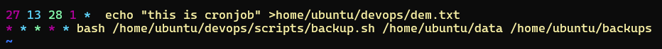
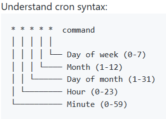
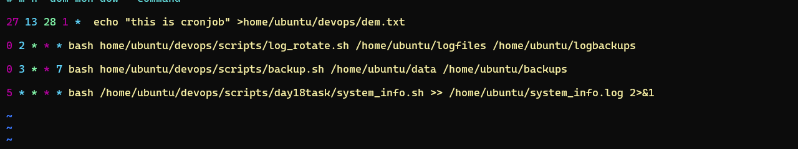
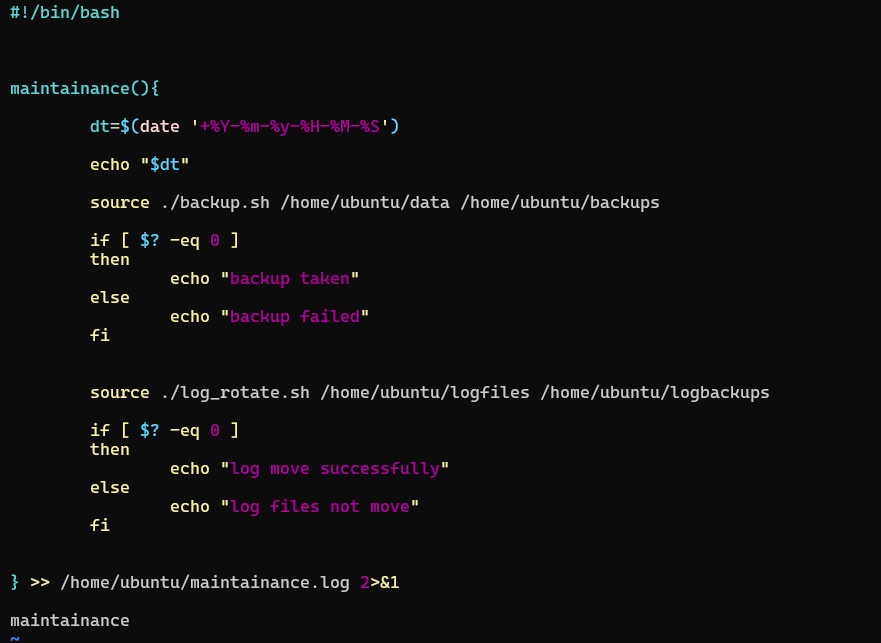
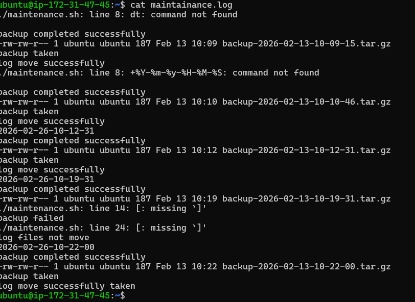
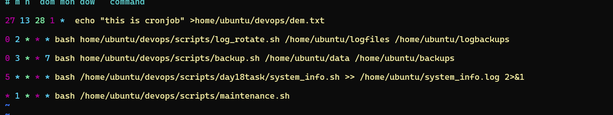

# Day 19 – Shell Scripting Project: Log Rotation, Backup & Crontab

# Log Rotation Script

# Server Backup Script

# Cronjobs 

- `corntab -e `: is used o edit cronjob
- `crontab -l `: is used to list cronjobs

- log_rotate.sh every day at 2 AM

    - ` 0 2 * * * bash home/ubuntu/devops/scripts/log_rotate.sh /home/ubuntu/logfiles /home/ubuntu/logbackups`

- backup.sh every Sunday at 3 AM

    - `0 3 * * 7 bash home/ubuntu/devops/scripts/backup.sh /home/ubuntu/data /home/ubuntu/backups`

- health check script every 5 minutes

    - `5 * * * * bash /home/ubuntu/devops/scripts/day18task/system_info.sh >> /home/ubuntu/system_info.log 2>&1`

# Combine — Scheduled Maintenance Script

- Daily at 1 AM

