# Day 20 – Bash Scripting Challenge: Log Analyzer and Report Generator

# Input and Validation

- 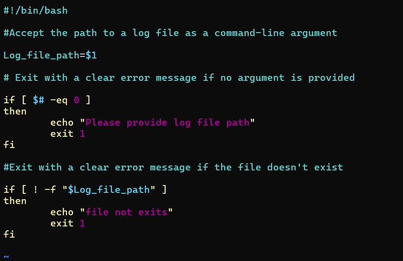

- 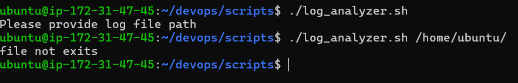

# Error Count

- 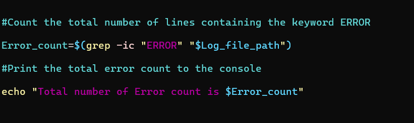 

- 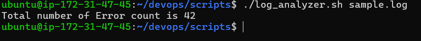

# Critical Events

- 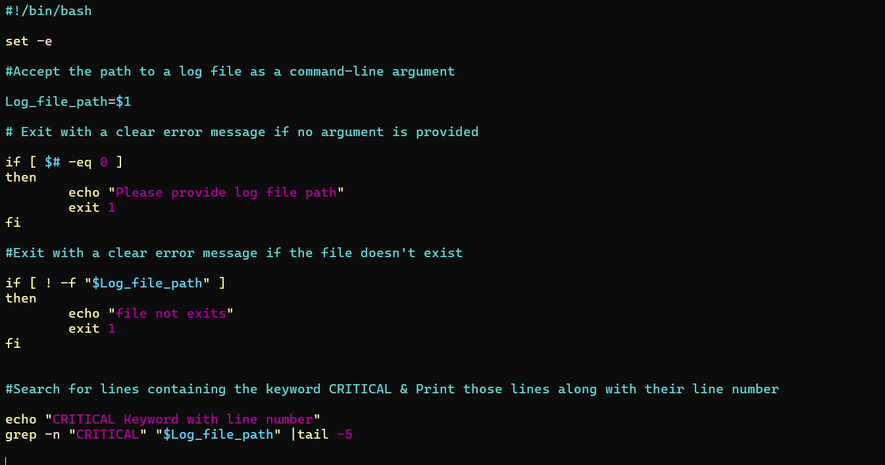

- 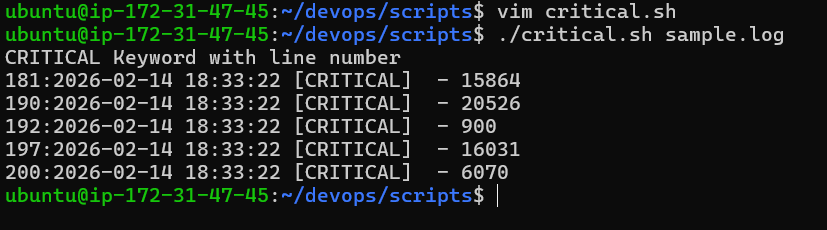

# Top Error Messages

- 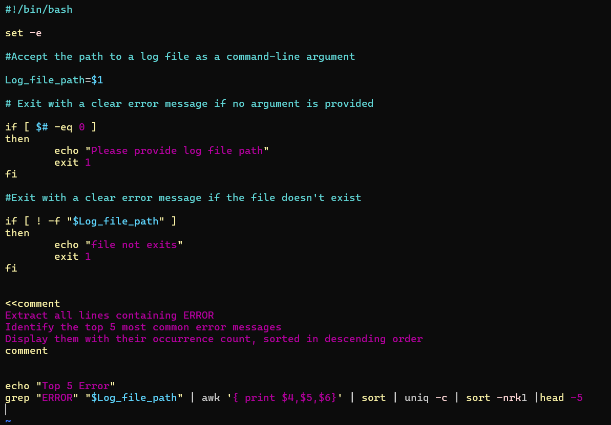

- 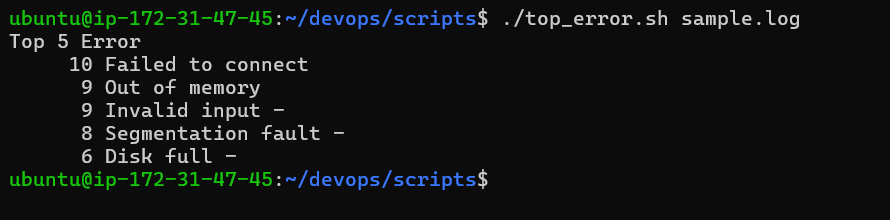

# Summary Report

-  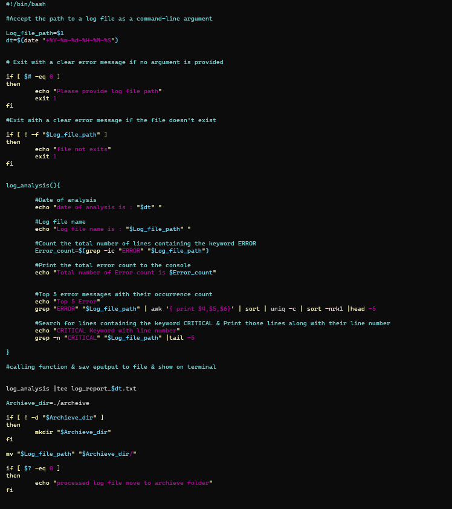  

-  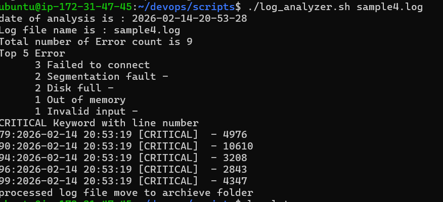

# Archive Processed Logs

- 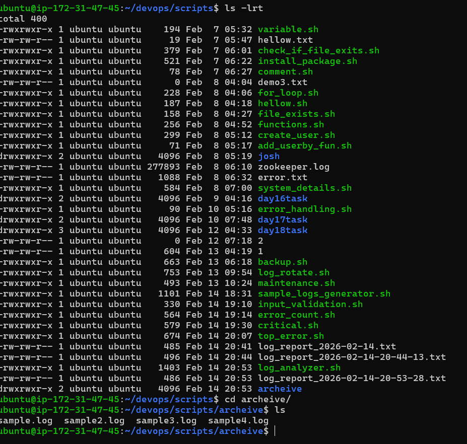

