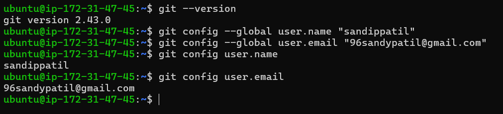
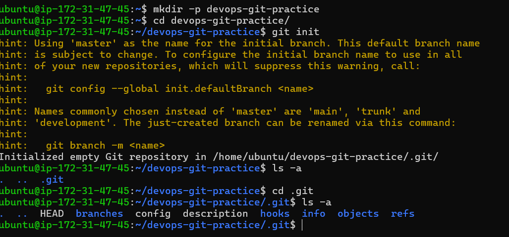
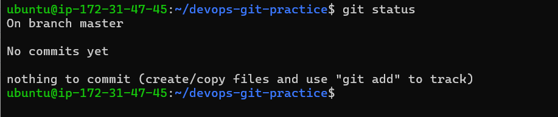
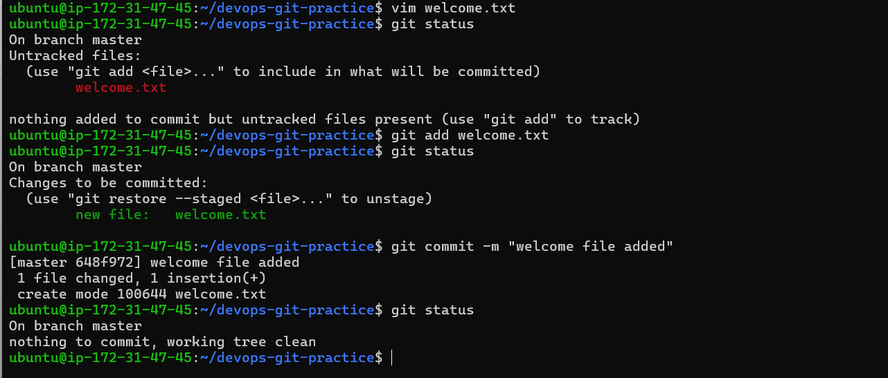
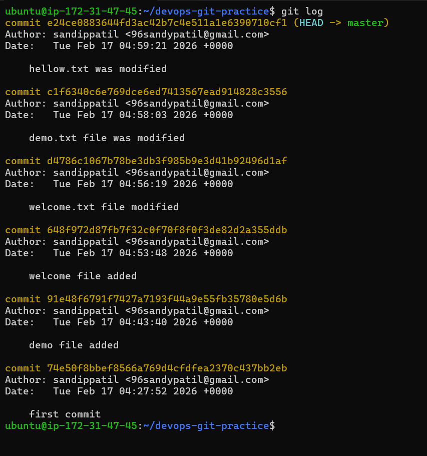
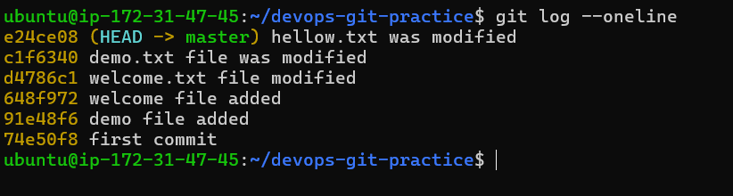

# Day 22 – Introduction to Git: 

# Install and Configure Git

- `git --version`

- `git config --global user.name "sandippatil"`

- `git config --global user.email "96sandypatil@gmail.com"`

- `git config user.name`

- `git config user.email`

# Create Your Git Project

- Initialise empty git repository

`git init`

- `git status`

# Stage and Commit

# Make More Changes and Build History

# Git Workflow

- `git add` 

    - To add a file to stage area

- `git commit`

    - To tracked a file 

- `Staging area & commit`

    - staging area provides you a control , git commits only those file which are in stagging 

- `git log`

    - it gives a commit history 

`.git/ folder`

    - It is most important folder of git repo it contains all information of your repo 
    - If you delete .git folder your directory is just normal directory

- `working directory, staging area, and repository`
    
    - **working directory :** where you create ,modify file 
    - **stagging area :** if you add file then git knows what changes you made need to commit
    - **Repository :** if you run **git init** inside directory then it become git reposioty & it conatins **.git** hidden folder 

