# Git Branching & Working with GitHub
---

# Understanding Branches

- Branch in git has seperate codebase from main untill you merge branch to main 
- if any wrong changes done in main branch it may impact your production so its better to create branch & do your changes 
- head is pointer & points to your current branch commit
- if we switch branch you will see a current branch working directory files

---

# Branching Commands

- List all branches 

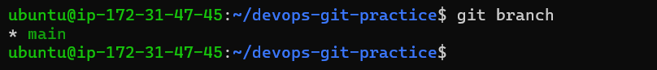

- Create a new branch called feature-1 & switch to branch

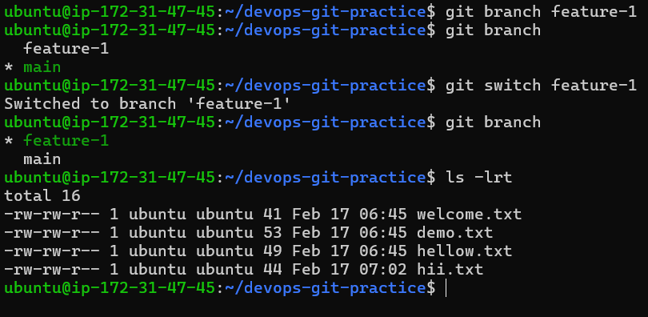

- Create a new branch and switch to it in a single command — call it feature-2

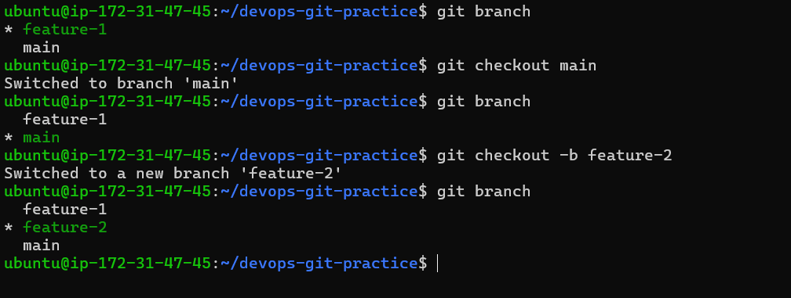

- git switch & git checkout is similar to switch between branches 

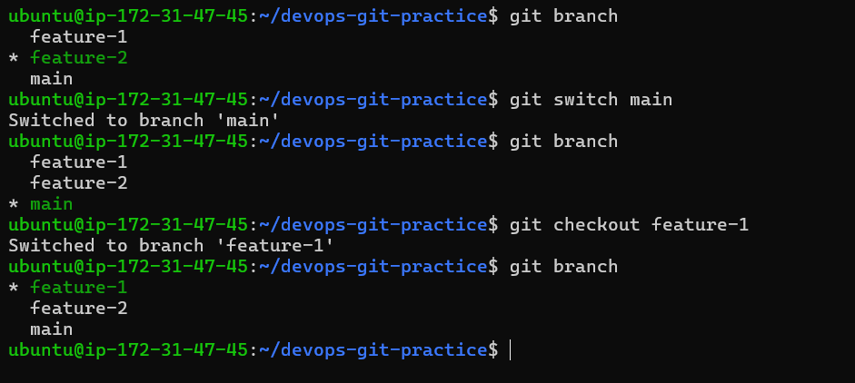

- commit on feature-1 that does not exist on main

- Switch back to main — verify that the commit from feature-1 is not there

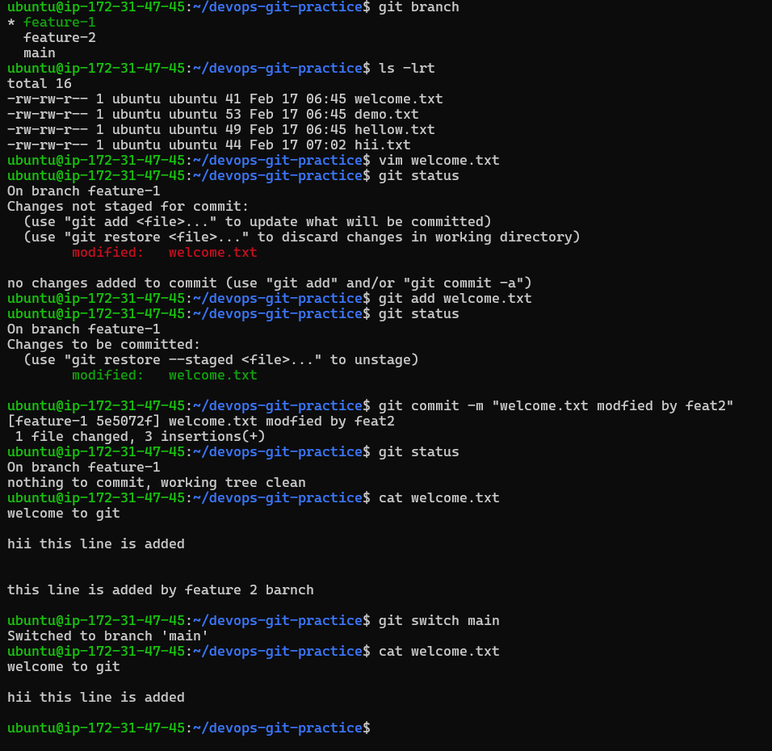

- Delete a branch you no longer need

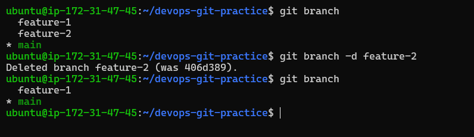

---

# Push to GitHub

- Create new repository on GitHub

- Connect your local devops-git-practice repo to the GitHub remote

    - generate ssh keys `ssh-keygen`

    - & if you have multiple keys then to avoid conflict create .ssh/config file in which put this lines 

        Host github.com
            AddKeysToAgent yes
            IdentityFile ~/.ssh/ec2_git_key 
    
    - add public key to your github account ( settings -> SSH and GPG keys -> New SSH key )

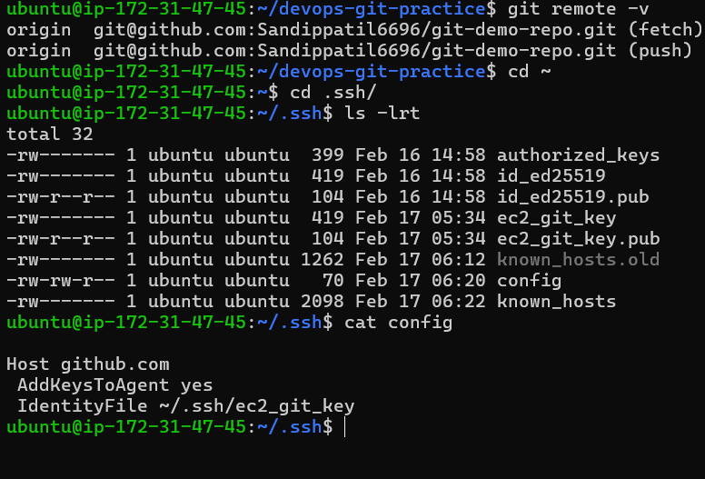

- Push your main branch to GitHub

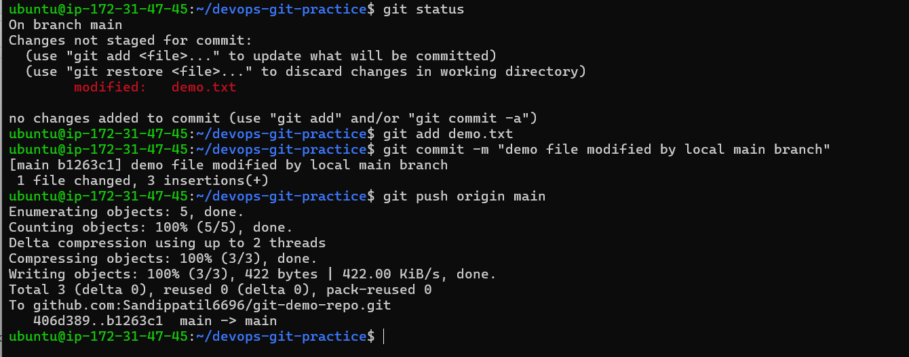

- Push feature-1 branch to GitHub

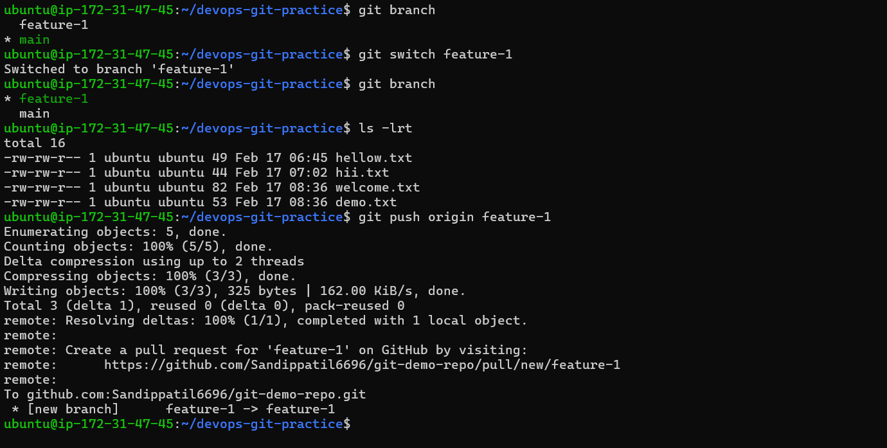

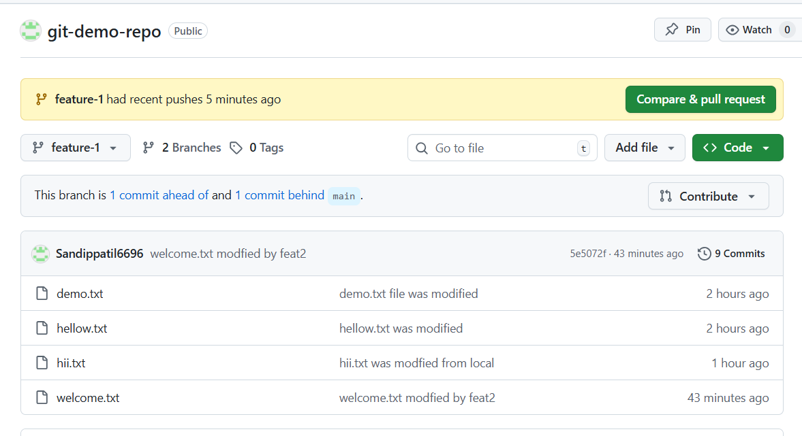

- Verify both branches are visible on GitHub

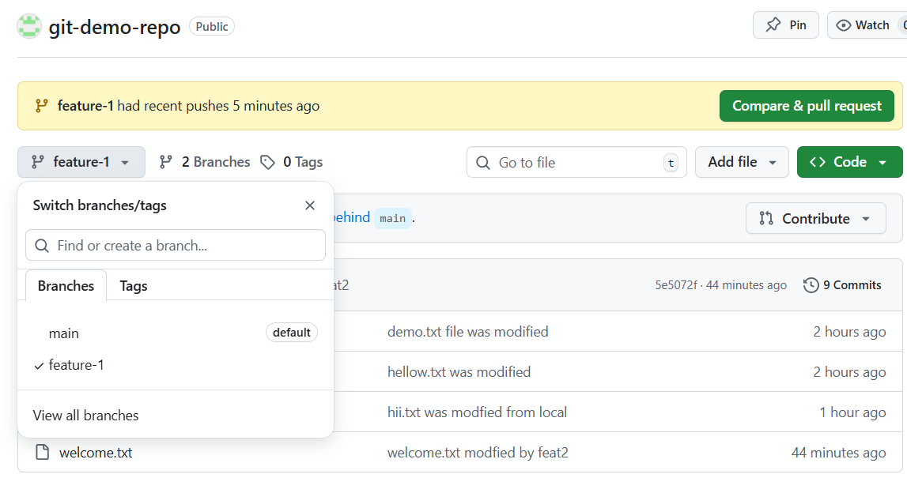

---

# difference between origin and upstream?

- `origin :` when you clone repository git gives default name **origin** to remote repository
- `upstram :` when you fork repository git gives names to main repository as upstream & your fork repo as origin on local 

---

# Pull from GitHub

- Changes to a file directly on GitHub

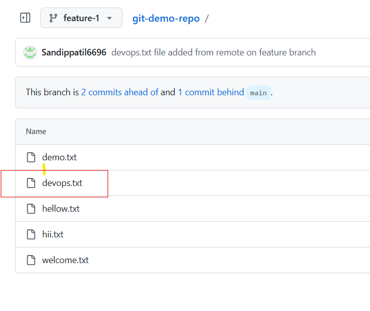

- Pull that change to your local repo

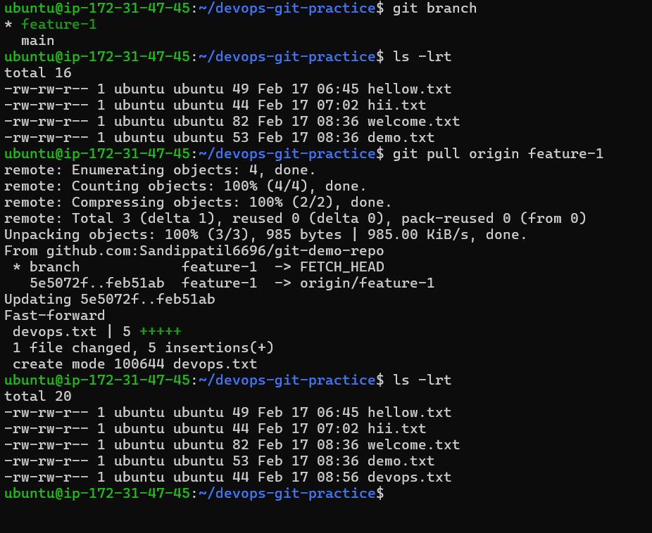

- git fetch and git pull

    - `git fetch :`

--- 

# Clone vs Fork

- `clone`

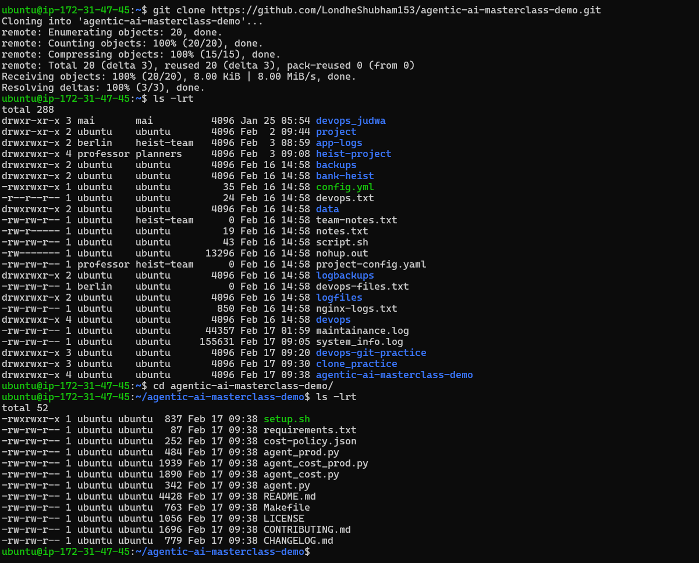

- `fork`

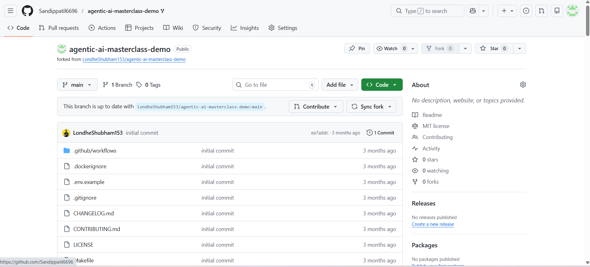

- difference between clone and fork?

    - clone is used to copy a remote repository from gihub to local 

    - fork is used to copy a gihub repository from one github account to other github account 

- When would you clone vs fork?

    - if you want copy remote repo to your local system use clone 

    - if you want copy a repo from one account to other gihub acount use fork 

-  keep your fork in sync with the original repo 

    - use sync fork from UI to sync your fork with upstram 

