# Day 24 – Advanced Git: Merge, Rebase, Stash & Cherry Pick
---

# Git Merge — Hands-On

- Created feature-login branch from main, and add a couple of commits to it
- Switch back to main and merge feature-login into main
- **if there is no any new commit on main branch after creation of branch feature-login It will do a fast-forward merge & there is no merge log**

- created another branch feature-signup, add commits to it — but also add a commit to main before merging
- Merge feature-signup into main
- This time **merge commit happens** beacause  main branch have commit history after creation of branch feature-signup

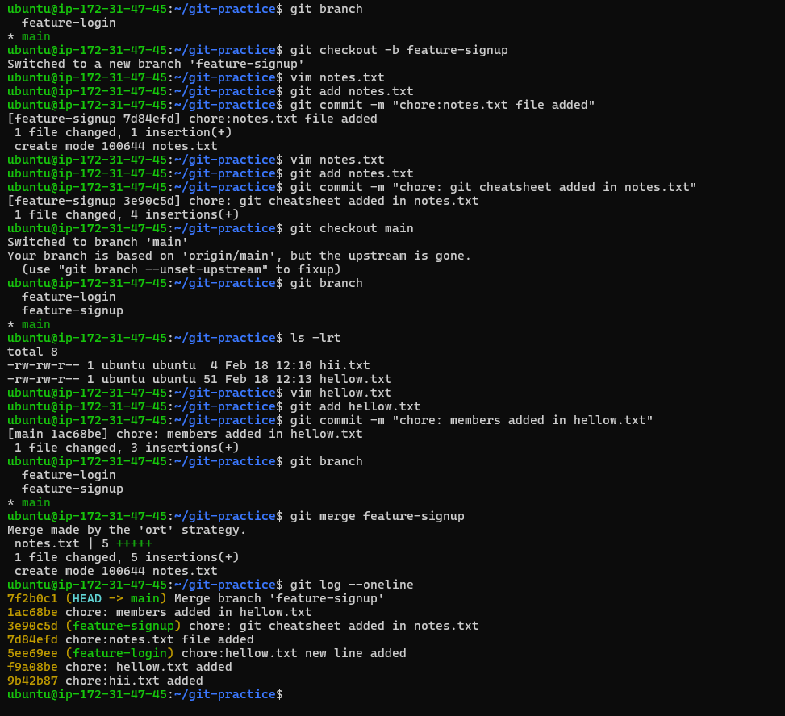

- **fast-forward merge**

    - if there is no any new commit on main branch after creation of branch feature-login It will do a fast-forward merge & there   is no commmit history for merge

- **merge commit**

    - If main branch have commit history after creation of branch it will do a merge commit

- **merge conflict**

    - if same file has two version in diff branches & if we are trying to merge then resolve conflict manually 

# Git Rebase

- it makes your commit history linear on the top of another branch

- if you commit & push to github & your frd pull that repo & if you rebase & push then you & your frd both have differnt commit history it may causes conflict so never rebase commits that have been pushed and shared with others

- rebase vs merge

    - rebase - when you are working alone & want a clean linear commit history you should rebase it 

    - merge - when you want a preaserve commit history use merge  

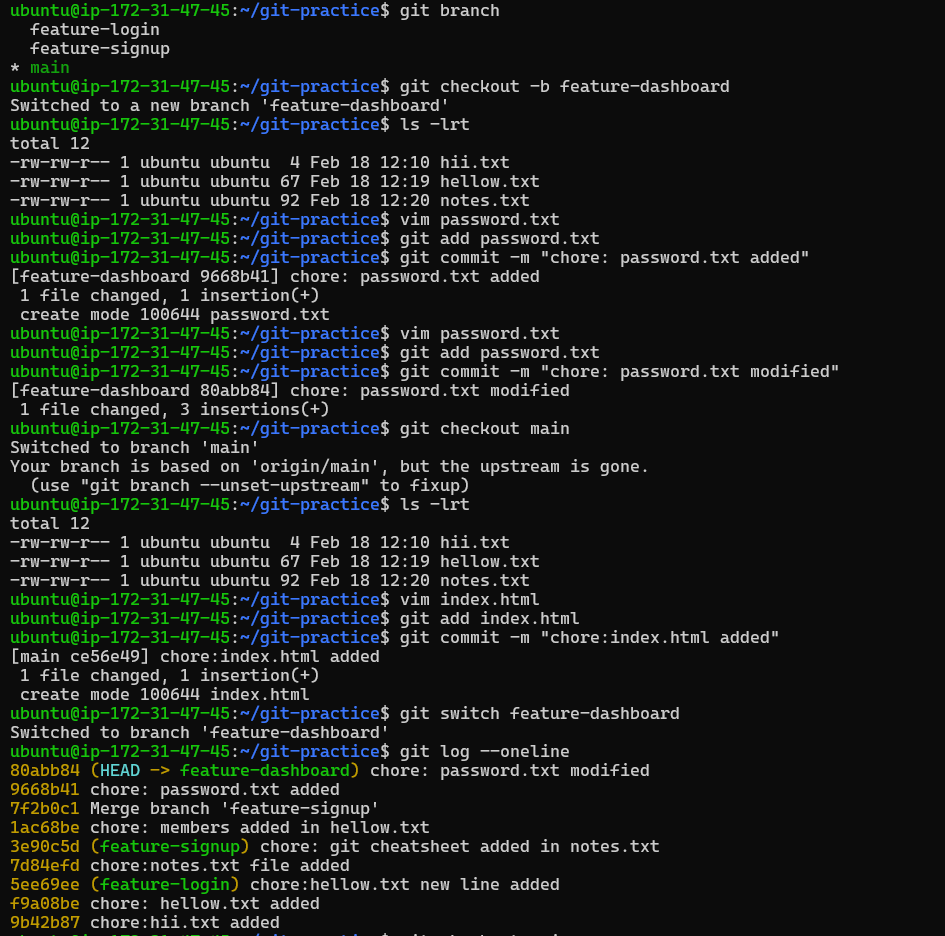

# Squash Commit vs Merge Commit

- Create a branch feature-profile, add 4-5 small commits & Merge it into main using --squash — what happens?

- a single commit history will be added to main for feature profile branch

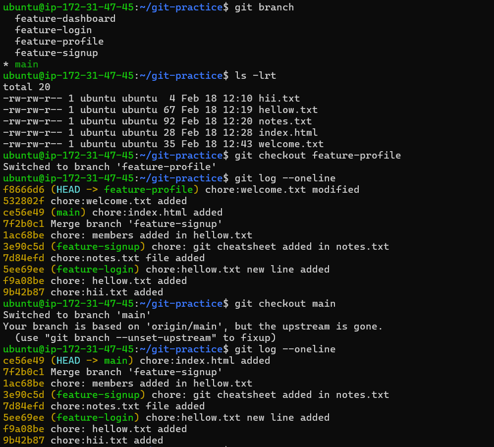

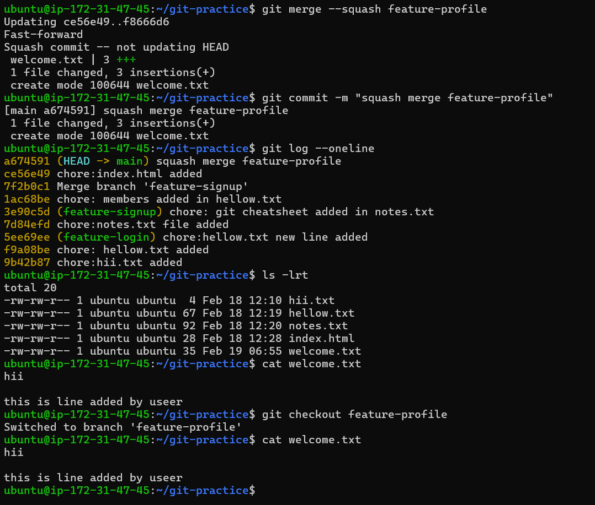

- created another branch feature-settings, add a few commits

- Merge it into main without --squash

- This time feature setting branch merge into main branch with all new commit history of feature-setting branch

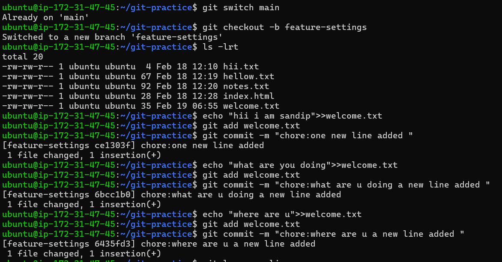

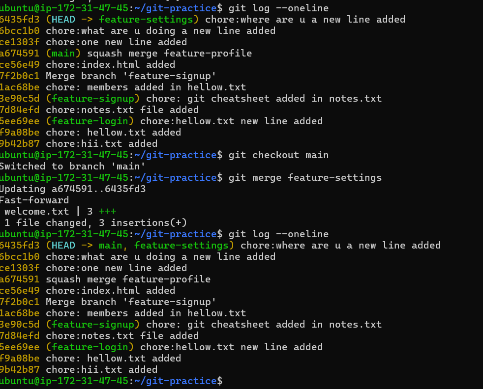

- **What does squash merging do**

    - squash merge wiil do a merge in other branch with a single commit history of that branch

- **When would you use squash merge vs regular merge**

    - when you want single commit history of that branch you should use squash merge 

    - & if you want complete details of commits of that branch you should use regular merge

- **What is the trade-off of squashing**

    - one commit per feature

# Git Stash

- Start making changes to a file but do not commit

- trying to Switch to another branch — but it ask for commit your last changes or stash so i dont want to commit a incomplete task so i will stack i.e hide these changes then i will able to switch branch

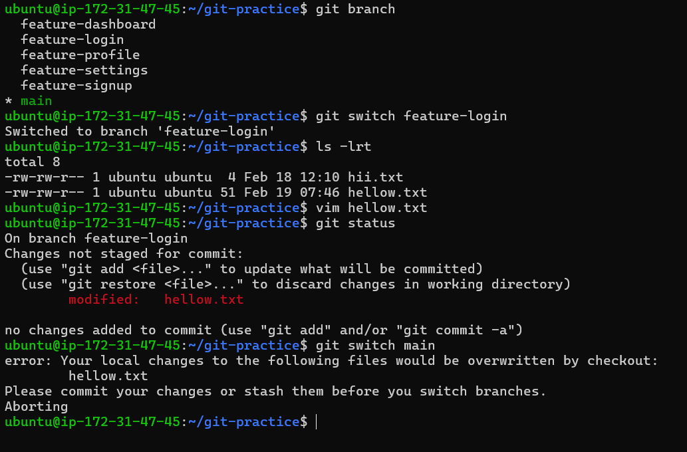

- Switch to another branch, do some work, switch back & Apply your stashed changes using git stash pop

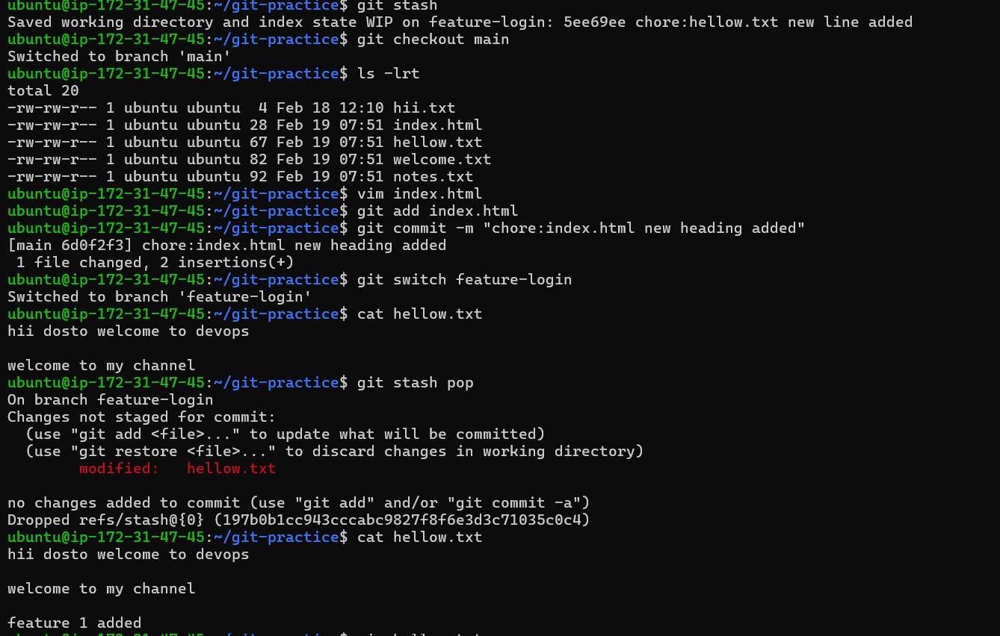

- Try stashing multiple times and list all stashes & Try applying a specific stash from the list

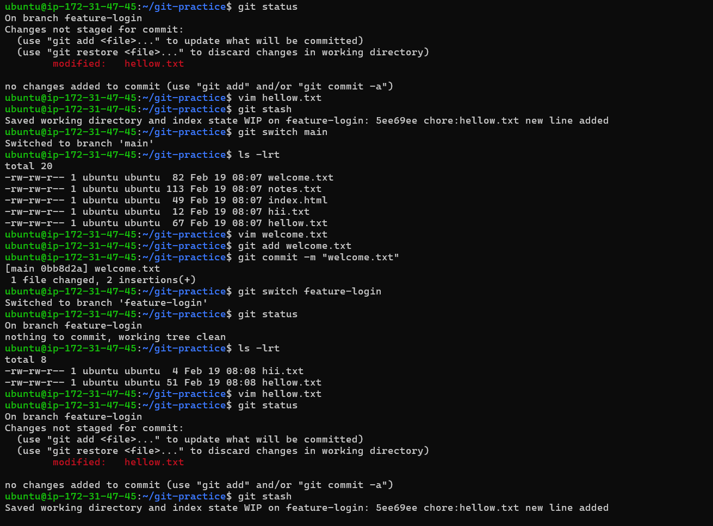

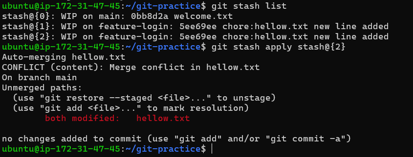

- **difference between git stash pop and git stash apply?**

`git stash pop stash@{1} - Restores changes & Removes the stash from the list`

`git stash apply stash@{1} - Restores changes & do not remove stash from the list`

- **When would you use stash in a real-world workflow**

    - You are working on branch dev & if any issue happens on main branch you need to fix it then you stack your incomplete work without commit in dev branch & then switch to main fix the bugs & then switch your dev branch & pop your imcomplete work

# Cherry Picking

- Create a branch feature-hotfix, make 3 commits with different changes

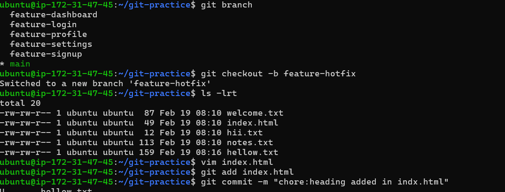

- Cherry-pick only the second commit from feature-hotfix onto main

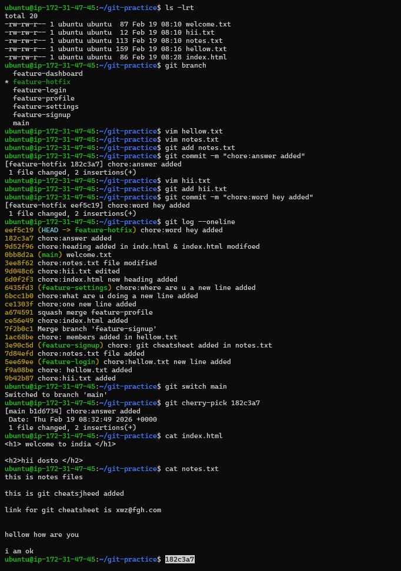

- Verify with git log that only that one commit was applied

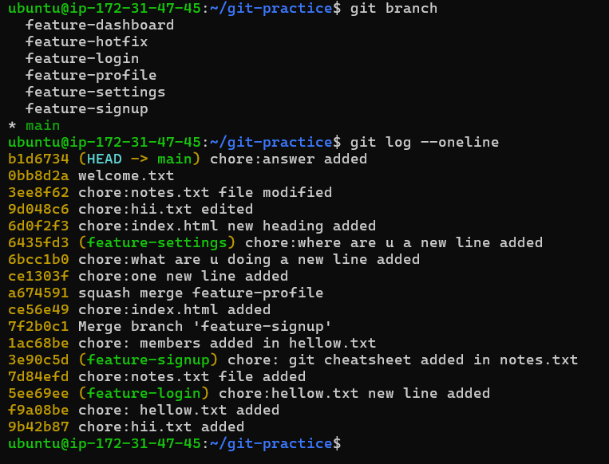

- **What does cherry-pick do?**

    - it allow you to pick only specific commit you want to merge in your branch from other branch

- **When would you use cherry-pick in a real project?**
    
    - if bugs happens in your production main branch you fix bugs in your dev branch & commit by changing config or code then instead of merging whole branch in production you would use cherry-pick to pick only that hotfix commit 

- **Cherry-pick creates a new commit with a new hash.Even though the code change is the same**

