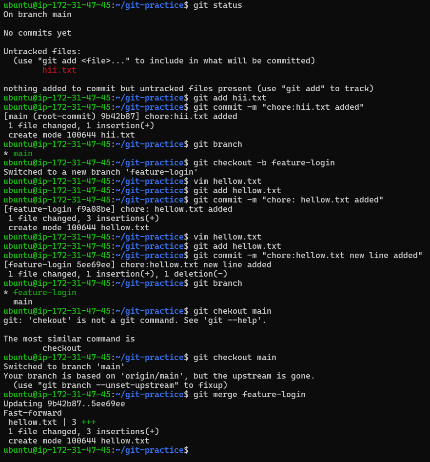
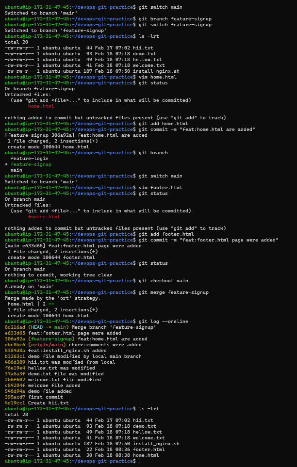
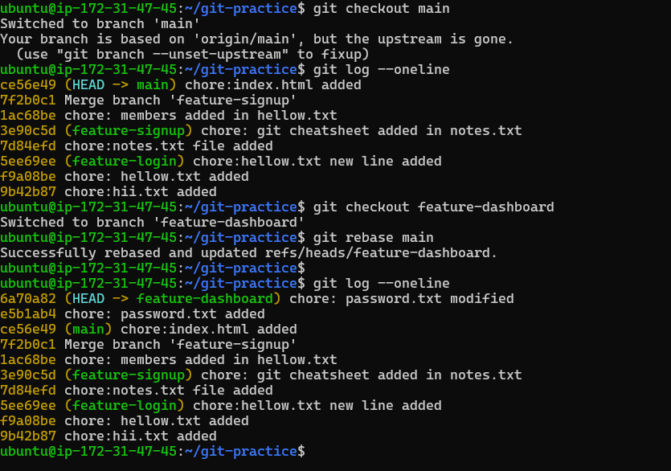

# Day 24 – Advanced Git: Merge, Rebase, Stash & Cherry Pick
---

# Git Merge — Hands-On

- Created feature-login branch from main, and add a couple of commits to it
- Switch back to main and merge feature-login into main
- **if there is no any new commit on main branch after creation of branch feature-login It will do a fast-forward merge & there is no merge log**

- created another branch feature-signup, add commits to it — but also add a commit to main before merging
- Merge feature-signup into main
- This time **merge commit happens** beacause  main branch have commit history after creation of branch feature-signup

- **fast-forward merge**

    - if there is no any new commit on main branch after creation of branch feature-login It will do a fast-forward merge & there   is no commmit history for merge

- **merge commit**

    - If main branch have commit history after creation of branch it will do a merge commit

- **merge conflict**

    - if same file has two version in diff branches & if we are trying to merge then resolve conflict manually 

# Git Rebase

- it makes your commit history linear on the top of another branch

