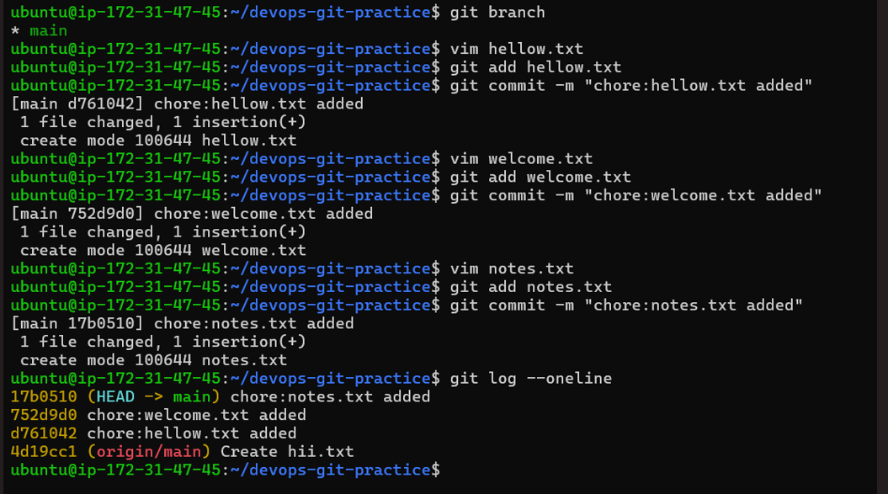
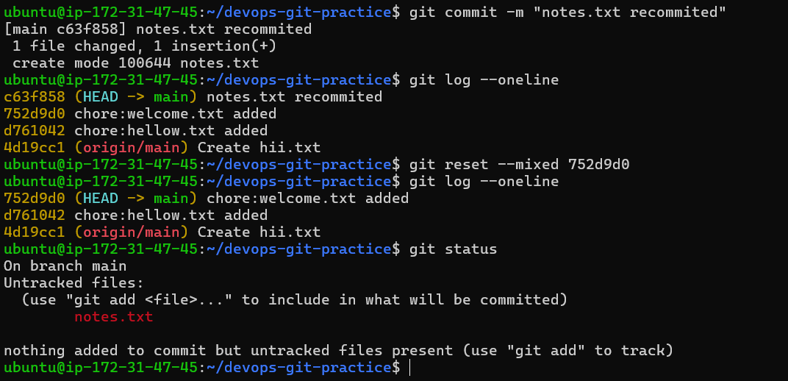
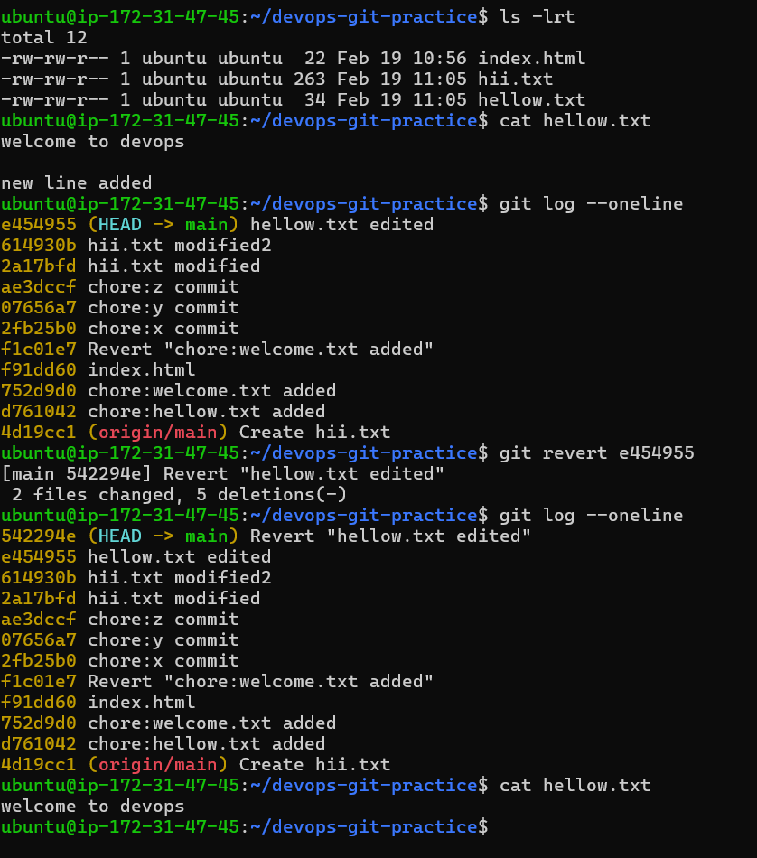

# Git Reset vs Revert & Branching Strategies

--- 

# Git Reset

- Make 3 commits

- Use **git reset --soft** to go back one commit — what happens to the changes?

- you go back to one commit and that commit reverse back to stagging area 

- Re-commit, then use **git reset --mixed** to go back one commit — what happens now?

- you go back to one commit & that commit changes reverse go back to untracked area 

- re-commit, then use **git reset --hard** to go back one commit — what happens this time?

- you go back to one commit & it removes changes also 

# Git Revert

- Make 3 commits
- Revert commit Y 
- but still y commit revert history in log

- **How is git revert different from git reset?**

**git revert**
    
    - git revert the commit but stil shows in commit history 

**git reset**

    - git reset used to remove commit history along with changes 

# Reset vs Revert — Summary

| | `git reset` | `git revert` |
|---|---|---|
| What it does                     | moves head pointer backward | create a new commit that undoes changes |
| Removes commit from history?     | yes                         | no                                      |
| Safe for shared/pushed branches? | no                          | yes                                     |
| When to use                      | locally revert before push  | revert changes in shared/pushed branches|

# Branching Strategies

- *GitFlow — develop, feature, release, hotfix branches*

main - (productio ready code)
  ↑
release/* (Pre-release)
  ↑
develop (multiple intergration branches merge code in develop branch)
  ↑
feature/*  (for adding New features)

    - *hotfix branches*

    - used to fix production issue 

    - *user for large teams*

- *GitHub Flow simple, single main branch + feature branches*

main
  ↑ PR → merge → deploy
feature-branch 

    - Used by those companies which have continuous deployment on GitHub

- *Trunk-Based Development — everyone commits to main, short-lived branches*

main (trunk)
  ↑
short-lived feature branches 

    - short live branches frequently merge into main branch 

    - used for mostly Microservices , devops teams etc 

*Which strategy would you use for a startup shipping fast?*
    - Trunk-Based Development or github flow 

*Which strategy would you use for a large team with scheduled releases?*
    - git flow

# Git Commands Reference Update

[git_cmd_sheet](90DaysOfDevOps\2026\day-22\git-commands.md)
