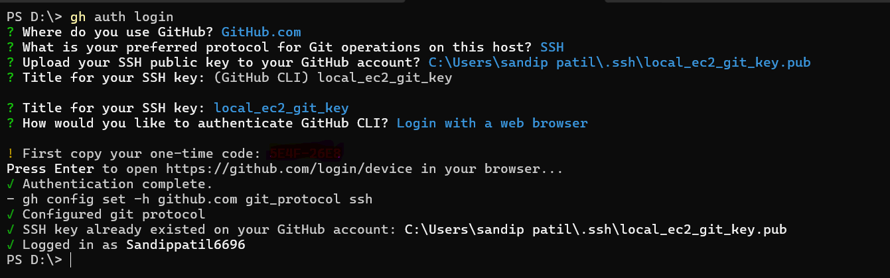
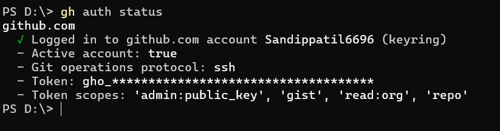
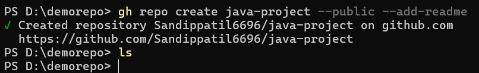
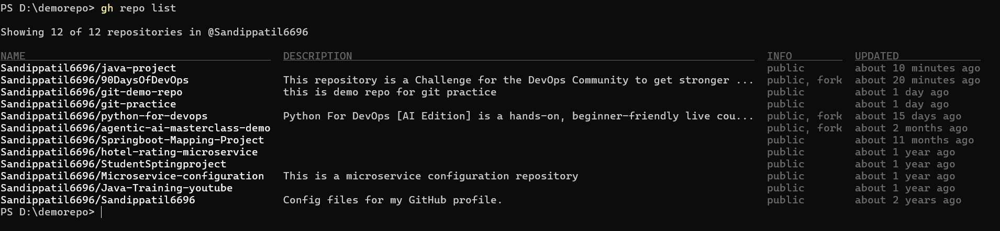
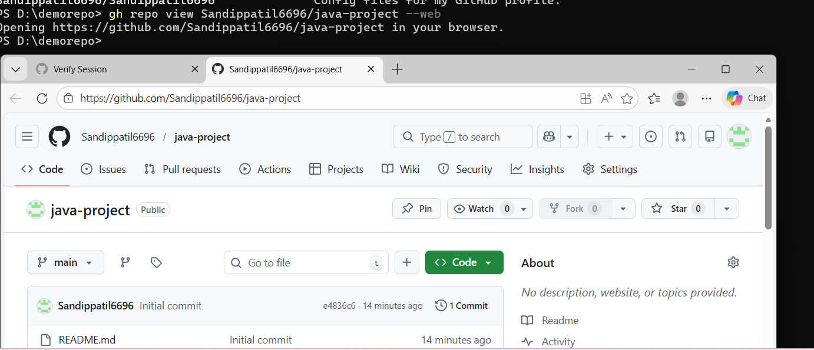
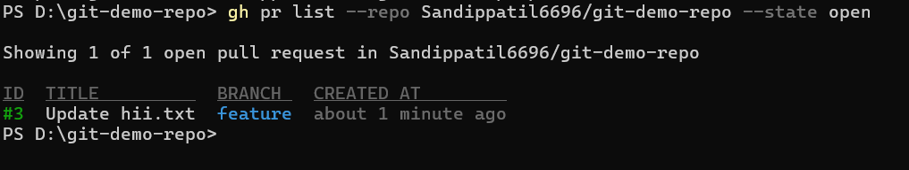
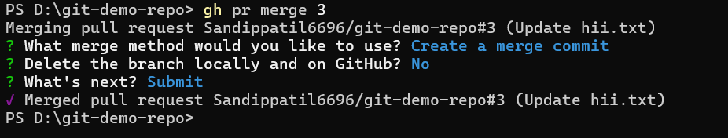

# Day26 – GitHub CLI: Manage GitHub from Your Terminal

---

- **Install and Authenticate**

    - for linux debian system `sudo apt update && sudo apt install gh -y`

    - for windows `winget install GitHub.cli`

    - to check version `gh --version`

    

    -  To Authenticate Sandippatil6696 `gh auth login`

    - To check auth status `gh auth status`

    

    

    - gh supports Browser-based Authentication , SSH ,PAT

**Working with Repositories**

- *Create a new GitHub repo directly from the terminal — make it public with a README*

    `gh repo create java-project --public --add-readme`

    

    

- *Clone a repo using gh instead of git clone*

    `gh repo clone Sandippatil6696/java-project`

    

- *list all your repo from github*

    `gh repo list`

    

- *Open a repo in your browser directly from the terminal*

    `gh repo view Sandippatil6696/java-project --web`

    

- *Delete the test repo you created*

    `gh repo delete Sandippatil6696/java-project`

    

- **Issues**

- *Create an issue on one of your repos from the terminal — give it a title, body, and a label*

    *gh issue create \
    --repo Sandippatil6696/git-demo-repo \
    --title "Add CI pipeline" \
    --body "We need to add a GitHub Actions workflow to automate build and testing." \

    

- *List all open issues on that repo*

    `gh issue list --repo Sandippatil6696/git-demo-repo --state open`

    

- *View a specific issue by its number*

    `gh issue view 2 --repo Sandippatil6696/git-demo-repo`

    

- *Close an issue from the terminal*

    `gh issue close 2 --repo Sandippatil6696/git-demo-repo  --comment "issue has been resolved"`
    
    

**Pull Requests**

- *Create a branch, make a change, push it, and create a pull request entirely from the terminal*

    `gh pr create -title "Update README" --body "This PR adds new line" --base main --head feature`

    

    

- *List all open PRs on a repo*

    `gh pr list --repo Sandippatil6696/git-demo-repo --state open`

    

- *View the details of your PR — check its status, reviewers, and checks*

    `gh pr view 3`

    

    `gh pr view 3 --json state,reviewDecision,reviewRequests,statusCheckRollup`

    

- *Merge your PR from the terminal*

    `gh pr merge 3`

    

- *What merge methods does gh pr merge support?*

    - Merge Commit
    - Squash Merge
    - Rebase Merge

- *How would you review someone else's PR using gh?*

    - gh pr list
    - gh pr view 3
    - gh pr checks 3
    - gh pr checkout 
    - git log
    - git diff
    - gh pr diff 3
    - gh pr review 3 --approve --body "request approve for changes"
