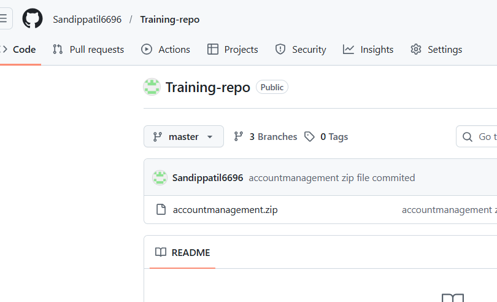

# Day 27 – GitHub Profile Makeover: Build Your Developer Identity

---

# Task 1: Audit Your Current GitHub Profile

- *Visit your own GitHub profile as if you were a stranger — what impression does it give?*

    - Not looks good just normal profile

- *Is your profile picture professional?*

    - not uploaded 

- *your bio filled in? Does it say what you do?*

    - Bio not uploaded

- *Are your pinned repos relevant, or are they random forks?*

    - not pimmed any repo

- *Do your repos have descriptions, or are they blank?*

    - some have one line discription other not have any description

- *Would a recruiter understand what you've been working on?*

    - no beacause i have not pinned any repo to show my work 

# Task 2: Create Your Profile README

- *Create a special repository with the same name as your GitHub username*

- *Add a README.md — this will appear on your profile page*

- *Include the following in your profile README:*

    - A short introduction — who you are, what you're learning
    - What you're currently working on (e.g., 90 Days of DevOps)
    - Skills/tools you know or are learning (Linux, Git, Python, Shell, etc.)
    - Links to your important repos
    - How to reach you (LinkedIn, Twitter, email — whatever you're comfortable sharing)

# Task 3: Organize Your Repositories

# Pin Your Best Repos

- Go to your GitHub profile

- Click on “Customize your pins”

- Select the repositories you want to show

- Click Save

# Clean Up

- Delete or archive repos that are empty, abandoned, or irrelevant
- Rename any repos with unclear names

-  i have rename this repo 

# Task 6: Before & After

-**Before**

-**After**

