# Day 29 – Introduction to Docker

---

- **Task 1: What is Docker**

    - What is a container and why do we need them?
        
        - Container is lightweight & contains your app code , libraries , configuration files whatever require for your app to run & it runs on any os 

    - Containers vs Virtual Machines — what's the real difference?

        - **virtual machines** - Needs pre allocated ram & vm runs complete os on the top of hypervisor 

        - **Containers** - Containers share the host os & runs on top of  container engine i.e docker engine

    - What is the Docker architecture? (daemon, client, images, containers, registry)

        - docker client - `talks with docker engine using docker daemon`

        - docker daemon - `it runs background processes`

        - docker registy - `to store images somewhere docker registry needs like dockhub`

        - image - `is an blueprint of an any application`

        - container - `it is running instance of image`

    
**Task 2: Install Docker**

- Install Docker on your machine

    - `sudo apt-get install docker.io`

- Verify the installation

    - `docker -v`

    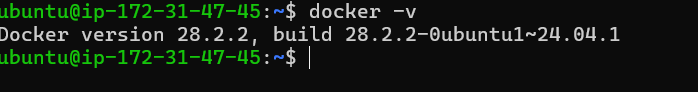

- Run the hello-world container

    - `docker run hello-world`

    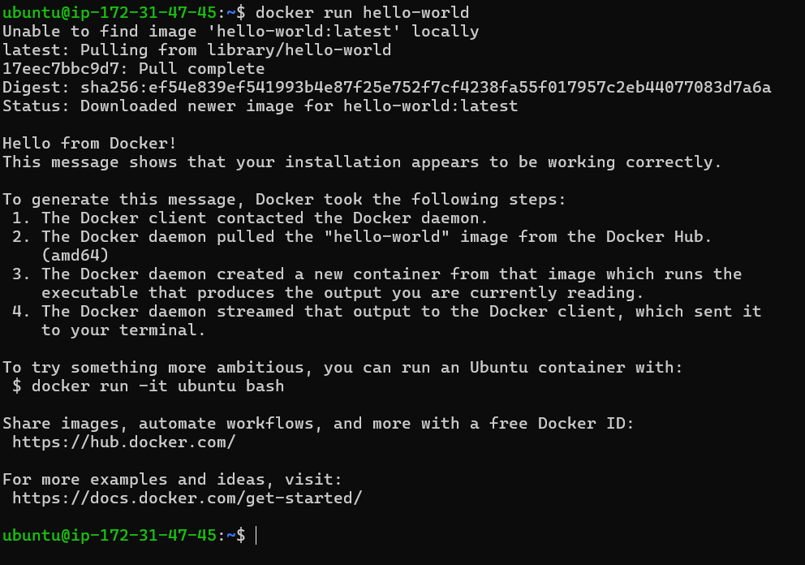

- Read the output carefully — it explains what just happened

    1. The Docker client contacted the Docker daemon.
    2. The Docker daemon pulled the "hello-world" image from the Docker Hub.
       (amd64)
    3. The Docker daemon created a new container from that image which runs the
       executable that produces the output you are currently reading.
    4. The Docker daemon streamed that output to the Docker client, which sent it
       to your terminal.

**Task 3: Run Real Containers**

- Run an Nginx container and access it in your browser

    - `docker run -d -p 80:80 nginx`

    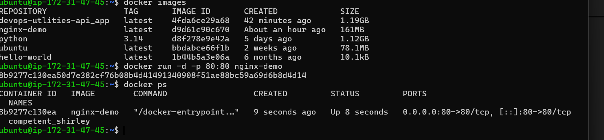

    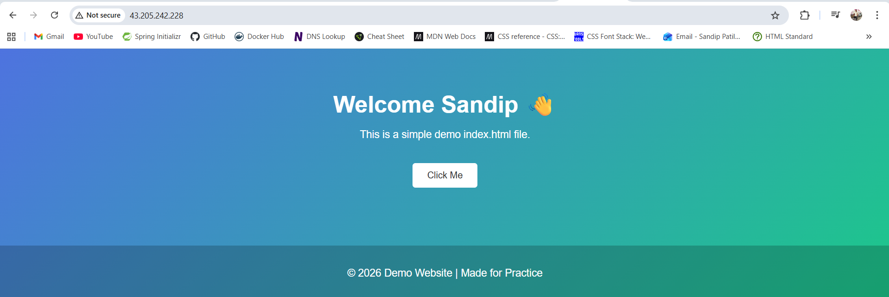

- Run an Ubuntu container in interactive mode — explore it like a mini Linux machine

    - `docker run -it -d ubuntu`

    - `docker exec -it <container-id> bash`

    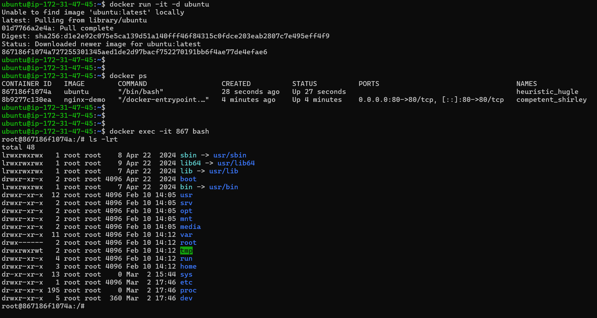

- List all running containers

    - `docker ps`

    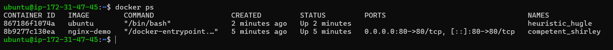

- List all containers (including stopped ones)

    - `docker ps -a`

    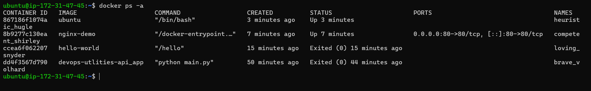

- Stop and remove a container

    - `docker stop <container-id> && docker rm <conatiner-id>`

    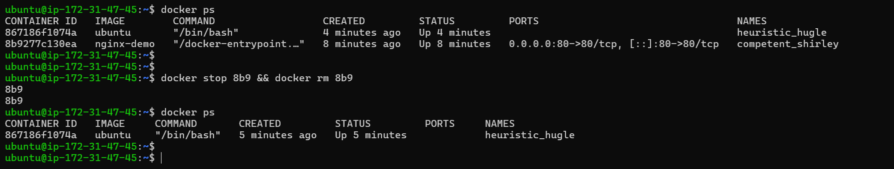

**Task 4: Explore**

- Run a container in detached mode — what's different?

    - `docker run -it -d ubuntu`

    - container runs in background

    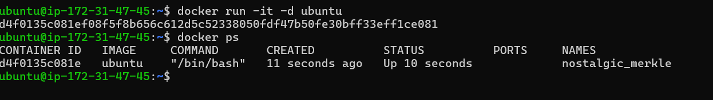

- Give a container a custom name

    - docker run -d --name <customname> <Image> 

    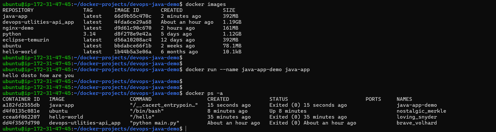

- Map a port from the container to your host

    - `docker run -d -p 80:80 nginx-demo`

    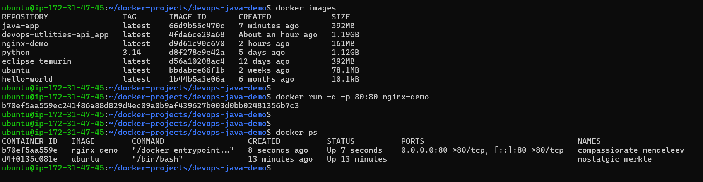

- Check logs of a running container

    - `docker logs <container-id>`

    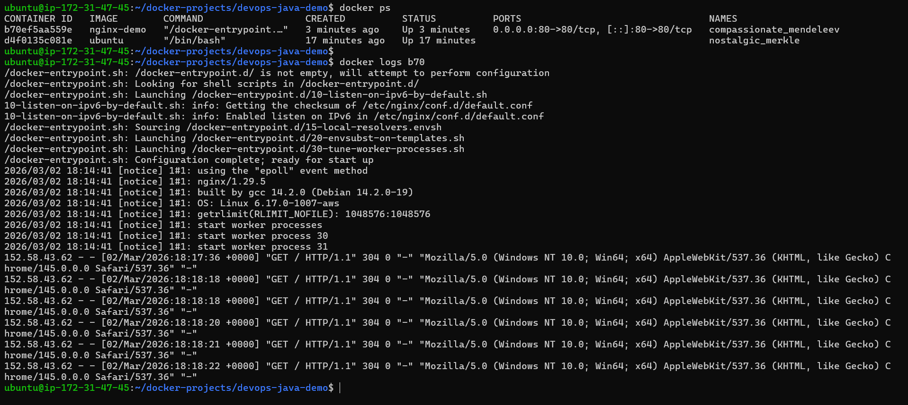

- Run a command inside a running container

    - `docker exec -it <container-id> bash`

    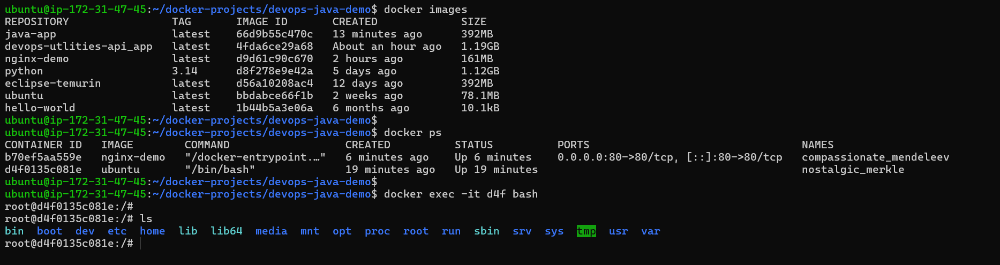

