# Day 30 – Docker Images & Container Lifecycle

**Task 1: Docker Images**

1. Pull the nginx, ubuntu, and alpine images from Docker Hub

    - `docker pull nginx`
    - `docker pull ubuntu`
    - `docker pull alpine`

2. List all images on your machine — note the sizes

    - `docker images`

    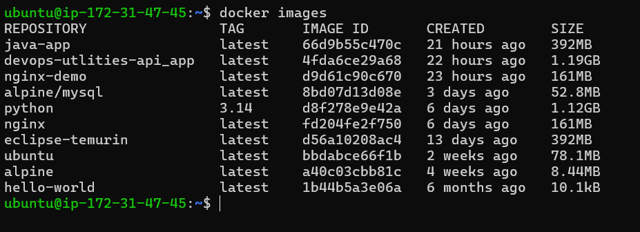

3. Compare ubuntu vs alpine — why is one much smaller?

    - alpine image is much smaller than ubuntu

4. Inspect an image — what information can you see?

    - `docker inspect ubuntu`

    - it shows detailed information about your container like cmds , layers , image used

5. Remove an image you no longer need

    - `docker rmi <images>`

**Task 2: Image Layers**

1. Run docker image history nginx — what do you see?

    - `docker image history nginx`

    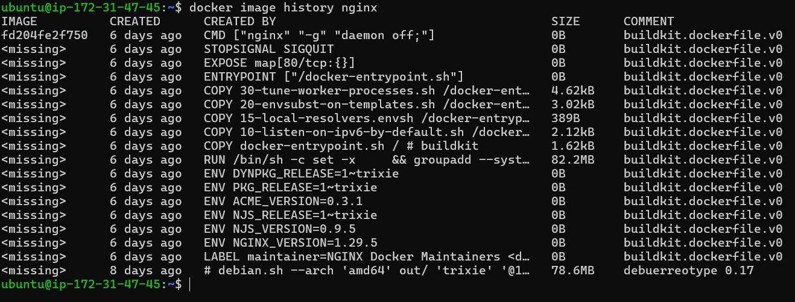

2. Each line is a layer. Note how some layers show sizes and some show 0B

    - Layers show 0B when 
        
        - you run CMD 
        - while changing env 
        - while showing metadata
        - setting configuration 

    - Some layers shows size 

        - while installing packages 
        - while copying workdir 
        - while modifying filesystem
    
3. Write in your notes: What are layers and why does Docker use them?

    - Each line in dockerfile is layer 
    - docker used them for faster build , smaller storage ,fater pull 

**Task 3: Container Lifecycle**

1. Create a container (without starting it)

    - `docker create <image>`

    - it shows created only not run container

    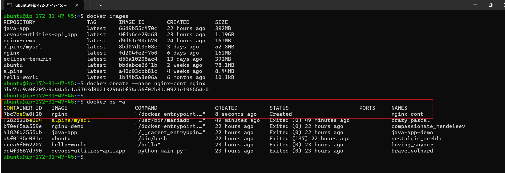

2. Start the container

    - `docker start <containerid>`

    - its shows container is running 

    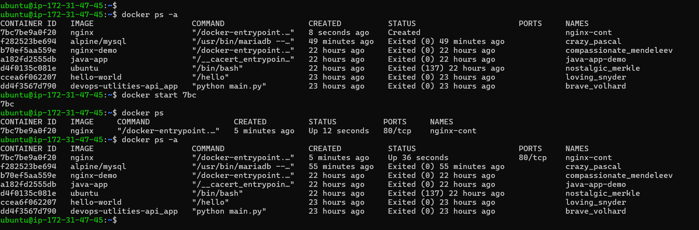

3. Pause it and check status

    - `docker pause <containerid>`

    - it will pause the container

    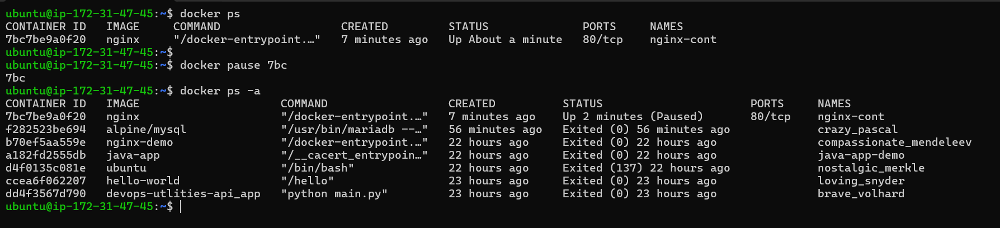

4. Unpause it

    - `docker unpause <containerid>`

    - it will unpause conatiner & con. running 

    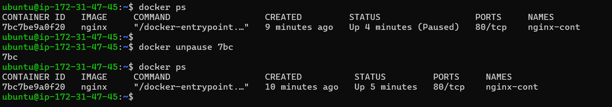

5. Stop it

    - `docker stop <containerid>`

    - it will stop the conatiner

    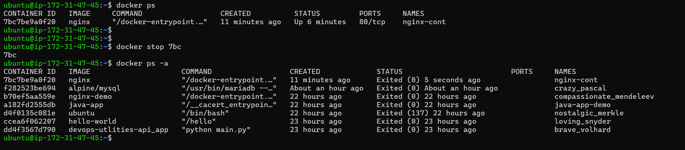

6. Restart it

    - `docker restart <containerid>`

    - it will restart the conatiner 

    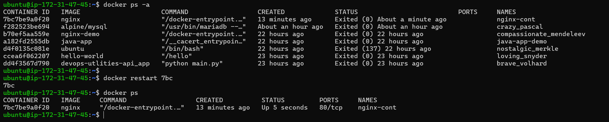

7. Kill it

    - `docker kill <containerid>`

    - it will kill the container

    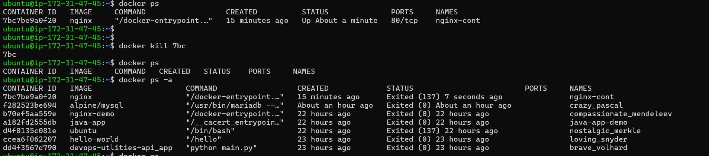

8. Remove it

    - `docker rm <containerid>`

    - it will remove container 

    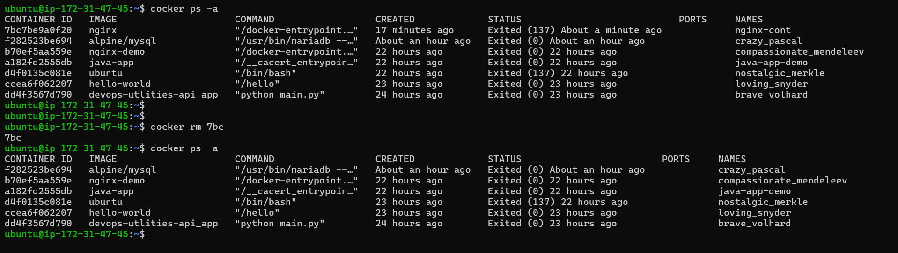

**Task 4: Working with Running Containers**

1. Run an Nginx container in detached mode

    - `docker run -itd nginx`

    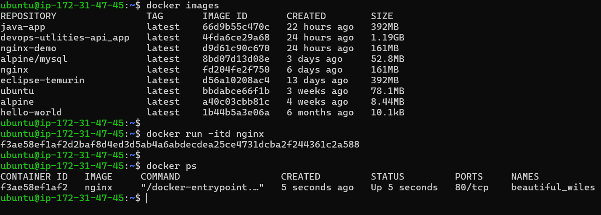

2. View its logs

    - `docker logs <containerid>`

    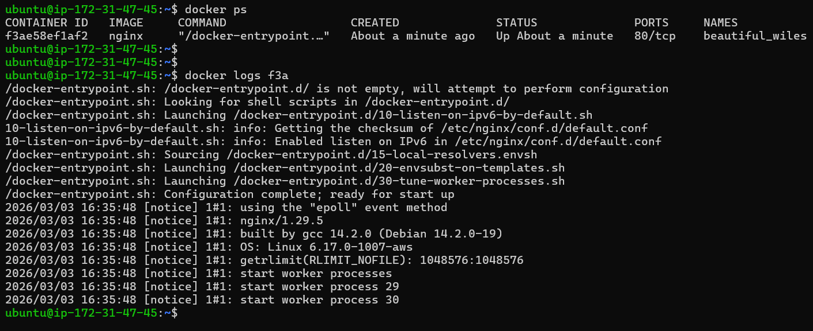

3. View real-time logs (follow mode)

    - `docker logs -f <containerid>`

    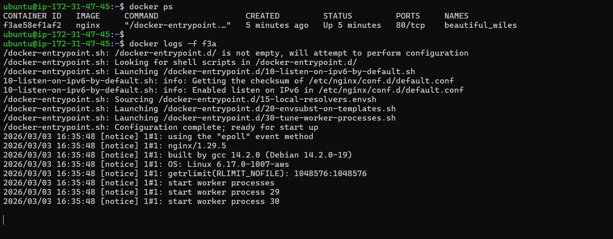

4. Exec into the container and look around the filesystem

    - `docker exec -it <containerid> bash`

    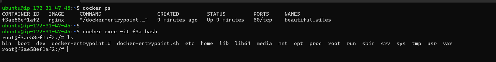

5. Run a single command inside the container without entering it

    - `docker exec <containerid> nginx -v`

    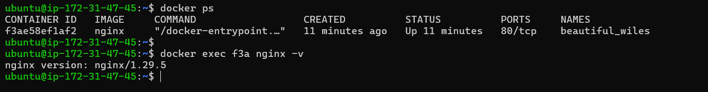

6. inspect the container — find its IP address, port mappings, and mounts

    - `docker inspect <containerid>`

    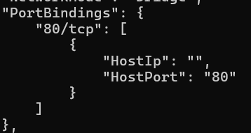

    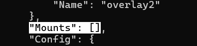

    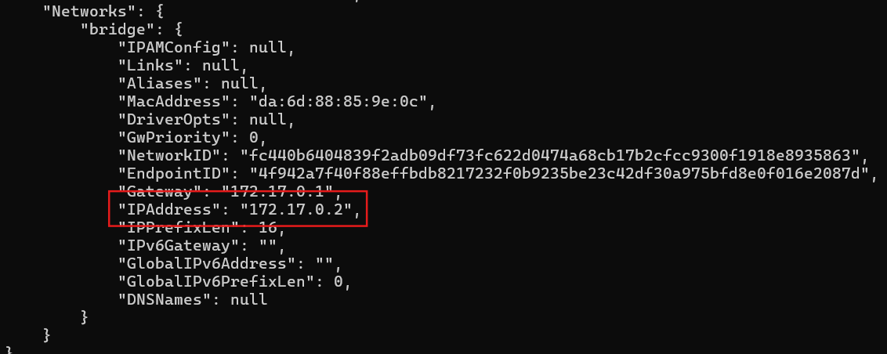

**Task 5: Cleanup**

1. Stop all running containers in one command

    - `docker stop $(docker ps -q)`

    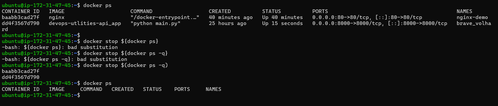

2. Remove all stopped containers in one command

    - `docker container prune`

    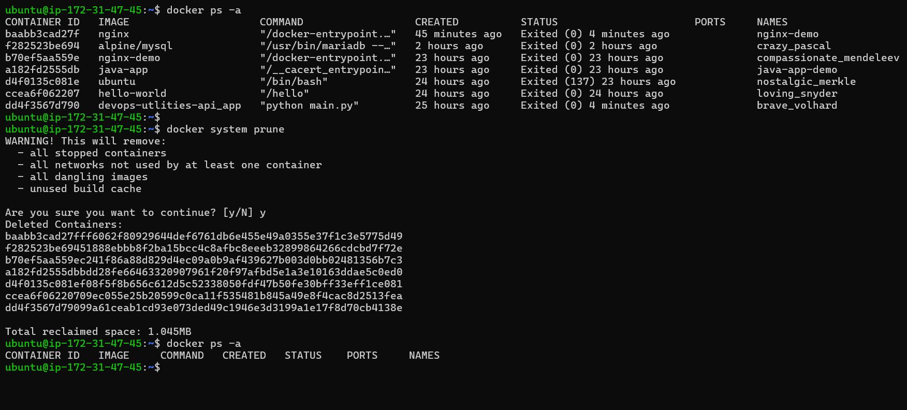

    - `docker system prune`

    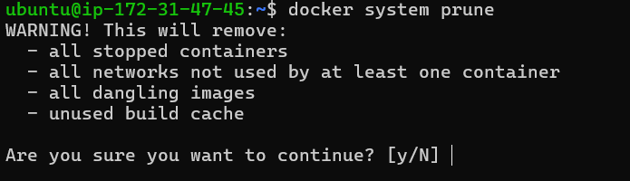

3. Remove unused images

    - `docker image prune`

4. Check how much disk space Docker is using

    - `docker system df `

    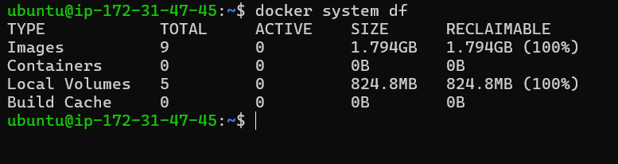

