# Day 31 – Dockerfile: Build Your Own Images

**Task 1: Your First Dockerfile**

1. Create a folder called my-first-image

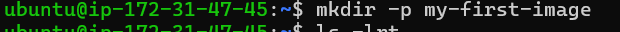

2. Inside it, create a Dockerfile that:
    - Uses ubuntu as the base image
    - Installs curl
    - Sets a default command to print "Hello from my custom image!"

    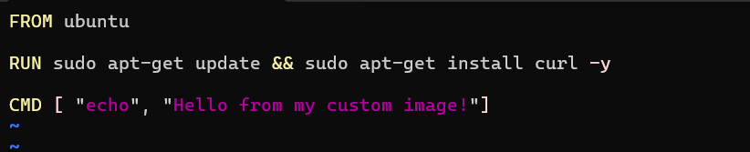

3. Build the image and tag it my-ubuntu:v1

    - `docker build -t my-ubuntu:v1`

    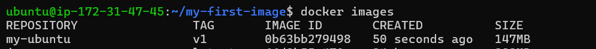

4. Run a container from your image

    - `docker run my-ubuntu:v1`

    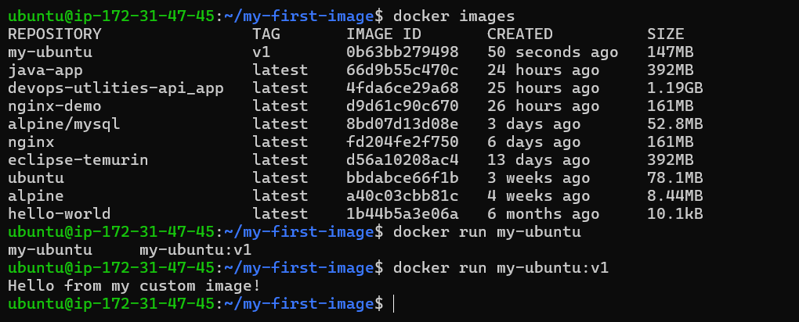

**Task 2: Dockerfile Instructions**

- FROM — base image
- RUN — execute commands during build
- COPY — copy files from host to image
- WORKDIR — set working directory
- EXPOSE — document the port
- CMD — default command

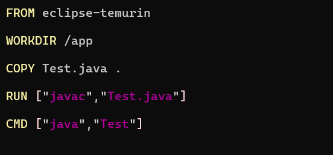

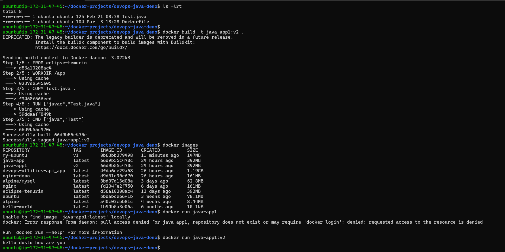

**Task 3: CMD vs ENTRYPOINT**

1. Create an image with CMD ["echo", "hello"] — run it

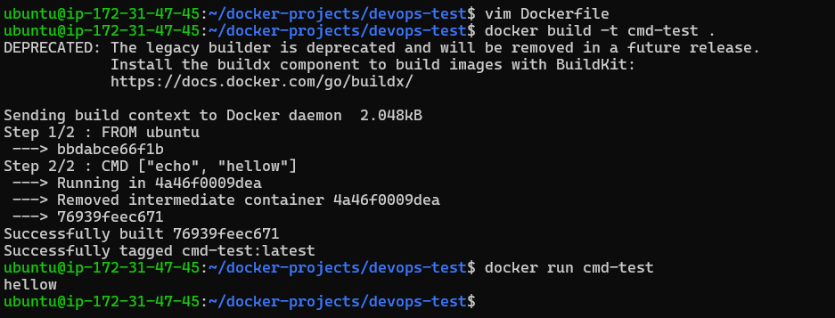

- then run it with a custom command. What happens?

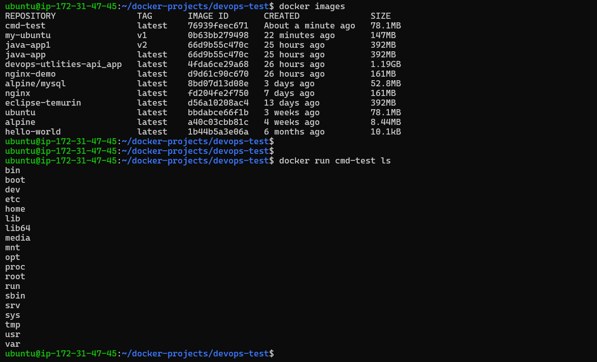

2. Create an image with ENTRYPOINT ["echo"] — run it, 

- It prints nothing because echo doen't have argument 

- then run it with additional arguments. it will print argument that you passed 

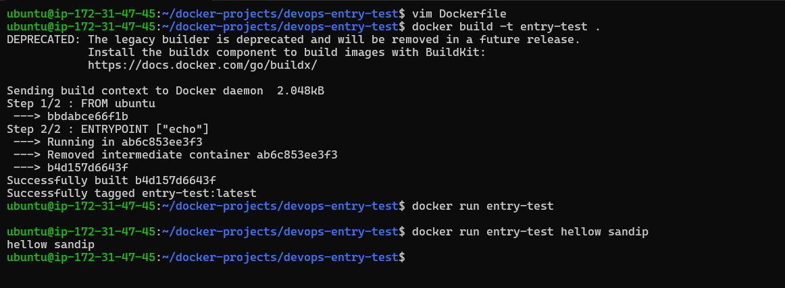

3. Write in your notes: When would you use CMD vs ENTRYPOINT?

- CMD : when you want to provide default cmd 

- ENTRYPOINT : when you want to provide fixed main cmd  

**Task 4: Build a Simple Web App Image**

1. Create a small static HTML file (index.html) with any content

2. Write a Dockerfile that:
    - Uses nginx:alpine as base
    - Copies your index.html to the Nginx web directory

    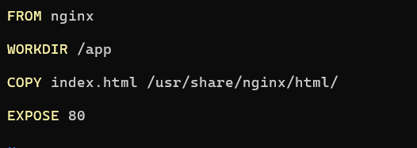

3. Build and tag it my-website:v1

    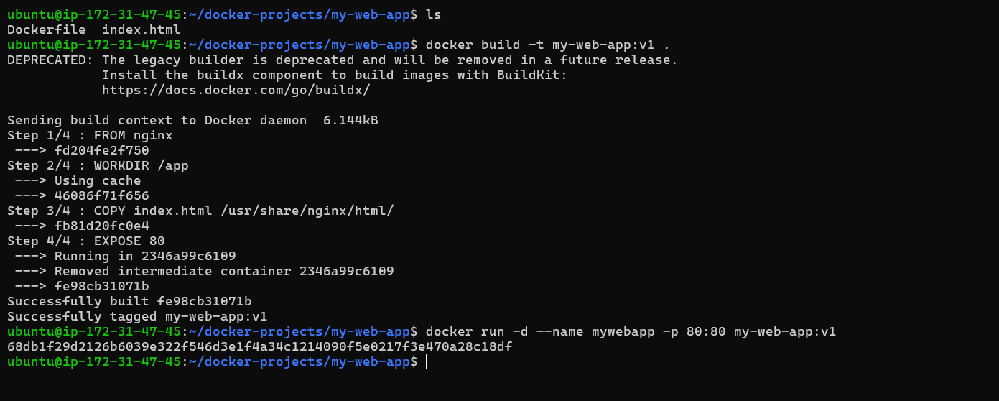 
 
4. Run it with port mapping and access it in your browser

    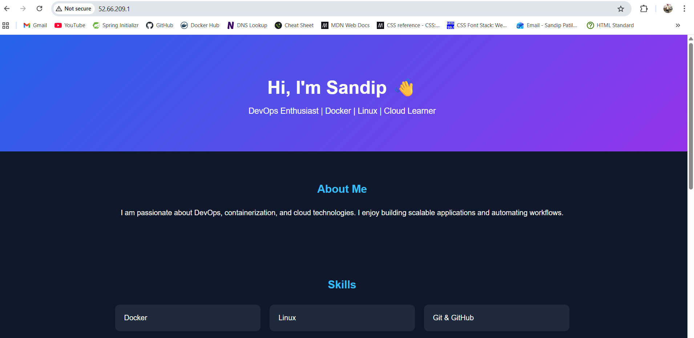

**Task 5: .dockerignore**

1. Create a .dockerignore file in one of your project folders

2. Add entries for: node_modules, .git, *.md, .env

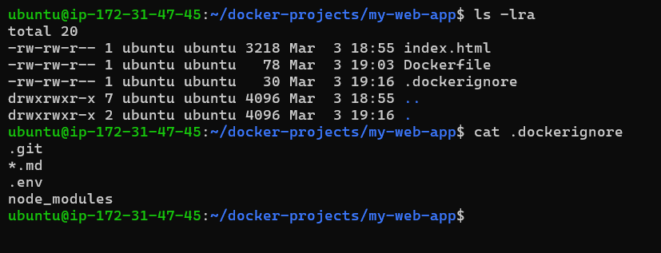

3. Build the image — verify that ignored files are not included

`docker build -t mywebsite:v1`

`docker run -itd -p 80:80 mywebsite:v1`

`docker exec -it <containerid> bash`

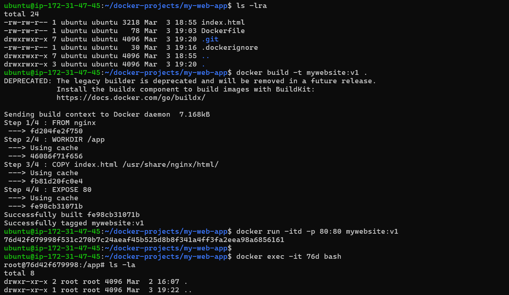

**Task 6: Build Optimization**

1. Build an image, then change one line and rebuild — notice how Docker uses cache

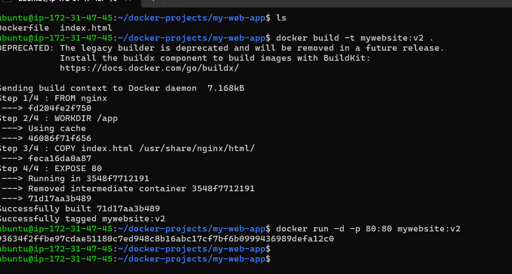

2. Reorder your Dockerfile so that frequently changing lines come last

`FROM nginx → less changes`

`EXPOSE 80 → rarely changes`

`WORKDIR /app → less changes`

`COPY index.html → changes frequently`

- i have re-arrange my dockerfile so it will build fast after changes in code 

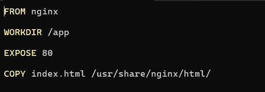

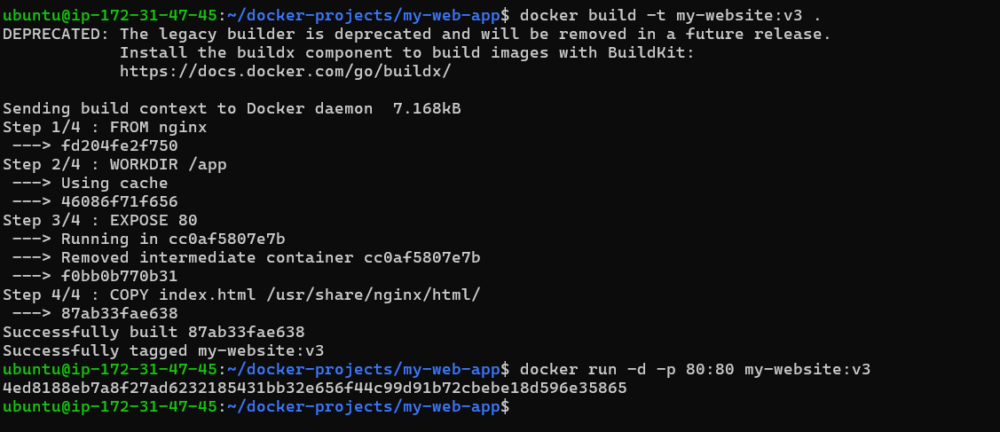

3. Write in your notes: Why does layer order matter for build speed?

- Each line in dockerfile creates a layer 
- docker uses cache for build image if no changes 
- & put your frequently changes code in last line 
- So your image build faster 

