# Day 32 – Docker Volumes & Networking

**Task 1: The Problem**

1. Run a Postgres or MySQL container

    ` docker run -d -e MYSQL_ROOT_PASSWORD=root -p 3306:3306 mysql `

2. Create some data inside it (a table, a few rows — anything)

    - `docker exec -it f58 bash`

    - `mysql -u root -p`

    - `show databases;`

    - `create database studentinfo;`

    - `CREATE TABLE students (`
      `id INT AUTO_INCREMENT PRIMARY KEY,`
      `name VARCHAR(100),`
      `age INT,`
      `email VARCHAR(100)`
      `);`

    - `INSERT INTO students (name, age, email)`
      `VALUES ('Sandip', 22, 'sandip@gmail.com');`

    - `select * from students;`

    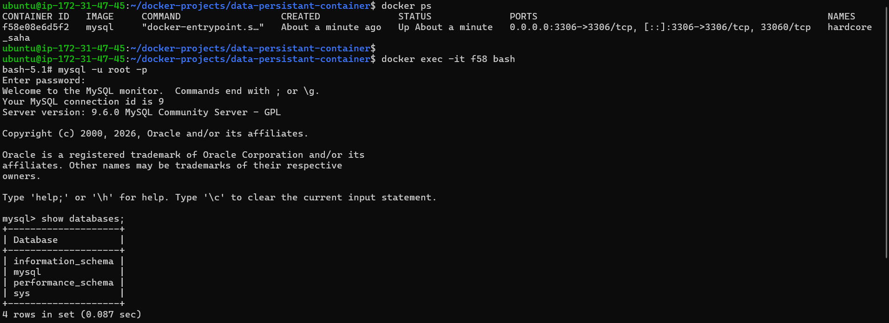

    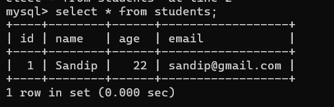

3. Stop and remove the container

    `docker stop <con.id> && docker rm <con.id>`

4. Run a new one — is your data still there?

    - my data was gone 

    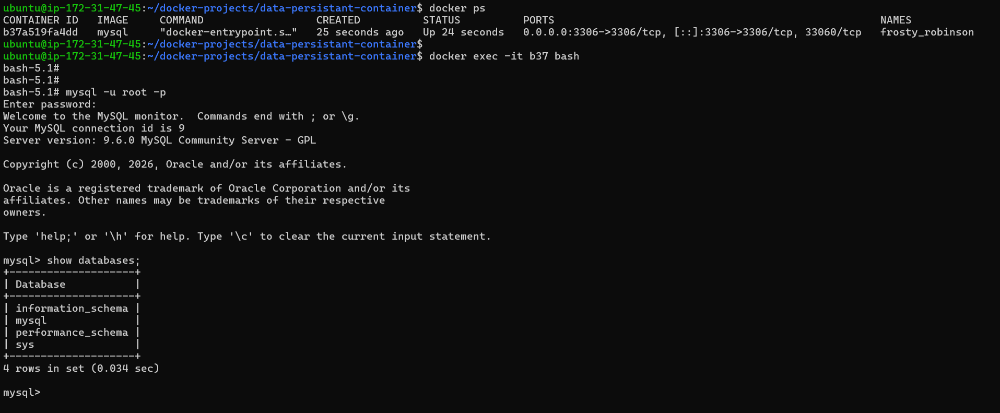

**Task 2: Named Volumes**

1. Create a named volume

    `docker create volume mysql-data`

    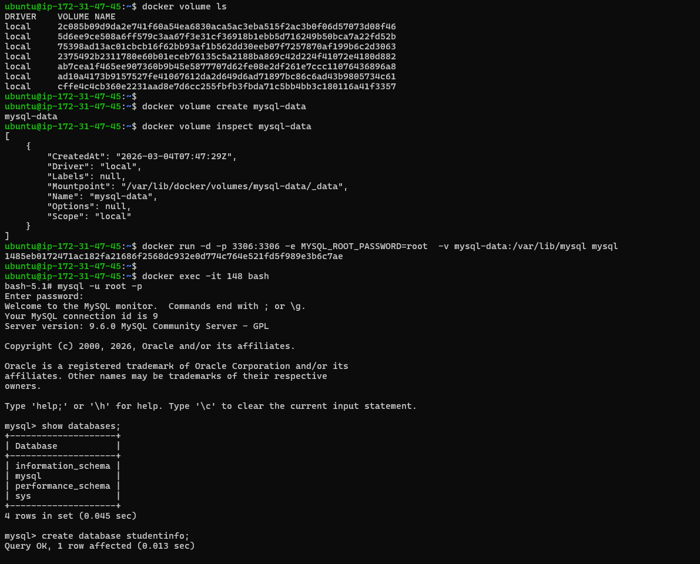

2. Run the same database container, but this time attach the volume to it

    `docker run -d -p 3306:3306 -e MYSQL_ROOT_PASSWORD=root  -v mysql-data:/var/lib/mysql mysql`

3. Add some data, stop and remove the container

    `docker stop <con.id> && docker rm <con.id>`

    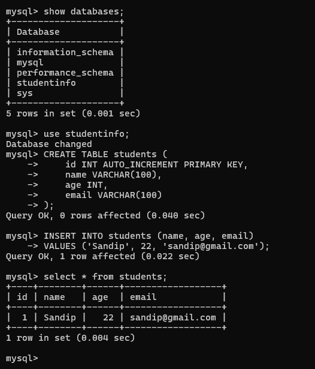

    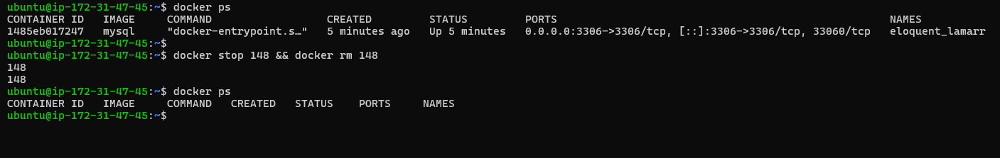

4. Run a brand new container with the same volume

    `docker run -d -p 3306:3306 -e MYSQL_ROOT_PASSWORD=root  -v mysql-data:/var/lib/mysql mysql`

    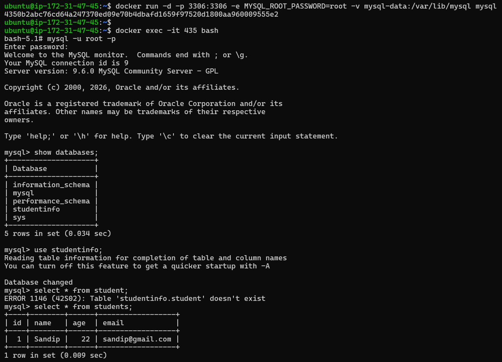

5. Is the data still there?

    - Data will be there & persistant 

    `docker volume ls`

    `docker volume inspect mysql-data`

    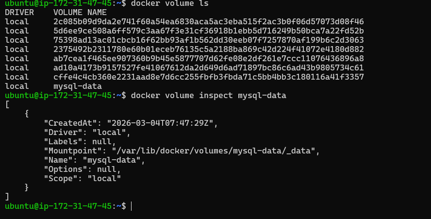

**Task 3: Bind Mounts**

1. Create a folder on your host machine with an index.html file

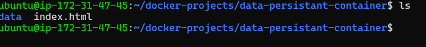

2. Run an Nginx container and bind mount your folder to the Nginx web directory

    `docker run -d -p 80:80 -v /home/ubuntu/docker-projects/data-persistant-container:/usr/share/nginx/html nginx`

    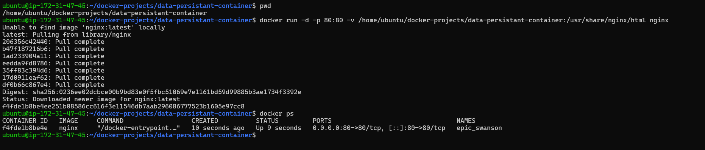

3. Access the page in your browser

    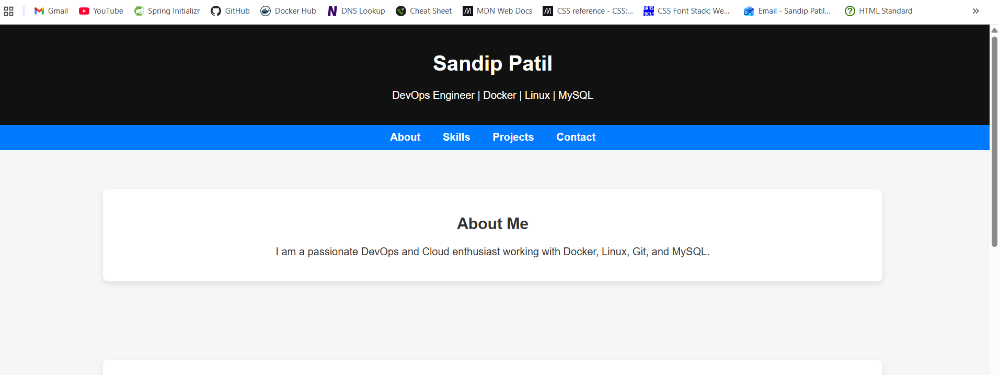

4. Edit the index.html on your host — refresh the browser 

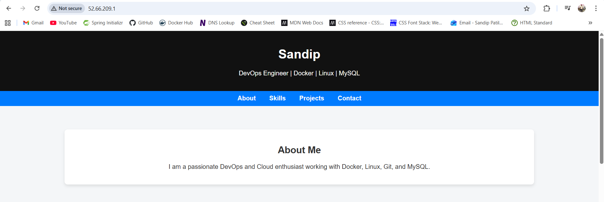

5. What is the difference between a named volume and a bind mount?

- named volume managed by docker 
- location for named volume on host is : `/var/lib/docker/volumes`

- bind volume managed by you 
- location for bind volume is directory where you want to bind data i.e custom directory created by you to bind 

**Task 4: Docker Networking Basics**

1. List all Docker networks on your machine

    `docker network ls`

    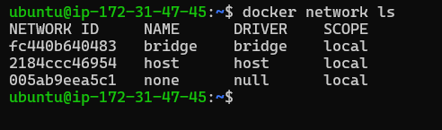

2. Inspect the default bridge network

    `docker inspect <network-id>`

    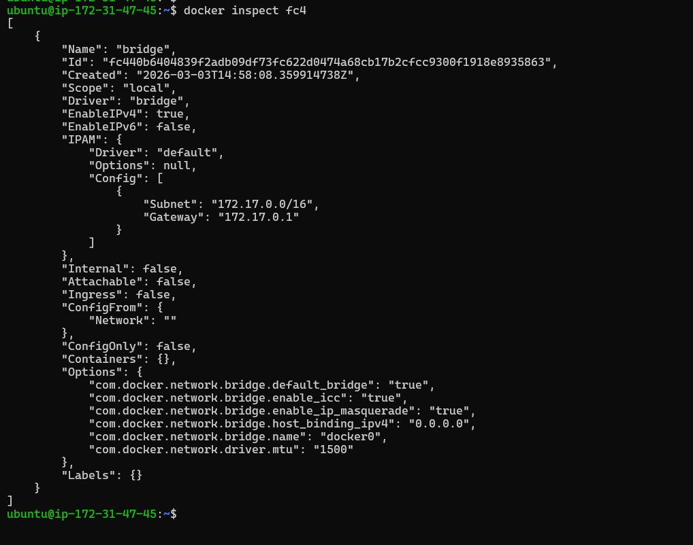

3. Run two containers on the default bridge — can they ping each other by name?

    `docker run -d -p 80:80 --network=bridge nginx`

    `docker run -d -p 3306:3306 -e MYSQL_ROOT_PASSWORD=root --network=bridge mysql `

    `docker run -d --network=bridge ubuntu`

    - you **cannot** ping a container by **name** in same default network
   

4. Run two containers on the default bridge — can they ping each other by IP?

    - you **can** ping a container by **IP** in same default network

     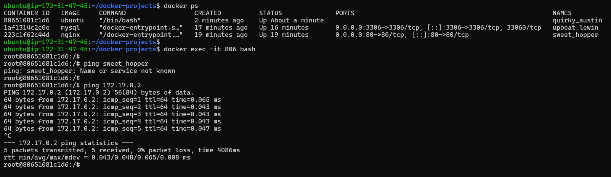

**Task 5: Custom Networks**

1. Create a custom bridge network called my-app-net

    - `docker network create my-app-net `

    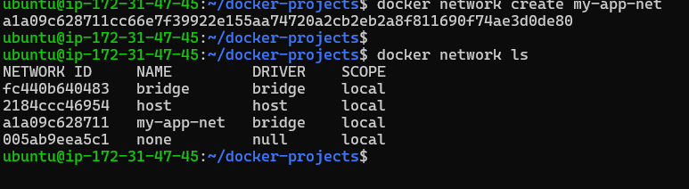

2. Run two containers on my-app-net

    - `docker run -itd --network=my-app-net ubuntu`

    - `docker run -d -p 80:80 --network=my-app-net nginx:latest`

3. Can they ping each other by name now?

    - *In custome bridge n/w you can ping by both name & ip*

    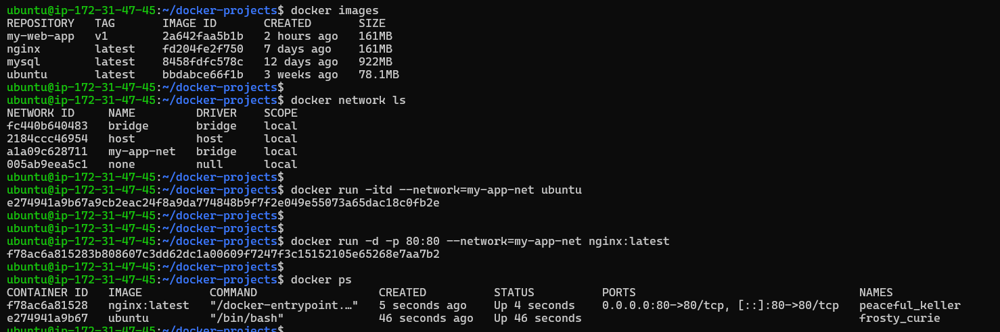

    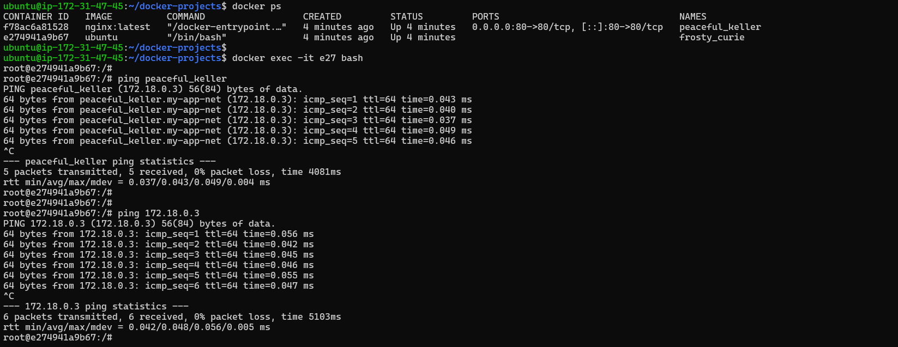

4. Write in your notes: Why does custom networking allow name-based communication but the default bridge doesn't?

    - *default bridge n/w*

        - It will created automatically when docker installed 
        - It will not provide automatic DNS resolution 
        - Container will communicate using ip addresses

    - *custome network*

        - It will manually created 
        - it will provide embeddeed DNS server
        - So it provide name to ip resolution 

**Task 6: Put It Together**

1. Create a custom network

    - `docker network create my-net`

      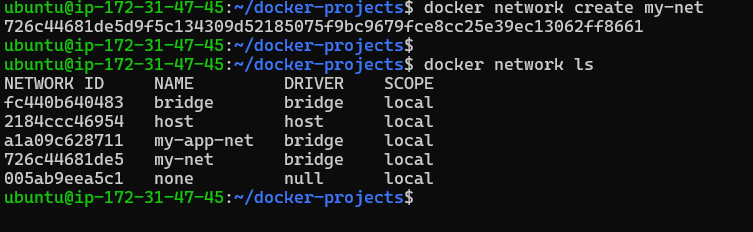

2. Run a database container (MySQL/Postgres) on that network with a volume for data

    - `docker run -d -p 3306:3306 -e MYSQL_ROOT_PASSWORD=root --network=my-net mysql:latest`

3. Run an app container (use any image) on the same network

    - `docker run -itd --network=my-net ubuntu:latest`

4. Verify the app container can reach the database by container name

    - Install ping package first 

     `apt update && apt install iputils-ping -y`

    - yes app conatiner reach mysql DB by container name
    
    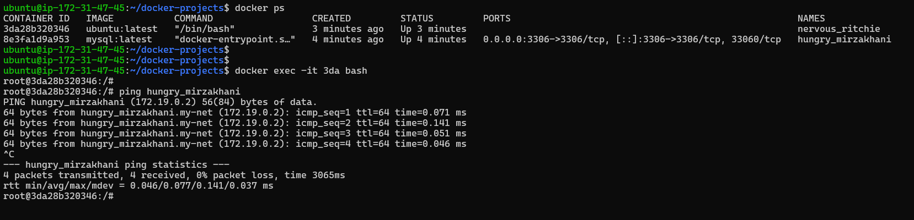