# Day 33 – Docker Compose: Multi-Container Basics

*Task 1: Install & Verify*

- `sudo apt install docker-compose-v2`

- `docker-compose -v`

*Task 2: Your First Compose File*

1. Create a folder compose-basics

2. Write a docker-compose.yml that runs a single Nginx container with port mapping

    `docker-compose.yml`

3. Start it with docker compose up

    `docker compose up`

4. Access it in your browser

    

5. Stop it with docker compose down

    `docker compose down`

*Task 3: Two-Container Setup*

- A WordPress container
- A MySQL container

    `docker-compose.two.yml`

 They should:

- Be on the same network (Compose does this automatically)
- MySQL should have a named volume for data persistence
- WordPress should connect to MySQL using the service name
- Start it, access WordPress in your browser, and set it up.

    `docker compose -f docker-compose.two.yml up`

    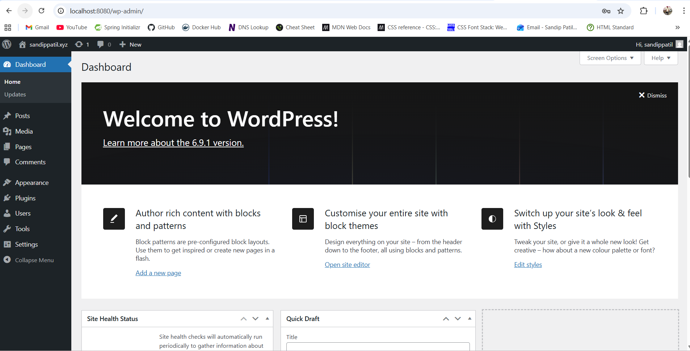

- Verify: Stop and restart with docker compose down and docker compose up — is your WordPress data still there?    

    - I have created a draft 

    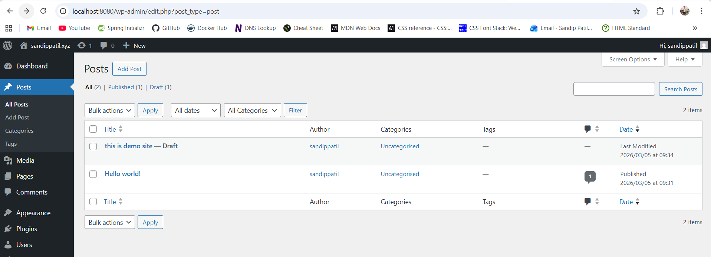

    - I have stop containers 

    `docker compose down`

    - I have restarted docker containers and data is still there 

    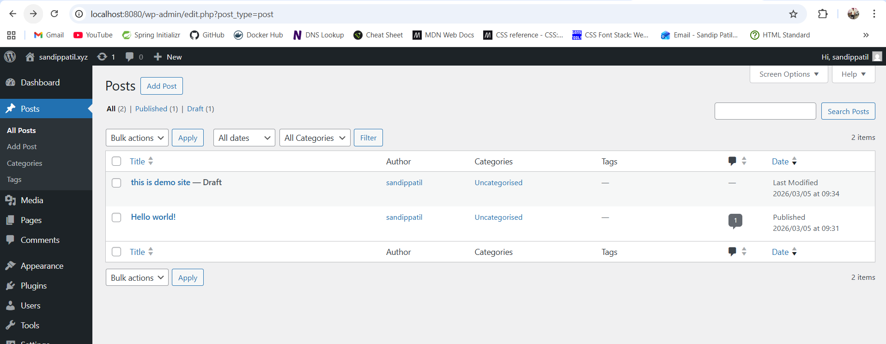

*Task 4: Compose Commands*

1. Start services in detached mode

    `docker compose -f docker-compose.two.yml up -d `

    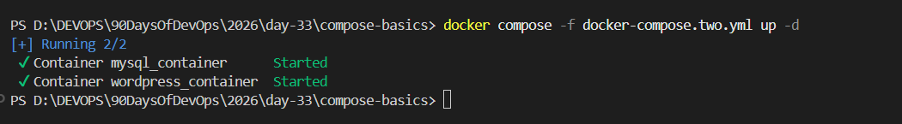

2. View running services

    `docker compose ps`

    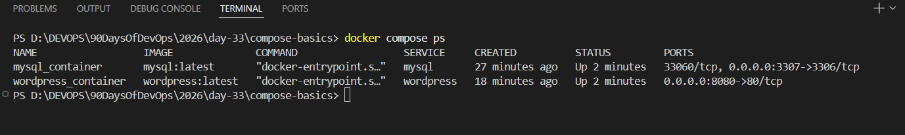

3. View logs of all services

    `docker compose -f docker-compose.two.yml logs`

    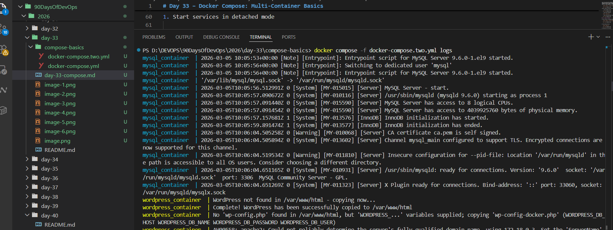

4. View logs of a specific service

    `docker compose -f docker-compose.two.yml logs mysql`

    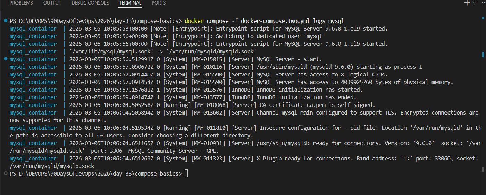

5. Stop services without removing

    `docker compose -f docker-compose.two.yml stop <service name>`
    `docker compose -f docker-compose.two.yml start <service name>`

    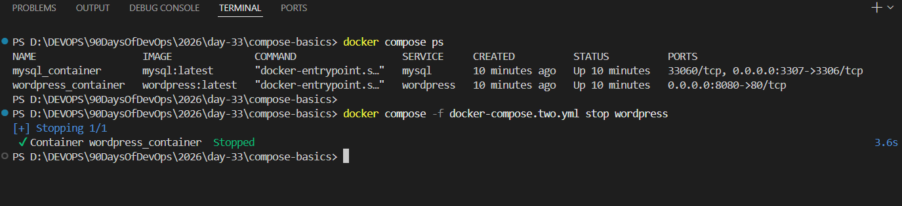

    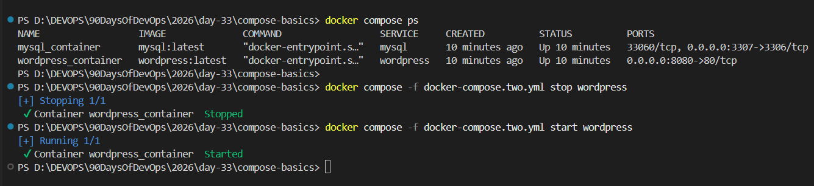

6. Remove everything (containers, networks)

    `docker compose -f docker-compose.two.yml down`

    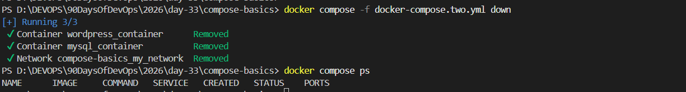

7. Rebuild images if you make a change

    `docker compose up -d --build`

*Task 5: Environment Variables*

- Add environment variables directly in your docker-compose.yml

    `.env`
    `docker-compose.two.env.yml`

    MYSQL_ROOT_PASSWORD: ${MYSQL_ROOT_PASSWORD}
    MYSQL_DATABASE: ${MYSQL_DATABASE}
    MYSQL_USER: ${MYSQL_USER}
    MYSQL_PASSWORD: ${MYSQL_PASSWORD}

    WORDPRESS_DB_HOST: ${WORDPRESS_DB_HOST}
    WORDPRESS_DB_USER: ${WORDPRESS_DB_USER}
    WORDPRESS_DB_PASSWORD: ${WORDPRESS_DB_PASSWORD}
    WORDPRESS_DB_NAME: ${WORDPRESS_DB_NAME}
    

- Create a .env file and reference variables from it in your compose file

    MYSQL_ROOT_PASSWORD: root
    MYSQL_DATABASE: mysql_db
    MYSQL_USER: sandip
    MYSQL_PASSWORD: sandip

    WORDPRESS_DB_HOST: mysql_container:3306
    WORDPRESS_DB_USER: sandip
    WORDPRESS_DB_PASSWORD: sandip
    WORDPRESS_DB_NAME: mysql_db

- *Verify the variables are being picked up*

    `docker compose -f docker-compose.two.env.yml config`

    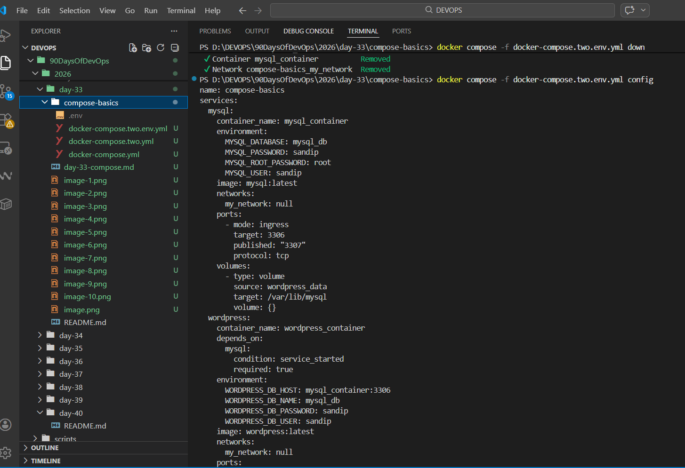