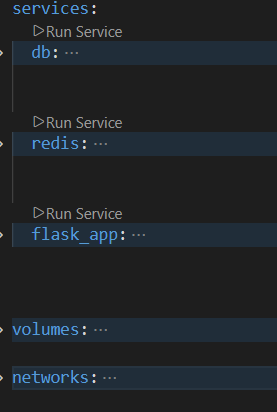
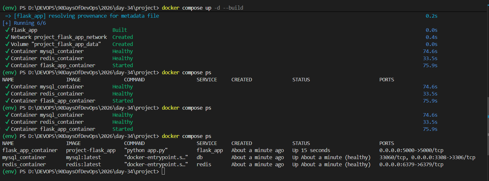
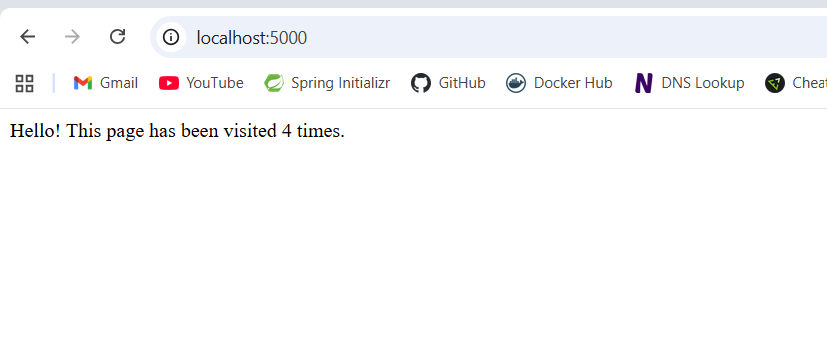
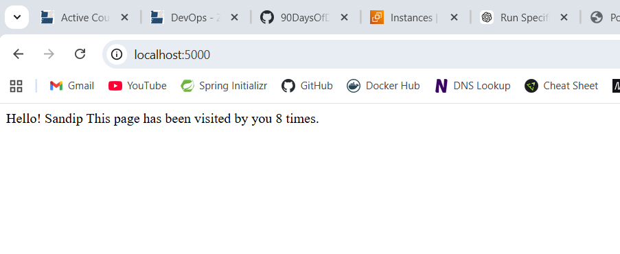
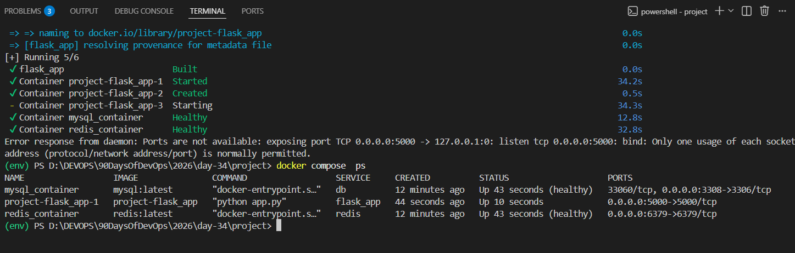

# Day 34 – Docker Compose: Real-World Multi-Container Apps

*Task 1: Build Your Own App Stack*

- docker-compose.yml for a 3-service stack:`

    1. A web app (use Python Flask, Node.js, or any language you know)

    2. A database (Postgres or MySQL)

    3. A cache (Redis)

    

    Write a simple Dockerfile for the web app. The app doesn't need to be complex — even a "Hello World" that connects to the database is enough.

    - `Dockerfile`

*Task 2: depends_on & Healthchecks*

1. Add depends_on to your compose file so the app starts after the database

    `depends_on:`
      ` db:`

    

2. Add a healthcheck on the database service

    `healthcheck:`
      `test: ["executable", "arg"]`
      `interval: 60s`
      `timeout: 20s`
      `retries: 3`
      `start_period: 10s`

   

3. Use depends_on with condition: service_healthy so the app waits for the database to be truly ready, not just started

    `depends_on:`
      ` db:`
          `condition: service_healthy`
    

4. Test: Bring everything down and up — does the app wait for the DB?

    `docker compose up -d --build`

    

    - `http://localhost:5000`

    

*Task 3: Restart Policies*
1. Add restart: always to your database service

    `restart: always`

2. Manually kill the database container — does it come back?

    `docker compose kill db`

    - It will restart automatically because of restart: always

3. Try restart: on-failure — how is it different?

    `restart: on-failure`

    - It will only restart if the container exits with a non-zero code (crashes), but not if you manually stop it.

4. Write in your notes: When would you use each restart policy?

| Restart Policy | Description | Restart on Crash | Restart on Manual Stop | Restart After Docker Restart | When to Use |
|----------------|-------------|------------------|------------------------|-------------------------------|-------------|
| **no** (default) | The container will **not restart automatically** when it stops or crashes. | ❌ No | ❌ No | ❌ No | Temporary containers, testing environments |
| **always** | The container **always restarts**, no matter why it stopped. | ✅ Yes | ✅ Yes | ✅ Yes | Databases, critical services, production systems |
| **on-failure** | The container **restarts only if it crashes** (non-zero exit code). | ✅ Yes | ❌ No | ❌ No | Background workers, batch jobs |
| **unless-stopped** | The container **restarts automatically unless it was manually stopped** by the user. | ✅ Yes | ❌ No | ✅ Yes | Web apps, APIs, long-running services |

*Task 4: Custom Dockerfiles in Compose*
1. Instead of using a pre-built image for your app, use build: in your compose file to build from a Dockerfile

    `docker-compose.yml`

2. Make a code change in your app

    `change the message in app.py to something new`

    

3. Rebuild and restart with one command

    `docker compose up -d --build`

*Task 5: Named Networks & Volumes*
1. Define explicit networks in your compose file instead of relying on the default

    `networks:`
        `flask_app_network:`
            `driver: bridge`

2. Define named volumes for database data

    `volumes:`
        `db_data:`

3. Add labels to your services for better organization

    `labels:`
      `- "project=flask-app"`
      `- "service=db"`
      `- "maintainer=sandip"`

*Task 6: Scaling (Bonus)*
1. Try scaling your web app to 3 replicas using docker compose up --scale

    `docker compose up -d --scale flask_app=3`

    `docker compose up -d --scale <service_name>=3`

    

What happens? What breaks?

- *Since all replicas of the web app are trying to bind to the same port (e.g., 5000), you will get a port conflict error. This is because only one container can bind to a specific host port at a time. Scaling works well for stateless services without port mapping, but when you have port mapping, you need to use a load balancer or reverse proxy to distribute traffic among the replicas.*

Write in your notes: Why doesn't simple scaling work with port mapping?*

- *Simple scaling doesn't work with port mapping because each container instance tries to bind to the same host port, leading to conflicts. Only one container can bind to a specific port on the host machine, so when you scale up, subsequent instances fail to start due to the port being already in use. To scale services that require port mapping, you need to use a load balancer or reverse proxy to route traffic to the different container instances without them needing to bind directly to the same host port.*