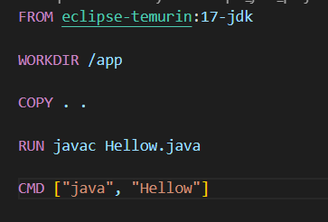
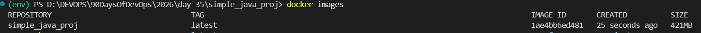
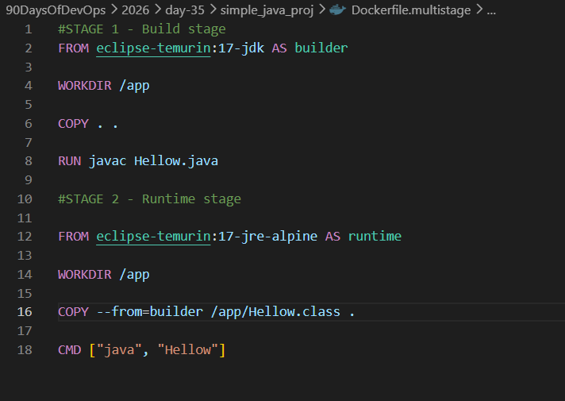
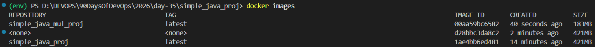
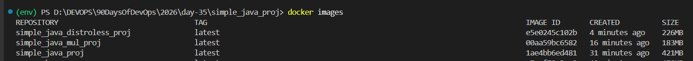
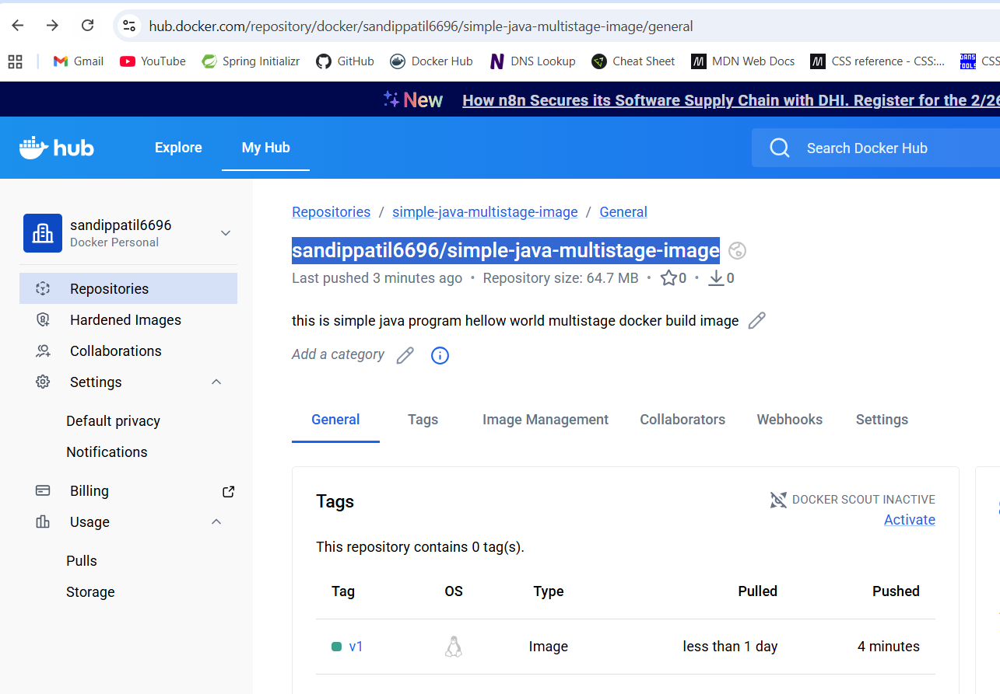
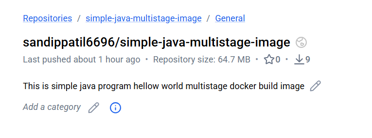
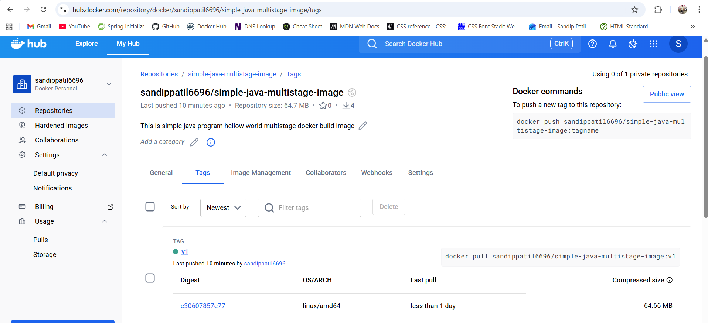
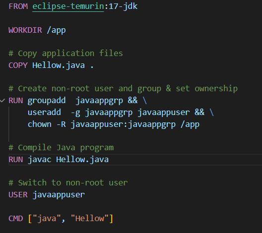

# Day 35 – Multi-Stage Builds & Docker Hub

*Task 1: The Problem with Large Images*

1. Write a simple Go, Java, or Node.js app (even a "Hello World" is fine)

2. Create a Dockerfile that builds and runs it in a single stage

    

3. Build the image and check its size

    - `docker build -t simple_java_proj .`    

    

    - its size is 421 MB, is too large for a simple line code

*Task 2: Multi-Stage Builds*

1. Rewrite the Dockerfile using multi-stage build:
   Stage 1: Build the app (install dependencies, compile)
   Stage 2: Copy only the built artifact into a minimal base image (alpine, distroless, or scratch)

   

2. Build the image and check its size again

    - `docker build -f Dockerfile.multistage -t simple_java_mul_proj .`

    - Dockerfile  `Dockerfile`

3. Compare the two sizes

    - alpine images

        - this time images size is 183 Mb, which is less than half of the previous one

        - Dockerfile `Dockerfile.multistage`

        

    - distroless image 

        - This time image is even smaller 

        - `docker build -f Dockerfile.multistage.distroless -t simple_java_distroless_proj .`

        - Dockerfile `Dockerfile.multistage.distroless`

        

        

4. Write in your notes: Why is the multi-stage image so much smaller?

    - because in the first stage we have all the dependencies and build tools, but in the second stage we only copy the compiled  file, which is much smaller than the entire build environment.

*Task 3: Push to Docker Hub*

1. Create a free account on Docker Hub (if you don't have one)

2. Log in from your terminal

     `docker login`

3. Tag your image properly: yourusername/image-name:tag

    `docker tag local-image yourusername/yourrepo:tag`

    `docker tag simple_java_mul_proj sandippatil6696/simple-java-multistage-image:v1`

4. Push it to Docker Hub

    `docker push sandippatil6696/simple-java-multistage-image:v1`

    

5. Pull it on a different machine (or after removing locally) to verify

    `docker pull sandippatil6696/simple-java-multistage-image:v1`

*Task 4: Docker Hub Repository*
1. Go to Docker Hub and check your pushed image

2. Add a description to the repository

    

3. Explore the tags tab — understand how versioning works

    

4. Pull a specific tag vs latest — what happens?

    - when we pull a specific tag, it will pull that specific version of the image, but when we pull latest, it will pull the most recent version of the image that has been tagged as latest. If there is no latest tag, it will pull the most recent version of the image.

*Task 5: Image Best Practices*

Apply these to one of your images and rebuild:

1. Use a minimal base image (alpine vs ubuntu — compare sizes)

`FROM ubuntu:22.04` - MUCH LARGER

`FROM alpine:latest` - MUCH SMALLER 

2. Don't run as root — add a non-root USER in your Dockerfile

3. Combine RUN commands to reduce layers

4. Use specific tags for base images (not latest)

    - Dockerfile `Dockerfile.nonroot.user`

