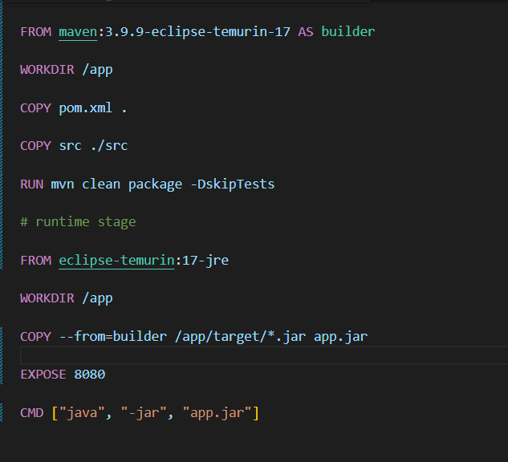
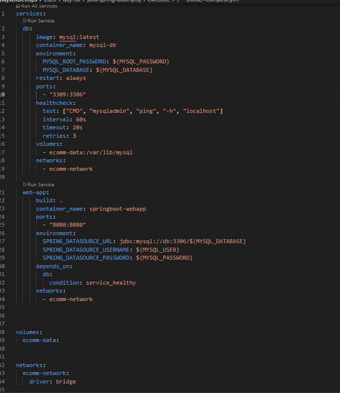
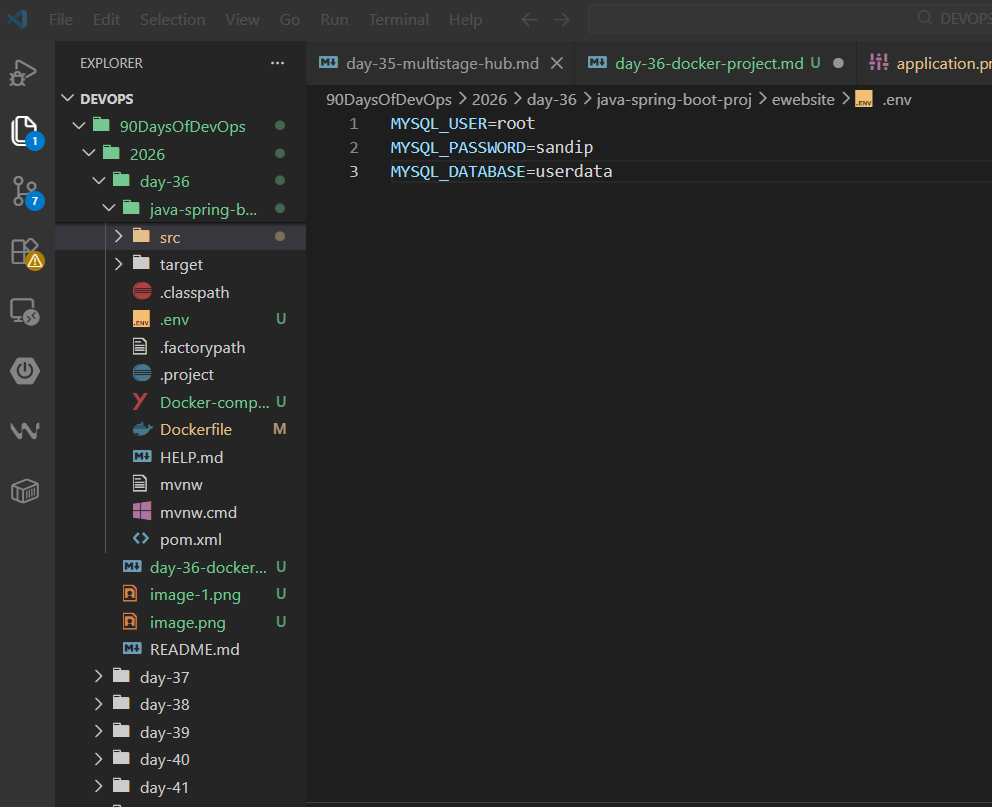
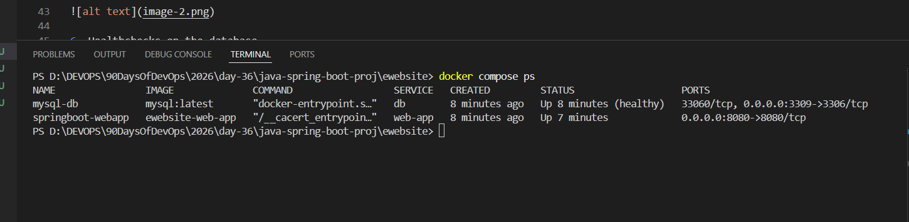
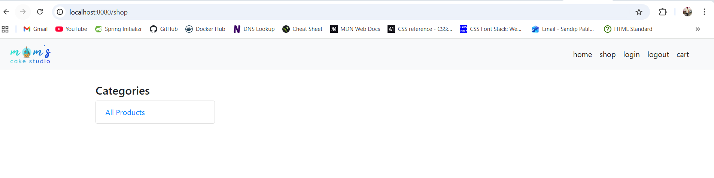
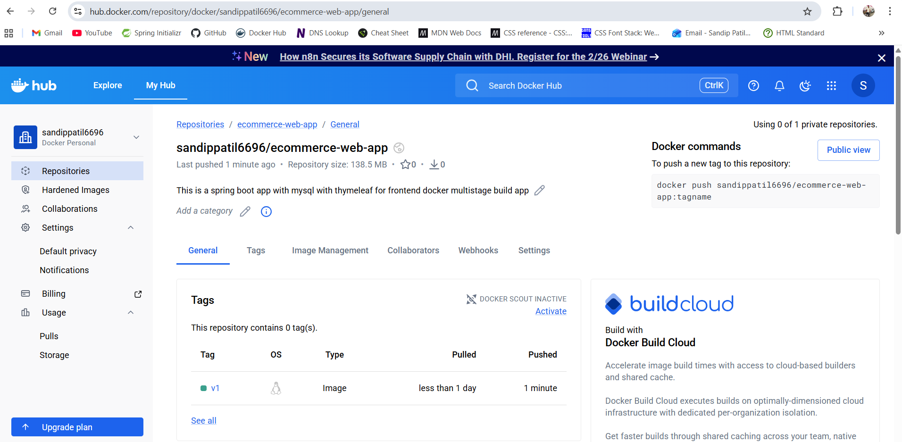
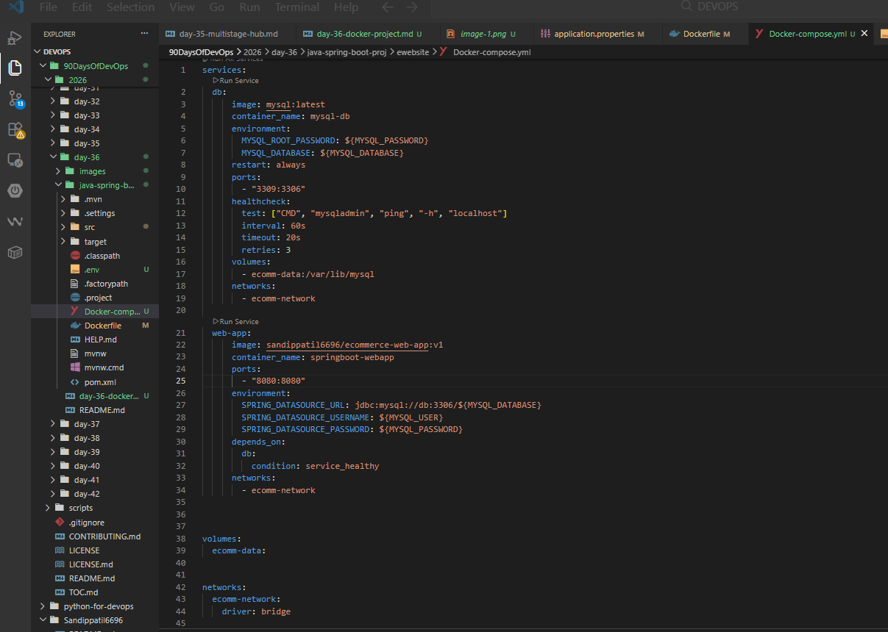
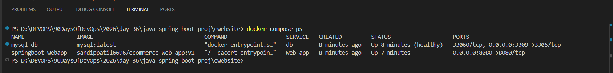
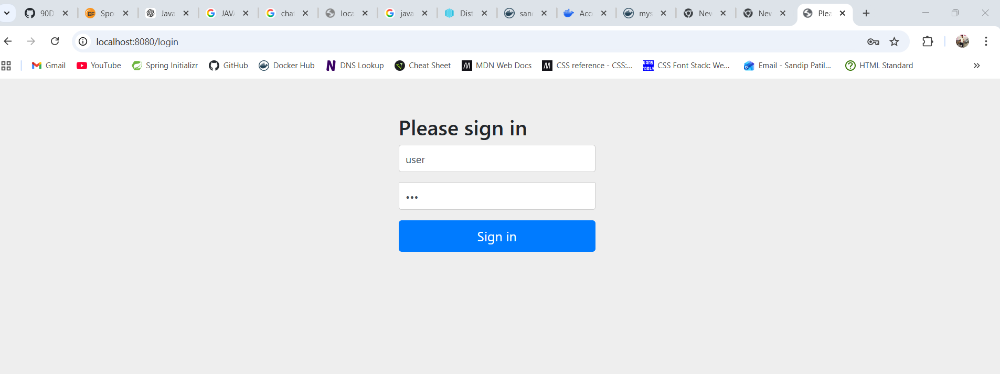
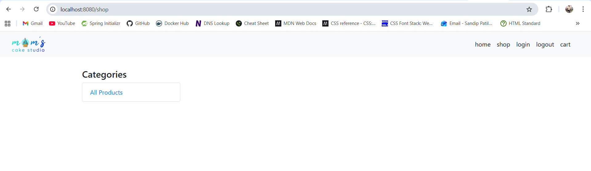

# Day 36 – Docker Project: Dockerize a Full Application

*Task 1: Pick Your App*

- I have selected java spring boot app with mysql databse with thymeleaf as frontend template engine.

- *Backend* - spring boot 

- *Database* - mysql

- *Frontend* - thymeleaf

*Task 2: Write the Dockerfile*

1. Create a Dockerfile for your application
2. Use a multi-stage build if applicable
3. Use a non-root user
4. Keep the image small — use alpine or slim base images
5. Add a .dockerignore file
6. Build and test it locally.

*Task 3: Add Docker Compose*
Write a docker-compose.yml that includes:

- `docker-compose.yml`

1. Your app service (built from Dockerfile)

- `Dockerfile` for app service

    

2. A database service (Postgres, MySQL, MongoDB — whatever your app needs)
3. Volumes for database persistence
4. A custom network

    

5. Environment variables for configuration (use .env file)

    

6. Healthchecks on the database

Run docker compose up and verify everything works together.*

- `docker compose up --build -d`

    

    

*Task 4: Ship It*
1. Tag your app image

    - `docker tag ewebsite-web-app sandippatil6696/ecommerce-web-app:v1`

2. Push it to Docker Hub

    - `docker push sandippatil6696/ecommerce-web-app:v1`

    

3. Share the Docker Hub link

   - `https://hub.docker.com/repository/docker/sandippatil6696/ecommerce-web-app/tags`

4. Write a README.md in your project with:
   - What the app does

        - It is simple eccomerce web application where user can register and login and view products.

        - user for login is `user` and password is `123`

        - url for login is `http://localhost:8080`

   - How to run it with Docker Compose

        - `docker compose up --build -d`

   - Any environment variables needed

        - MYSQL_USER=root
        - MYSQL_PASSWORD=sandip
        - MYSQL_DATABASE=userdata

*Task 5: Test the Whole Flow*
1. Remove all local images and containers

    - `docker compose down --rmi all`

2. Pull from Docker Hub and run using only your compose file

    - `docker pull sandippatil6696/ecommerce-web-app:v1`

    - `docker compose up  -d`

    

3. Does it work fresh? If not — fix it until it does

    - yes it works fine.

    

    

    