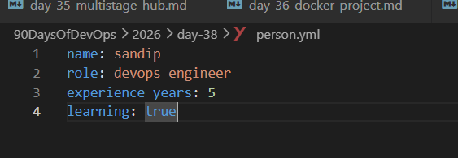
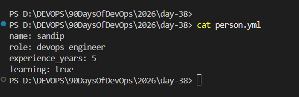
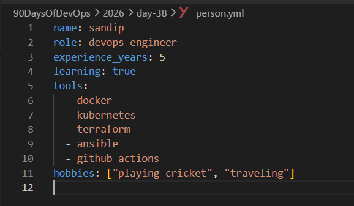
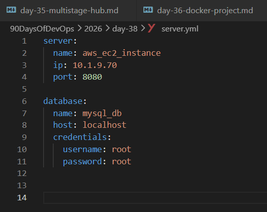
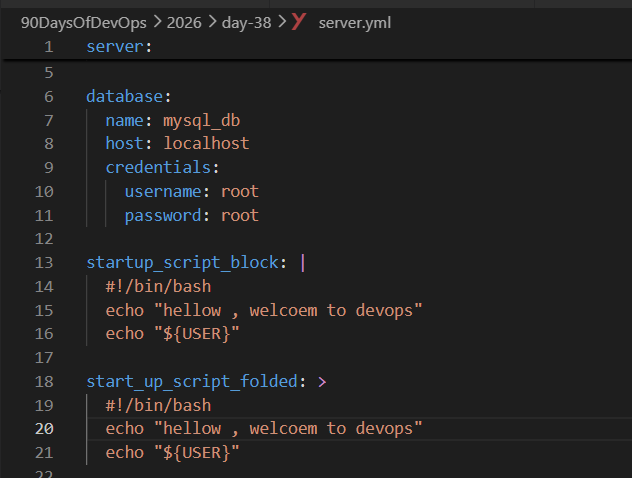
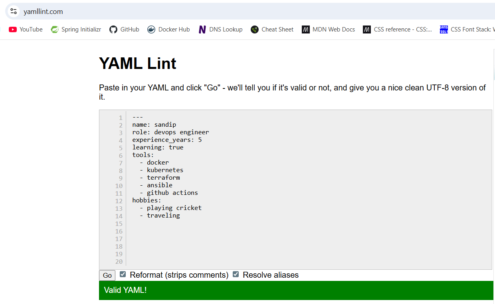
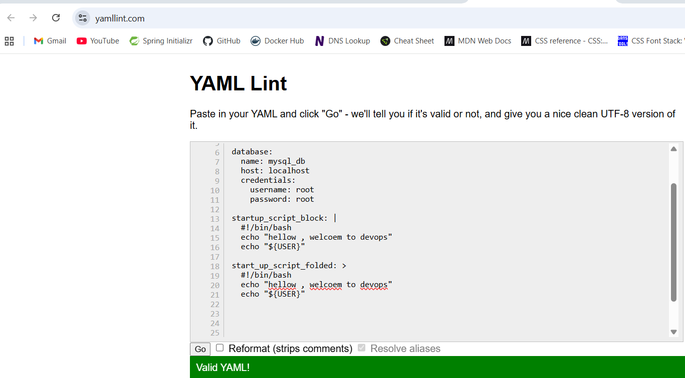

# Day 38 – YAML Basics

*Task 1: Key-Value Pairs*

- Create person.yaml that describes yourself with:

    - name
    - role
    - experience_years
    - learning (a boolean)

- Verify: Run cat person.yaml — does it look clean? No tabs?

*Task 2: Lists*

- Add to person.yaml:

    - tools — a list of 5 DevOps tools you know or are learning
    - hobbies — a list using the inline format [item1, item2]

    

    - Write in your notes: What are the two ways to write a list in YAML?

    - The two ways to write a list in YAML are:

        1. Block style: using a dash (-) followed by a space for each item in the list.
        2. Inline style: using square brackets [] with items separated by commas.

*Task 3: Nested Objects*

- Create server.yaml that describes a server:

    - server with nested keys: name, ip, port
    - database with nested keys: host, name, credentials (nested further: user, password)

    

    - Verify: Try adding a tab instead of spaces — what happens when you validate it?

    - When you add a tab instead of spaces in YAML, it will cause a syntax error during validation. YAML requires consistent indentation using spaces.

*Task 4: Multi-line Strings*

- In server.yaml, add a startup_script field using:

    - The | block style (preserves newlines)
    - The > fold style (folds into one line)

    

    - Write in your notes: When would you use | vs >?
      
      - *| block style when you want to preserve the formatting and newlines of the multi-line string. This is useful for scripts* 

      - *> fold style when you want to fold the multi-line string into a single line, while still allowing for line breaks in the source. This is useful for long strings that should be treated as a single line in the output.*

*Task 5: Validate Your YAML*

  - Install yamllint or use an online validator

  - Validate both your YAML files

  - Intentionally break the indentation — what error do you get?

  - Fix it and validate again

    - ymllint

  

  
