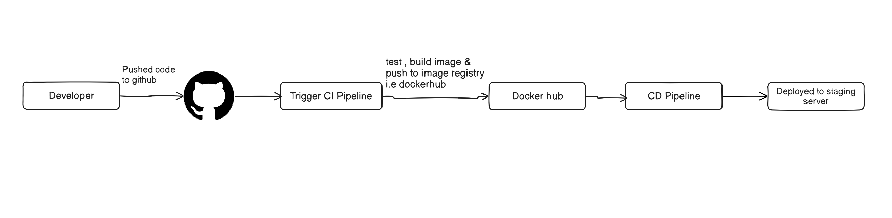
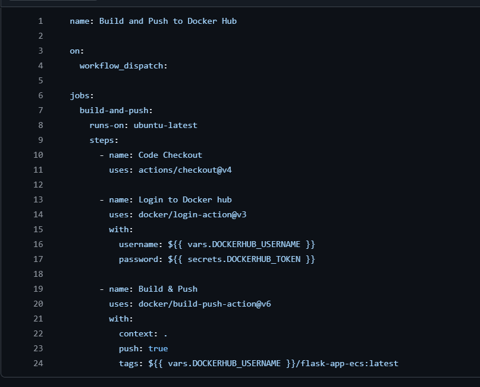

# Day 39 – What is CI/CD?

*Task 1: The Problem*

- Think about a team of 5 developers all pushing code to the same repo manually deploying to production.

- Write in your notes:

    - What can go wrong?
        - *Inconsistent environments leading to bugs that only appear in production*
        - *human error during deployment*

    - What does "it works on my machine" mean and why is it a real problem?

        - *"It works on my machine" means that the code runs successfully in the developer's local environment but fails in other environments (like staging or production). This is a real problem because it indicates that there are differences between the developer's environment and the target environment, such as missing dependencies, different configurations, or incompatible software versions. This can lead to unexpected bugs and downtime when the code is deployed.*

    - How many times a day can a team safely deploy manually?

        - *1-2 times a day, depending on the complexity of the application and the team's experience with manual deployments.*

    
*Task 2: CI vs CD*

- Research and write short definitions (2-3 lines each):

    - Continuous Integration — what happens, how often, what it catches

        - *Continuous Integration (CI) is the practice of automatically integrating code changes from multiple developers into a shared repository several times a day. It involves automated testing to catch bugs early in the development process.*

    - Continuous Delivery — how it's different from CI, what "delivery" means

        - *"Delivery" means that the code is always in a deployable state, but the actual deployment to production may still require manual approval.*

    - Continuous Deployment — how it differs from Delivery, when teams use it

        - *automatically deploying every change that passes the automated tests to production without manual approval.*

- Write one real-world example for each.

    - CI: *A team uses Jenkins to automatically run unit tests every time code is pushed to the repository.*
    - CD: *A team uses GitHub Actions to automatically build and test their application, but a release manager manually approves   deployments to production.*
    - Continuous Deployment: *A team uses GitHub Actions CI/CD to automatically deploy every successful build to production without any manual intervention.*

*Task 3: Pipeline Anatomy*

- A pipeline has these parts — write what each one does:

    - Trigger — what starts the pipeline

        - *A trigger is an event that initiates the execution of a CI/CD pipeline, such as on code push, pull request, or scheduled time.*

    - Stage — a logical phase (build, test, deploy)

        - *A stage is a  phase in the pipeline that groups related jobs together, such as building the application, running tests, or deploying to production.*

    - Job — a unit of work inside a stage

        - *A job is a set of steps that perform a specific task within a stage, such as compiling code or running tests.*

    - Step — a single command or action inside a job

        - *A step is an individual command or action that is executed as part of a job, such as installing dependencies or running a script.*

    - Runner — the machine that executes the job

        - *A runner is the environment (physical or virtual machine) where the jobs are executed.*

    - Artifact — output produced by a job

        - *An artifact is a file or set of files produced as a result of a job, such as compiled binaries, test reports, or Docker images.* 

*Task 4: Draw a Pipeline*

- Draw a CI/CD pipeline for this scenario:

    `A developer pushes code to GitHub. The app is tested, built into a Docker image, and deployed to a staging server.`

    - Include at least 3 stages. Hand-drawn and photographed is perfectly fine.

    

*Task 5: Explore in the Wild*

- Open any popular open-source repo on GitHub (Kubernetes, React, FastAPI — pick one you know)
- Find their .github/workflows/ folder
- Open one workflow YAML file
- Write in your notes:
    - What triggers it?

        - *The workflow is triggered manually*

    - How many jobs does it have?

        - *it has 1 job i.e build-and-push*

    - What does it do? (best guess)

        - *The workflow checkout code in current repository*
        - *Then login to dockerhub*
        - *Build and push the Docker image*

s
