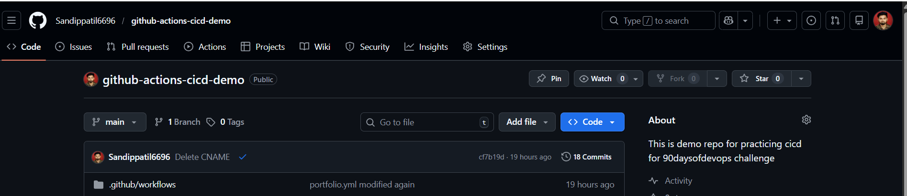
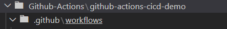
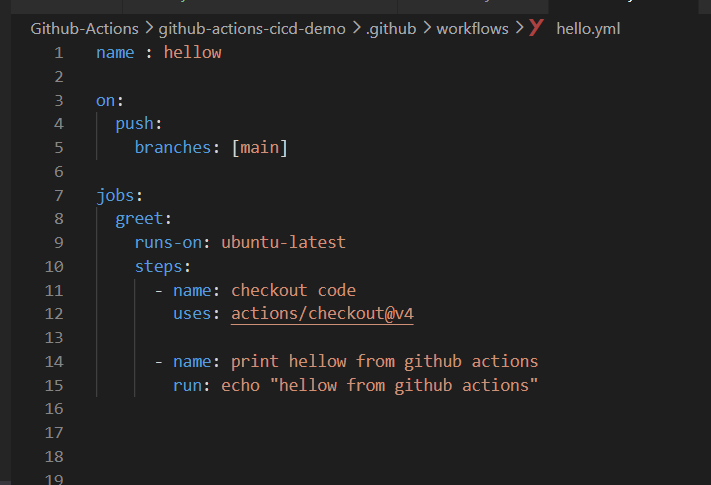
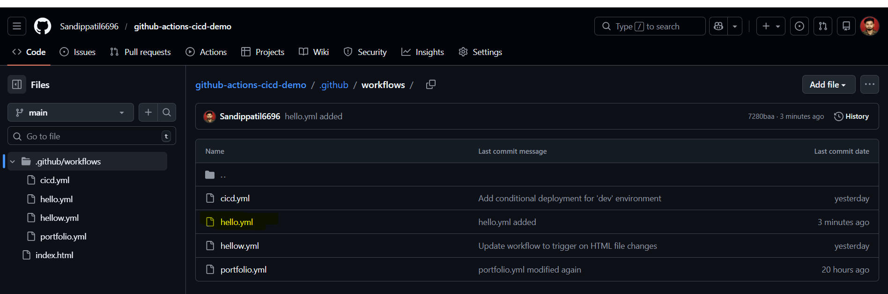
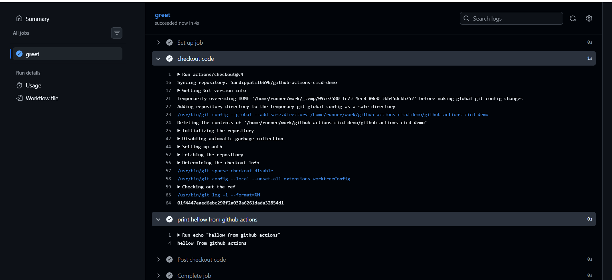
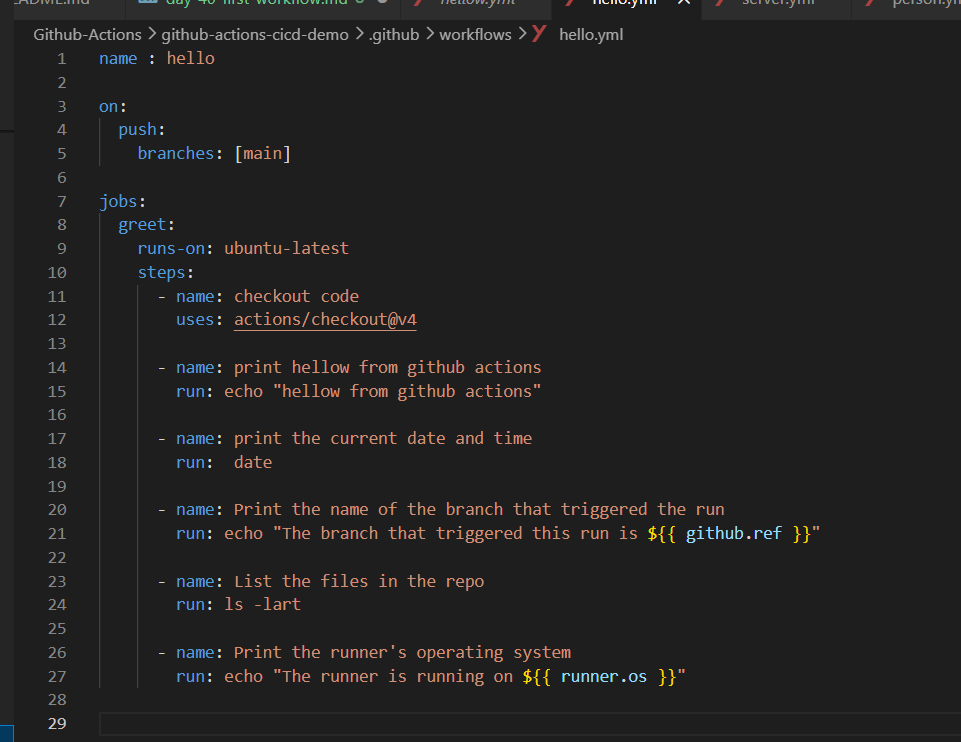
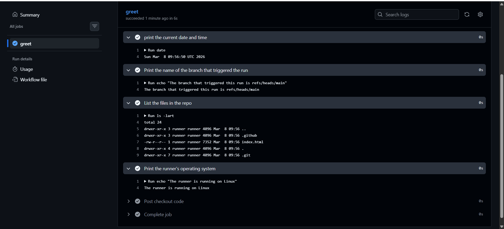
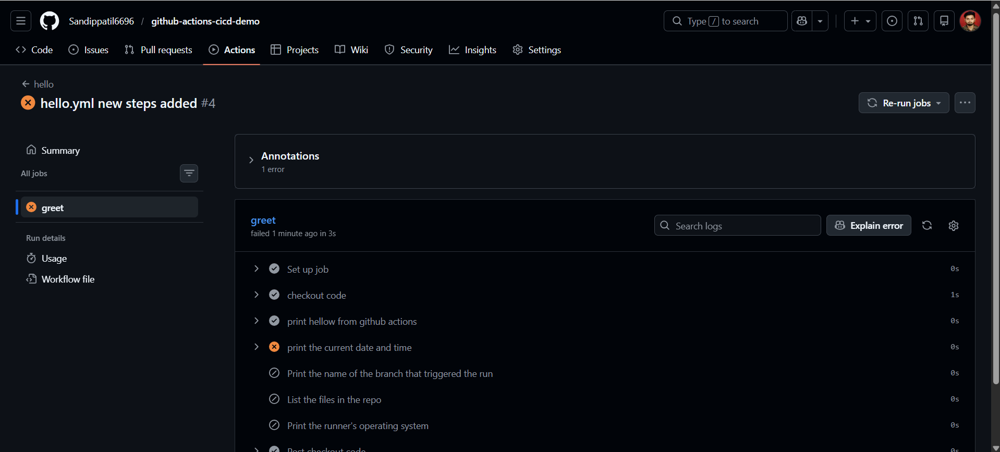

# Day 40 – Your First GitHub Actions Workflow

*Task 1: Set Up*

- Create a new public GitHub repository called github-actions-practice

    - `created a demo repository on github i.e github-actions-cicd-demo`

- Clone it locally

    - `git clone git@github.com:Sandippatil6696/github-actions-cicd-demo.git`

- Create the folder structure: .github/workflows/

    

    

*Task 2: Hello Workflow*

- Create .github/workflows/hello.yml with a workflow that:

    - Triggers on every push
    - Has one job called greet
    - Runs on ubuntu-latest
    - Has two steps:
        - Step 1: Check out the code using actions/checkout
        - Step 2: Print Hello from GitHub Actions!
Push it. Go to the Actions tab on GitHub and watch it run.

Verify: Is it green? Click into the job and read every step.

*Task 3: Understand the Anatomy*
 
- Look at your workflow file and write in your notes what each key does:

    - on: *It specifies the event that triggers the workflow, such as a push to the repository.*
    - jobs: *It defines the collection of jobs that will be executed as part of the workflow.*
    - runs-on: *It specifies the type of runner (operating system) on which the job will run, such as ubuntu-latest.*
    - steps: *It defines the individual steps that make up a job, which can include actions to perform or commands to run.*
    - uses: *It specifies the action to use in a step.*
    - run: *It specifies the command to run in a step.*
    - name: *It specifies the name of a step.*

*Task 4: Add More Steps*

- Update hello.yml to also:

    - Print the current date and time
    - Print the name of the branch that triggered the run (hint: GitHub provides this as a variable)
    - List the files in the repo
    - Print the runner's operating system
    - Push again — watch the new run.

    

    

*Task 5: Break It On Purpose*

- Add a step that runs a command that will fail (e.g., exit 1 or a misspelled command)
    - Push and observe what happens in the Actions tab
    - Fix it and push again
    - Write in your notes: What does a failed pipeline look like? How do you read the error?

    