# Day 41 – Triggers & Matrix Builds

'*Task 1: Trigger on Pull Request*

1. Create .github/workflows/pr-check.yml
2. Trigger it only when a pull request is opened or updated against main
3. Add a step that prints: PR check running for branch: <branch name>

    - 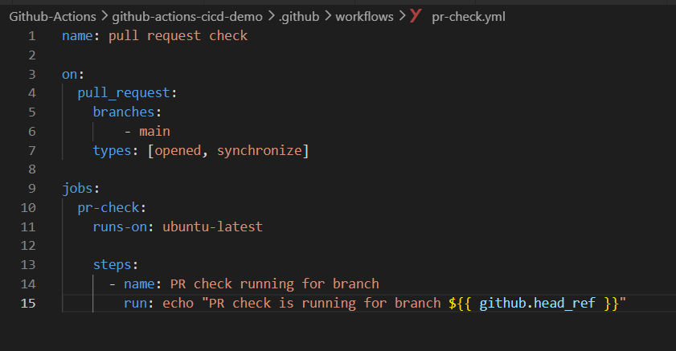

4. Create a new branch, push a commit, and open a PR

    - `git chdeckout -b feature`

    - `git commit -m "index.html updated`

    - `git push origin feature`

    - `open a PR from feature to main`

5. Watch the workflow run automatically

    - `yes it should run automatically when i open pr to main branch`

    - 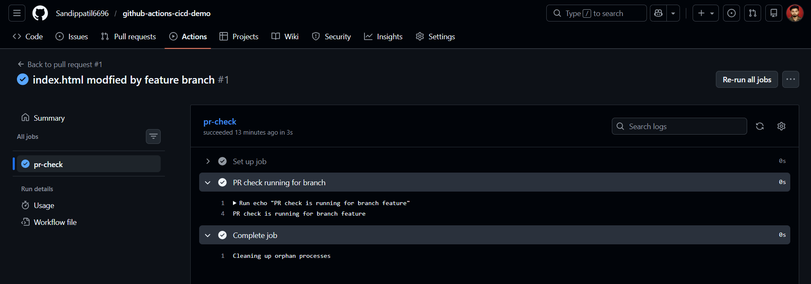

6. Verify: Does it show up on the PR page?

    - `yes it should show up on the PR page`

    - 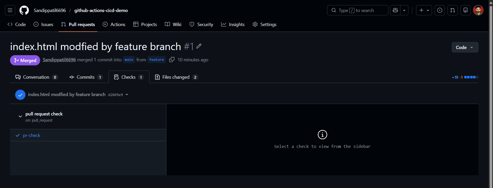

*Task 2: Scheduled Trigger*

1. Add a schedule: trigger to any workflow using cron syntax

    - 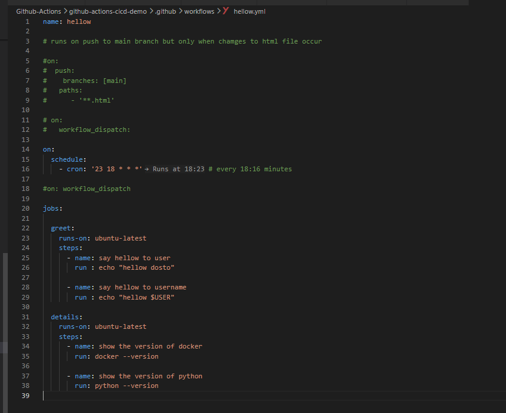

2. Set it to run every day at midnight UTC

    - on:
        schedule:
            - cron: '0 0 * * *'  # every day at midnight UTC

3. Write in your notes: What is the cron expression for every Monday at 9 AM?

    - 0 9 * * 1 # every Monday at 9 AM

*Task 3: Manual Trigger*

1. Create .github/workflows/manual.yml with a workflow_dispatch: trigger
2. Add an input that asks for an environment name (staging/production)

    - 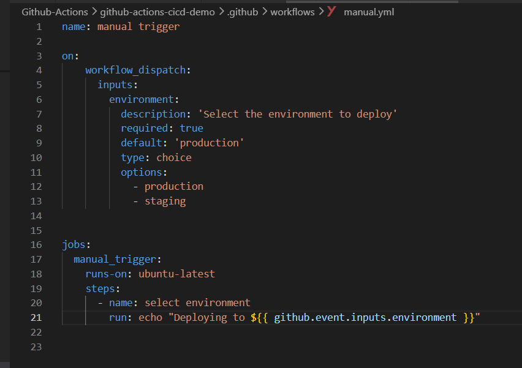

3. Print the input value in a step
4. Go to the Actions tab → find the workflow → click Run workflow

    - 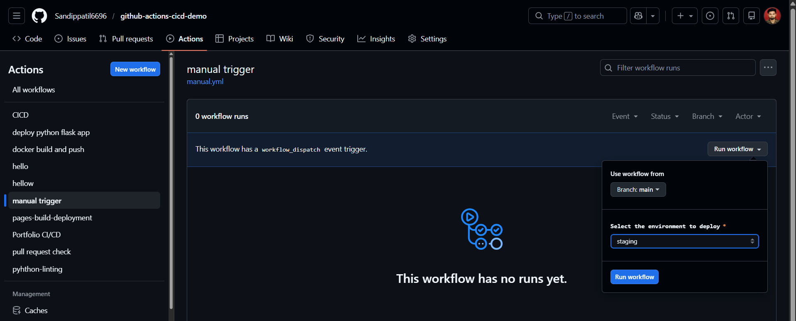

    - 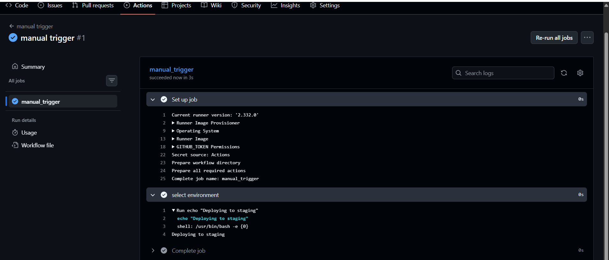

*Task 4: Matrix Builds*

1. Create .github/workflows/matrix.yml that:

    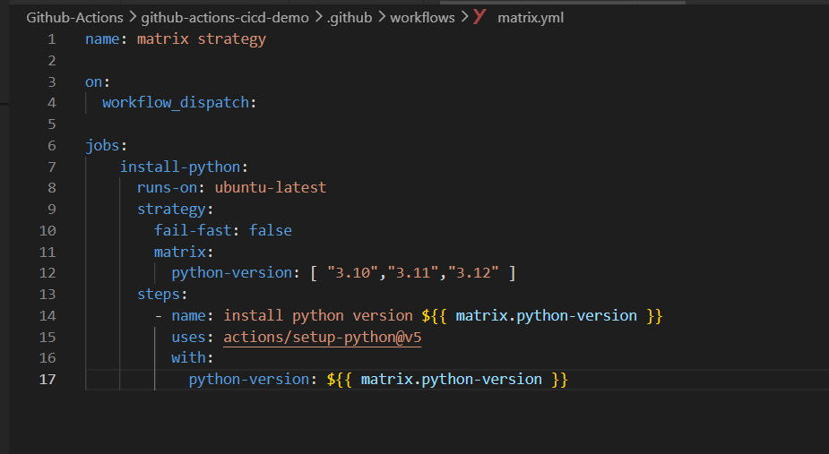

2. Uses a matrix strategy to run the same job across:
3. Python versions: 3.10, 3.11, 3.12
4. Each job installs Python and prints the version
    
    Watch all 3 run in parallel

   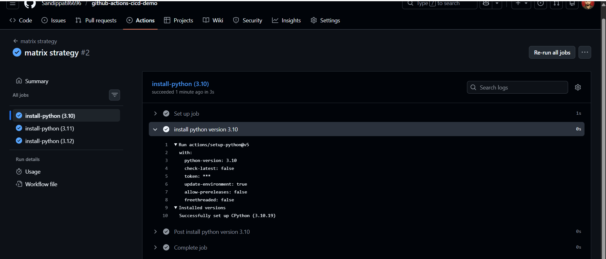

5. Then extend the matrix to also include 2 operating systems — how many total jobs run now?

    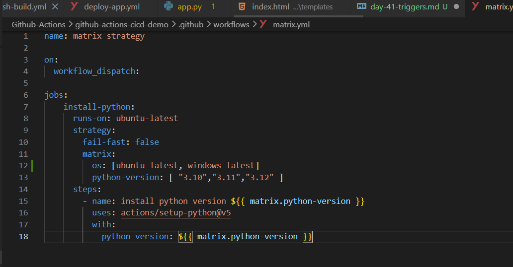

    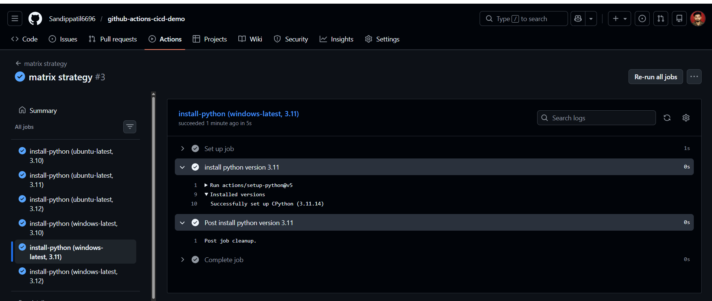

    - There is 6 total jobs run now because we have 3 python versions and 2 operating systems so 3*2 = 6

*Task 5: Exclude & Fail-Fast*

1. In your matrix, exclude one specific combination (e.g., Python 3.10 on Windows)

    - 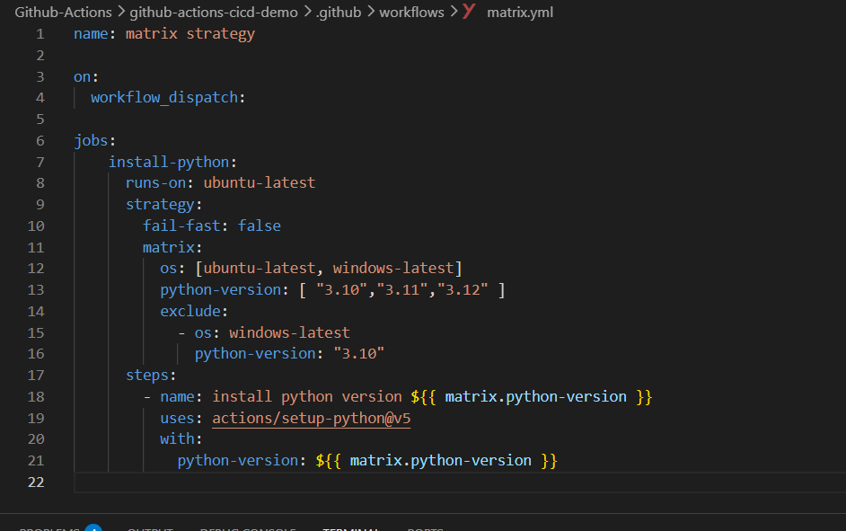

    - 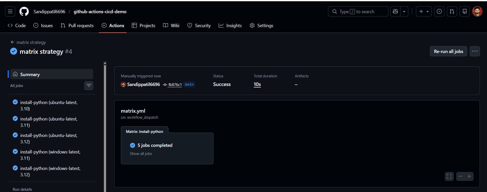

2. Set fail-fast: false — trigger a failure in one job and observe what happens to the rest

    - if fail-fast is set to false then even if one job fails then the  rest of the jobs will continue to 
      run and will  not be stopped immediately

3. Write in your notes: What does fail-fast: true (the default) do vs false?

    - fail-fast: true (the default) will stop all the jobs immediately if one job fails, 
    - fail-fast: false will allow the rest of the jobs to continue running even if one job fails.