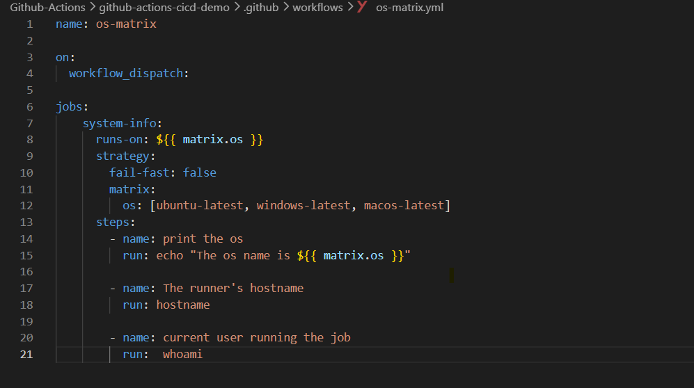
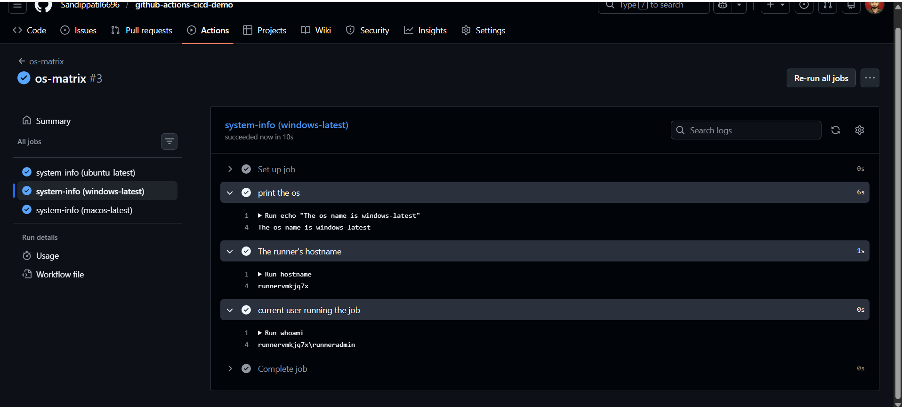
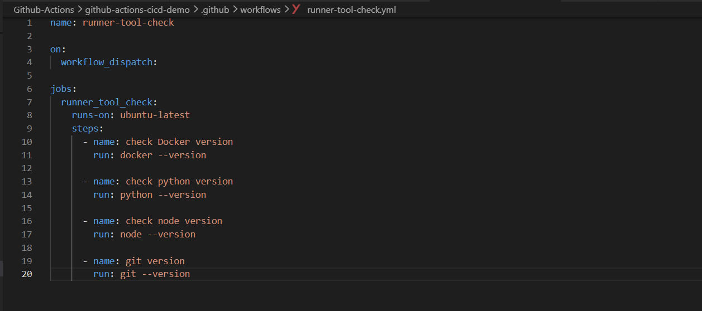
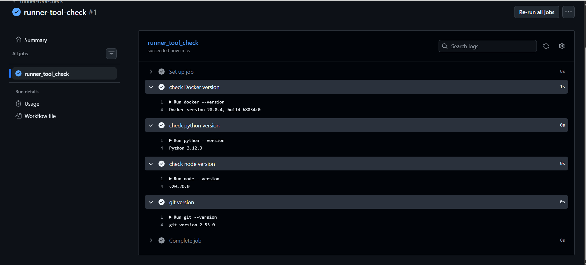
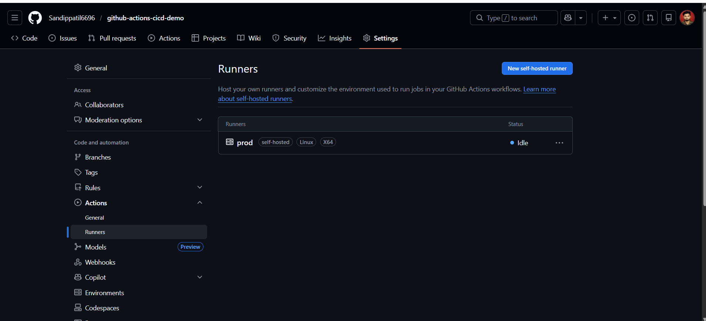
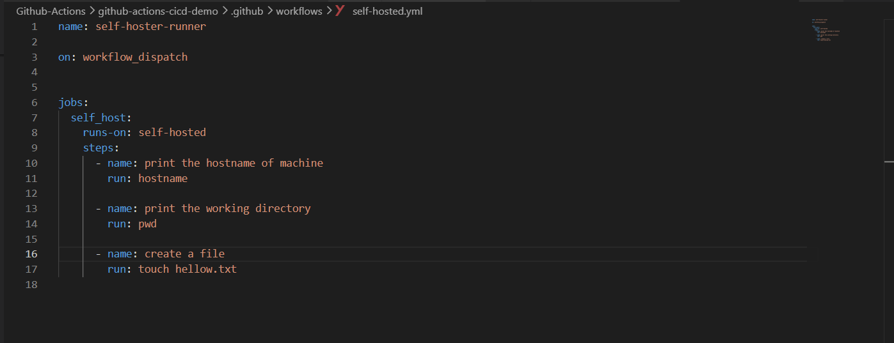
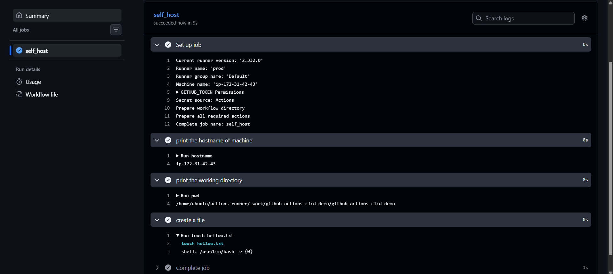
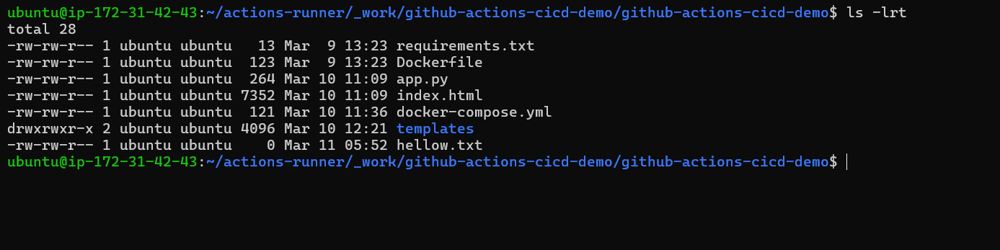
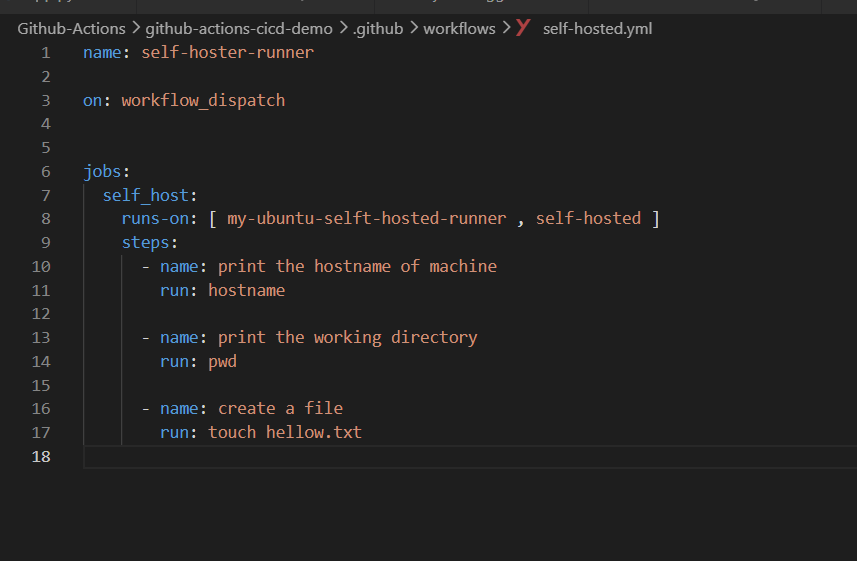
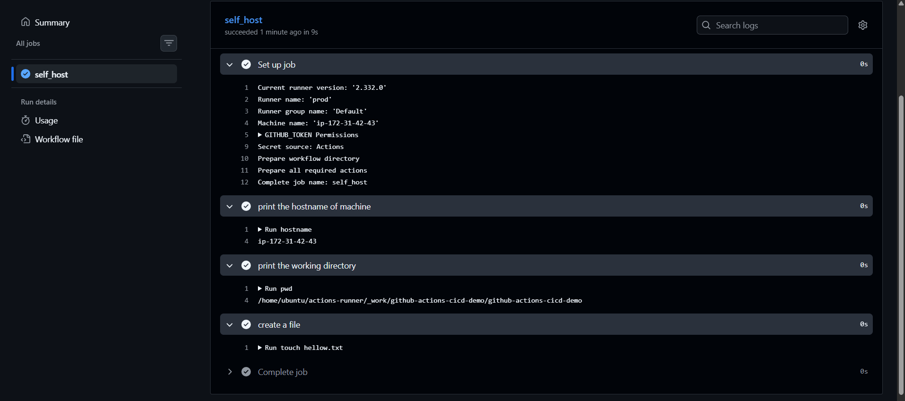

# Day 42 – Runners: GitHub-Hosted & Self-Hosted

*Task 1: GitHub-Hosted Runners*

1. Create a workflow with 3 jobs, each on a different OS:
    - ubuntu-latest
    - windows-latest
    - macos-latest
2. In each job, print:
    - The OS name
    - The runner's hostname
    - The current user running the job
3. Watch all 3 run in parallel
4. Write in your notes: What is a GitHub-hosted runner? Who manages it?

    - A GitHub-hosted runner is a virtual machine provided and managed by GitHub that runs your workflow jobs. You don't have to worry about maintenance, updates, or security patches as GitHub takes care of all that for you.

    - 

    - 

*Task 2: Explore What's Pre-installed*

1. On the ubuntu-latest runner, run a step that prints:
    - Docker version
    - Python version
    - Node version
    - Git version
2. Look up the GitHub docs for the full list of pre-installed software on ubuntu-latest

   *Write in your notes: Why does it matter that runners come with tools pre-installed?*

    - It saves time and effort in setting up the environment for your workflows. You can immediately use popular tools and languages without having to install them yourself, which speeds up development and testing processes.

    - 

    - 

*Task 3: Set Up a Self-Hosted Runner*

 - Go to your GitHub repo → Settings → Actions → Runners → New self-hosted runner

1. Choose Linux as the OS
2. Follow the instructions to download and configure the runner on:
3. Your local machine, OR
    - A cloud VM (EC2, Utho, or any VPS)
    - Start the runner — verify it shows as Idle in GitHub
4. Verify: Your runner appears in the Runners list with a green dot.

    - 

*Task 4: Use Your Self-Hosted Runner*

1. Create .github/workflows/self-hosted.yml

2. Set runs-on: self-hosted
3. Add steps that:
    - Print the hostname of the machine (it should be YOUR machine/VM)
    - Print the working directory
    - Create a file and verify it exists on your machine after the run
4. Trigger it and watch it run on your own hardware

    Verify: Check your machine — is the file there?

    - 

    - 

    - 

*5. Task 5: Labels*

1. Add a label to your self-hosted runner (e.g., my-linux-runner)
2. Update your workflow to use runs-on: [self-hosted, my-linux-runner]
3. Trigger it — does it still pick up the job?
    
    - 

    - 

    
    Write in your notes: Why are labels useful when you have multiple self-hosted runners?

    - if i have multiple self hosted runner then labels is used to easily understand on which runners your job will run .

*6.GitHub-Hosted vs Self-Hosted*

| Feature | GitHub-Hosted | Self-Hosted |
|---|---|---|
| **Who manages it?** | GitHub manages the runner infrastructure | You  |
| **Cost** | Free minutes included (e.g., 2000/month for free tier), additional minutes are paid | No GitHub Actions minutes used, but you pay for your own server/VM |
| **Pre-installed tools** | Many tools already installed (Docker, Python, Node, Git, etc.) | Only the tools that you install manually |
| **Good for** | Quick setup, open-source projects, simple CI/CD pipelines | Custom environments, internal systems, large builds, deployments inside private networks |
| **Security concern** | Code runs on GitHub infrastructure (shared cloud environment) | You must secure and maintain your own server infrastructure |
 