# Day 44 – Secrets, Artifacts & Running Real Tests in CI

**Task 1: GitHub Secrets**

1. Go to your repo → Settings → Secrets and Variables → Actions
2. Create a secret called MY_SECRET_MESSAGE

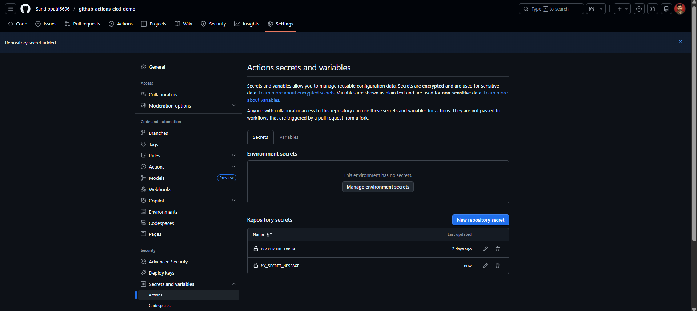

3. Create a workflow that reads it and prints: The secret is set: true (never print the actual value)

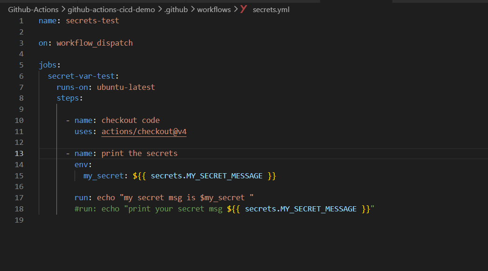

4. Try to print ${{ secrets.MY_SECRET_MESSAGE }} directly — what does GitHub show?

  - It show secret value as ***

  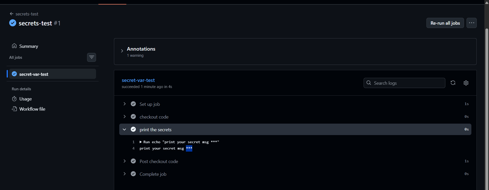

- Write in your notes: Why should you never print secrets in CI logs?

  - logs are stored, and shared, which can expose sensitive credentials.

**Task 2: Use Secrets as Environment Variables**

1. Pass a secret to a step as an environment variable

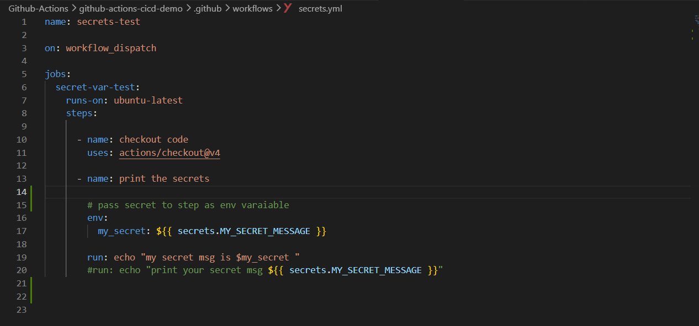

2. Use it in a shell command without ever hardcoding it
3. Add DOCKER_USERNAME and DOCKER_TOKEN as secrets (you'll need these on Day 45)

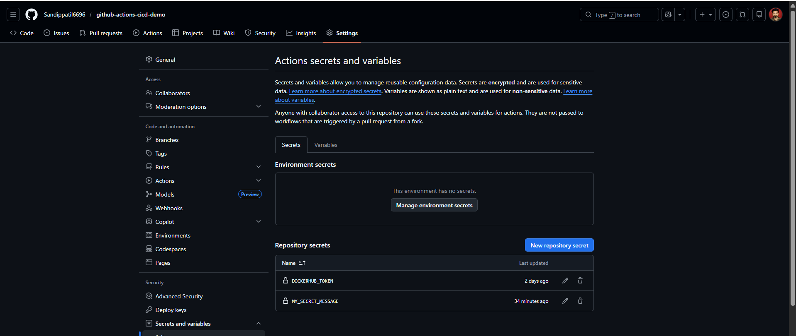

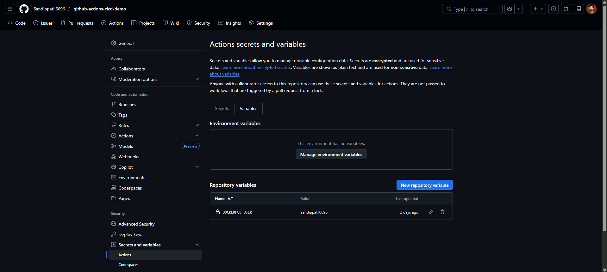

**Task 3: Upload Artifacts**

1. Create a step that generates a file — e.g., a test report or a log file
2. Use actions/upload-artifact to save it
3. After the workflow runs, download the artifact from the Actions tab
-  Verify: Can you see and download it from GitHub?

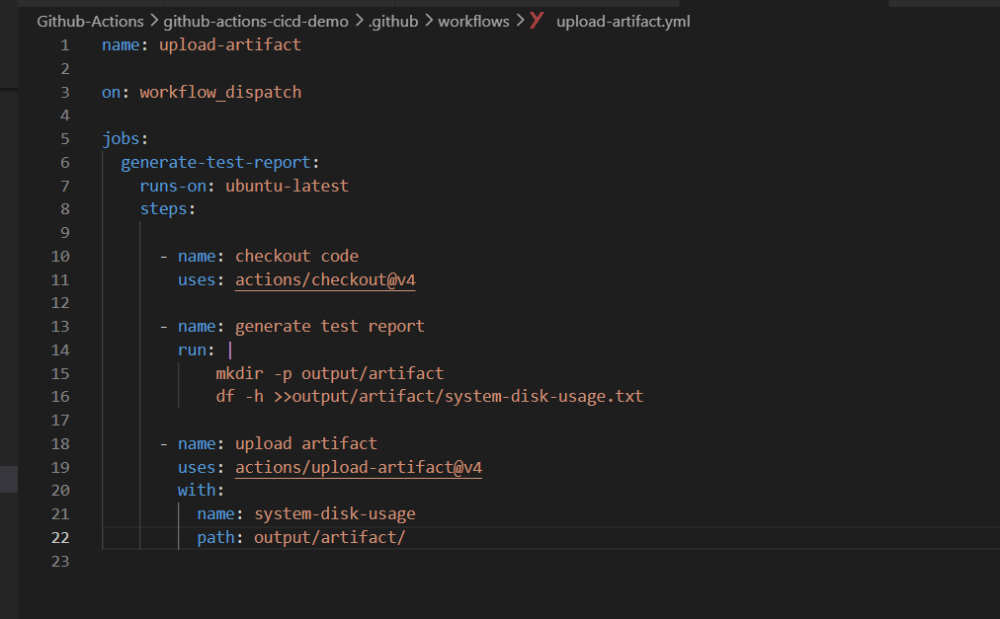

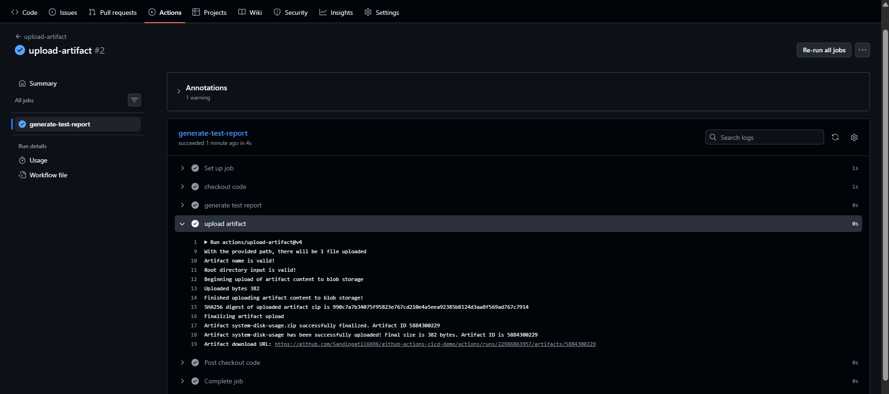

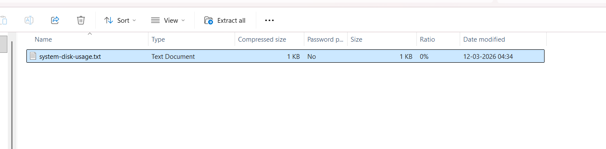

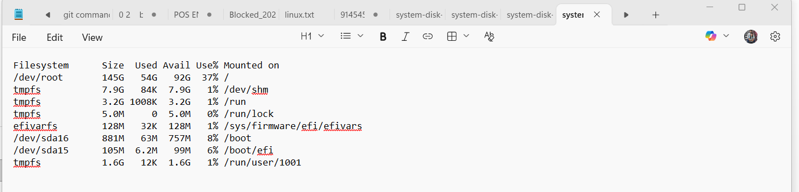

**Task 4: Download Artifacts Between Jobs**

- Job 1: generate a file and upload it as an artifact

- Job 2: download the artifact from Job 1 and use it (print its contents)

- Write in your notes: When would you use artifacts in a real pipeline?

  - when one job produce output that need by other job then we used artifact

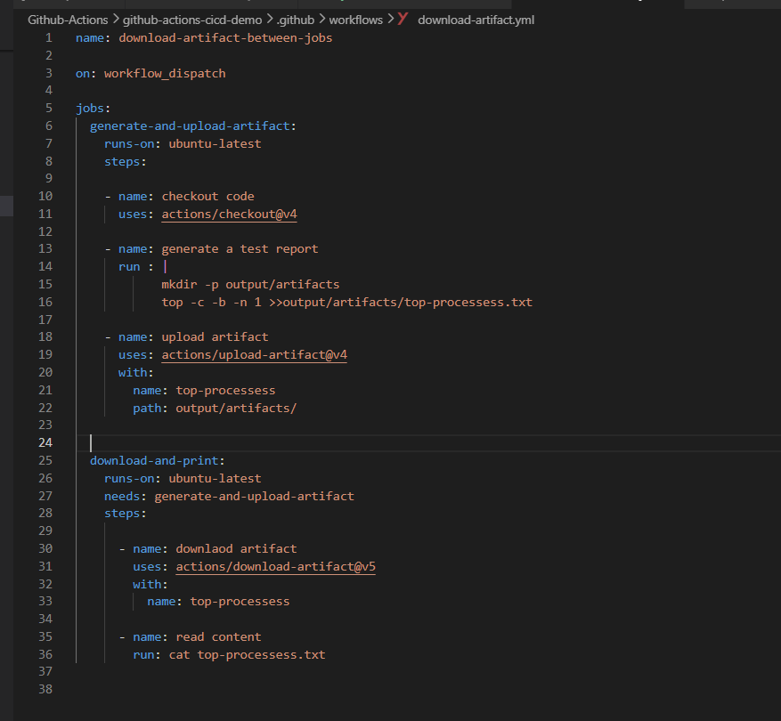

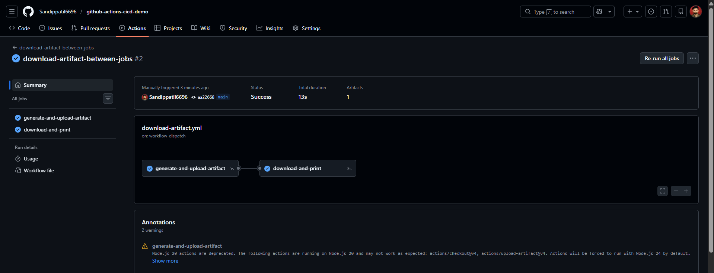

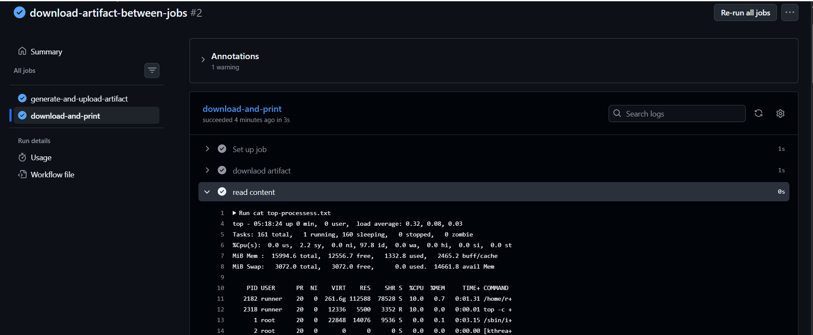

**Task 5: Run Real Tests in CI**
Take any script from your earlier days (Python or Shell) and run it in CI:

1. Add your script to the github-actions-practice repo

2. Write a workflow that:
  - Checks out the code
  - Installs any dependencies needed
  - Runs the script
  - Fails the pipeline if the script exits with a non-zero code

3. Intentionally break the script — verify the pipeline goes red

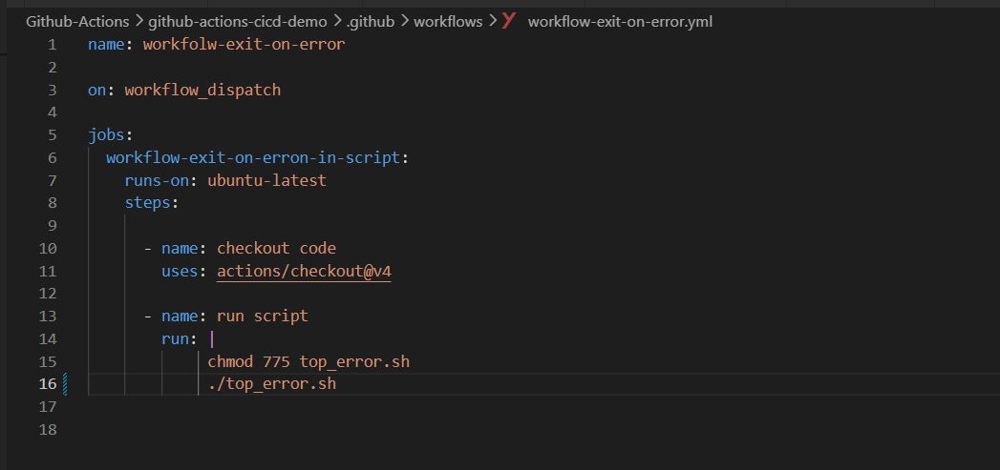

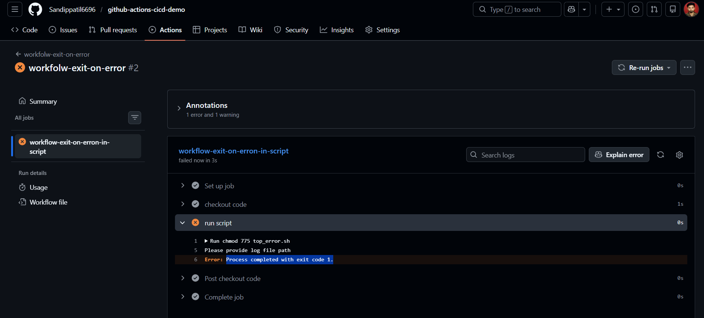

4. Fix it — verify it goes green again

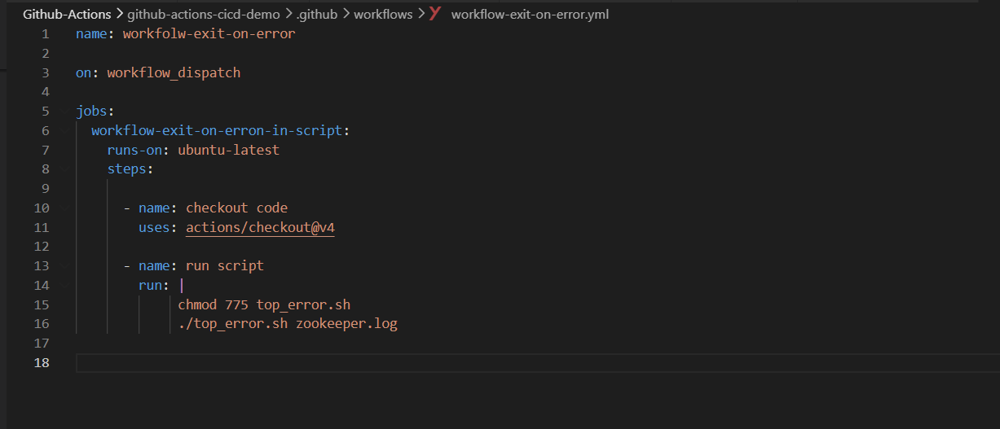

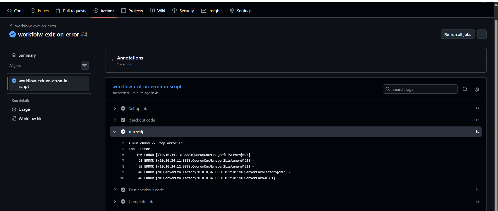

**Task 6: Caching**

1. Add actions/cache to a workflow that installs dependencies
2. Run it twice — observe the time difference
3. Write in your notes: What is being cached and where is it stored?

  - the workflow stores files or directories or  dependencies so they can be reused in future runs.

  - he cache is not stored on the runner machine permanently.

  - It is stored in GitHub’s cloud storage associated with the repository managed by **GitHub.

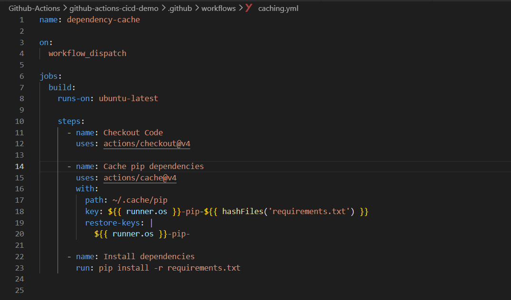

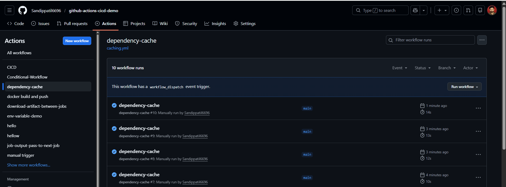

