# Day 45 – Docker Build & Push in GitHub Actions

**Task 1: Prepare**

1. Use the app you Dockerized on Day 36 (or any simple Dockerfile)

- uses python flask app 

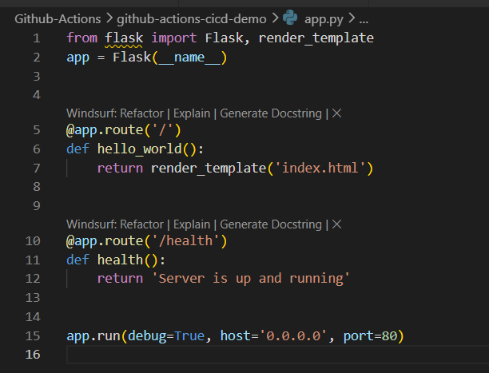

2. Add the Dockerfile to your github-actions-practice repo (or create a minimal one)

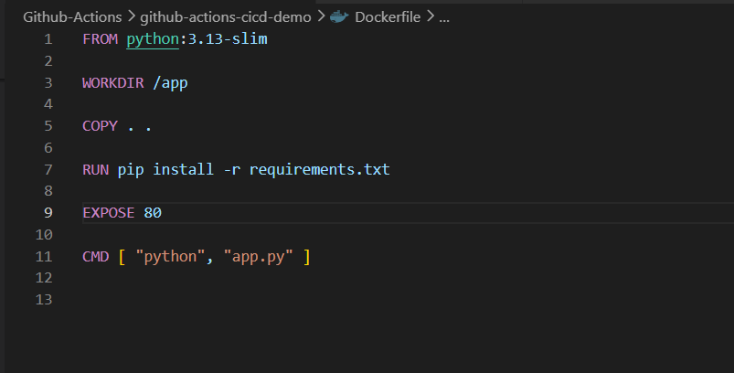

3. Make sure DOCKER_USERNAME and DOCKER_TOKEN secrets are set from Day 44

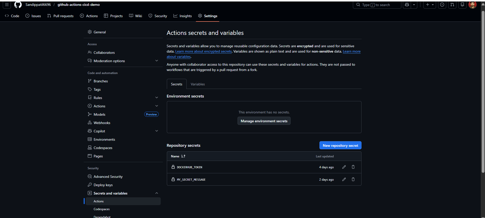

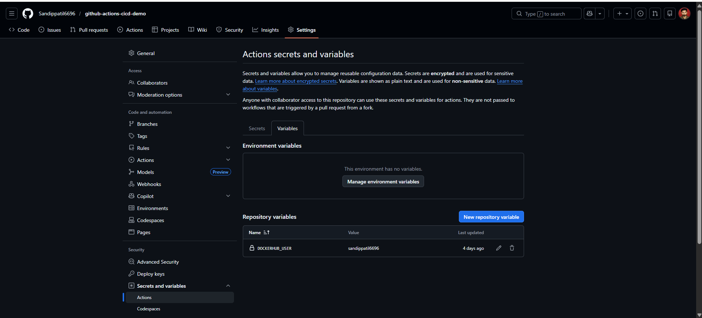

**Task 2: Build the Docker Image in CI**

- Create .github/workflows/docker-push-build.yml that:

1. Triggers on push to main
2. Checks out the code
3. Builds the Docker image and tags it

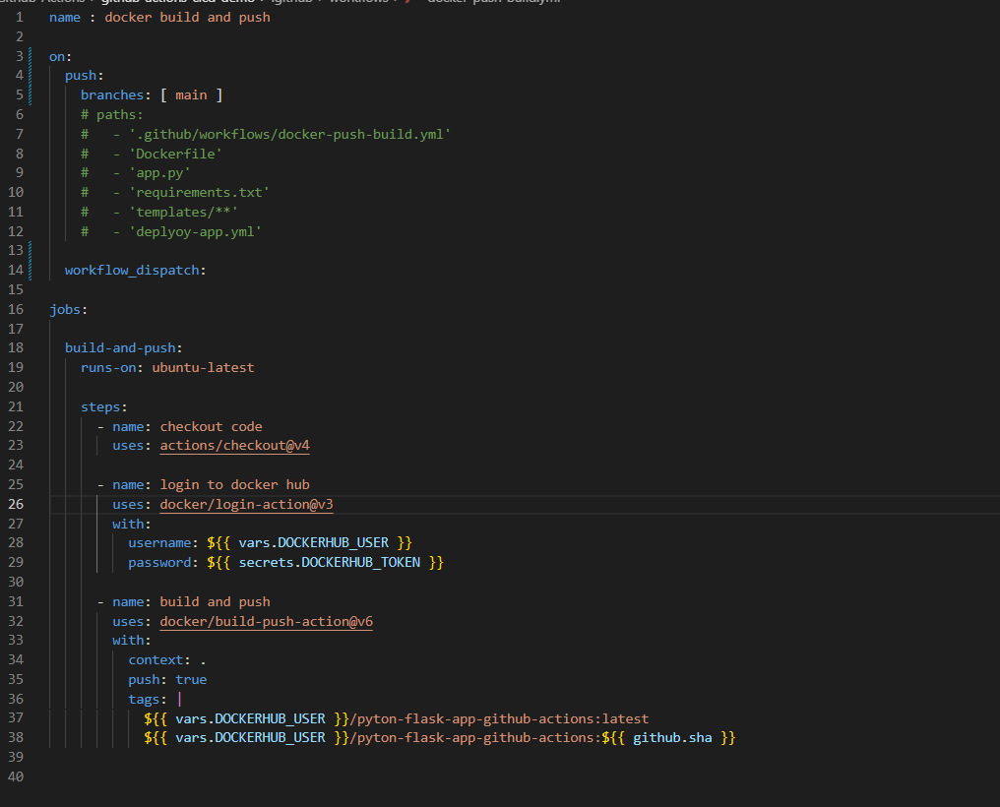

- Verify: Check the build step logs — does the image build successfully?

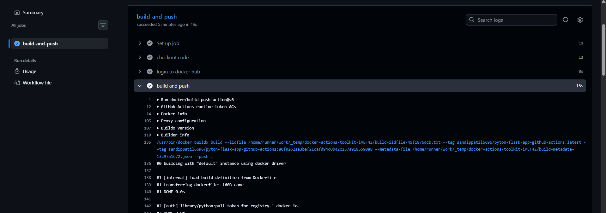

**Task 3: Push to Docker Hub**

Add steps to:

1. Log in to Docker Hub using your secrets
2. Tag the image as username/repo:latest and also username/repo:sha-<short-commit-hash>
3. Push both tags

- Verify: Go to Docker Hub — is your image there with both tags?

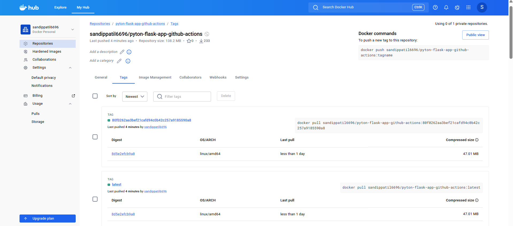

**Task 4: Only Push on Main**

Add a condition so the push step only runs on the main branch — not on feature branches or PRs.

Test it: push to a feature branch and verify the image is built but NOT pushed.

 `on:`
    `push:`
       `branches: [ main ]`

**Task 5: Add a Status Badge**

1. Get the badge URL for your docker-publish workflow from the Actions tab

2. Add it to your README.md

3. Push — the badge should show green

- 

**Task 6: Pull and Run It**

1. On your local machine (or a cloud server), pull the image you just pushed

2. Run it

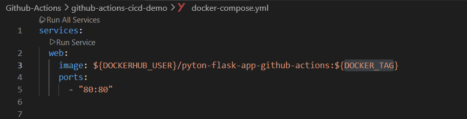

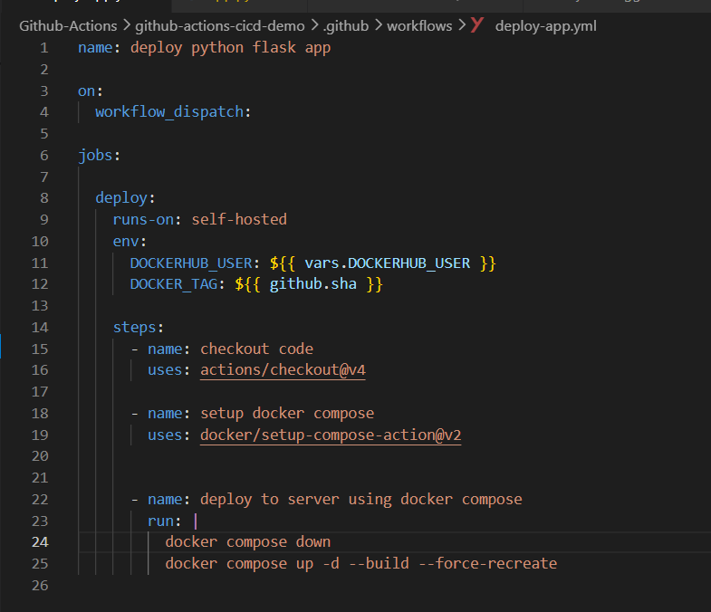

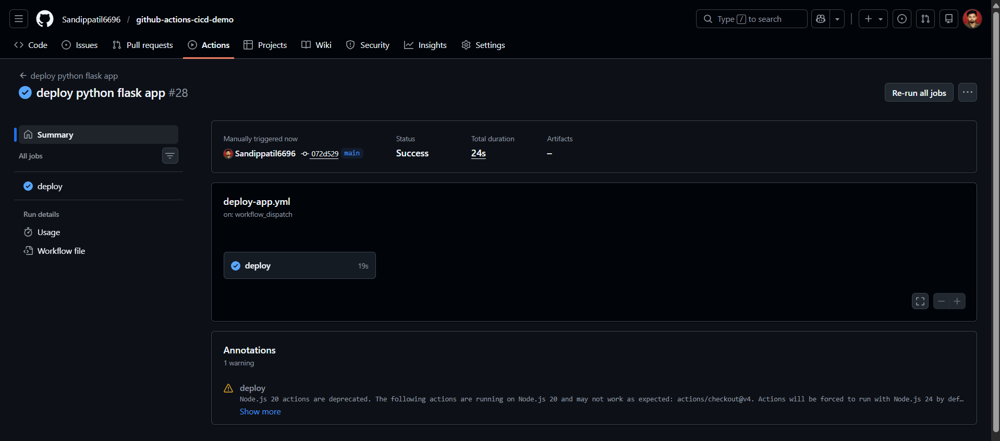

3. Confirm it works

- Write in your notes: What is the full journey from git push to a running container?

    | git push |
    |  ↓ |
    | GitHub Trigger |
    |    ↓ |
    | Checkout Code |
    |   ↓ |
    | Install requirements |
    |    ↓ |
    | Docker Build & push to dockerhub |
    |   ↓ |
    | pull images & Deploy on Server |
    |  ↓ |
    | Container Running |
    |   ↓ |
    | Users Access App |

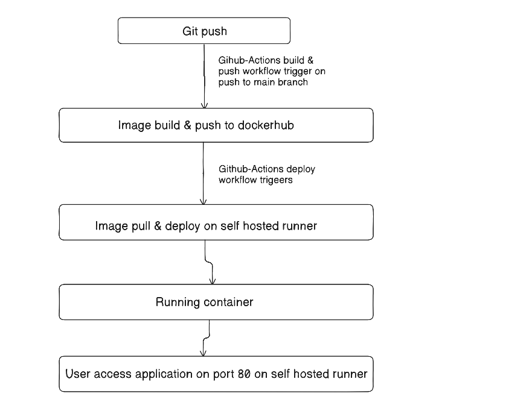