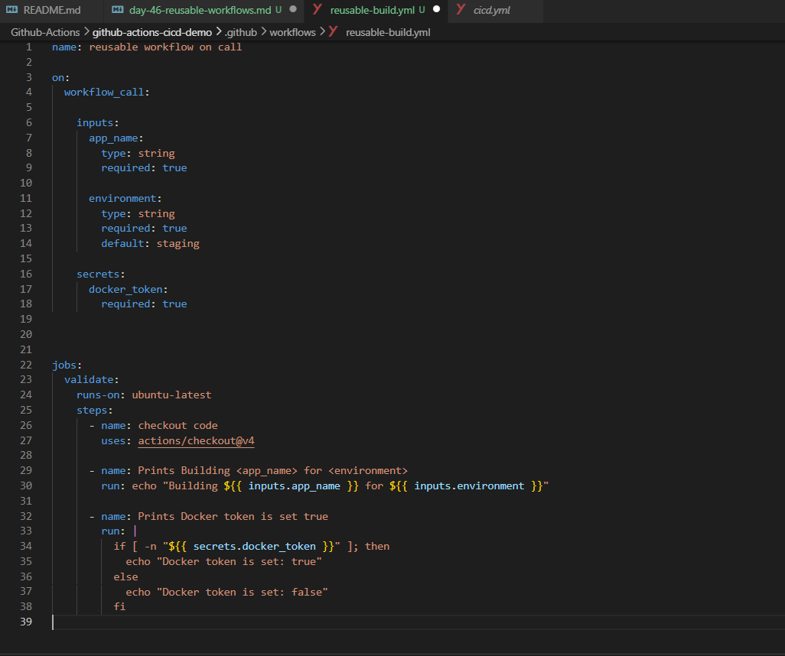
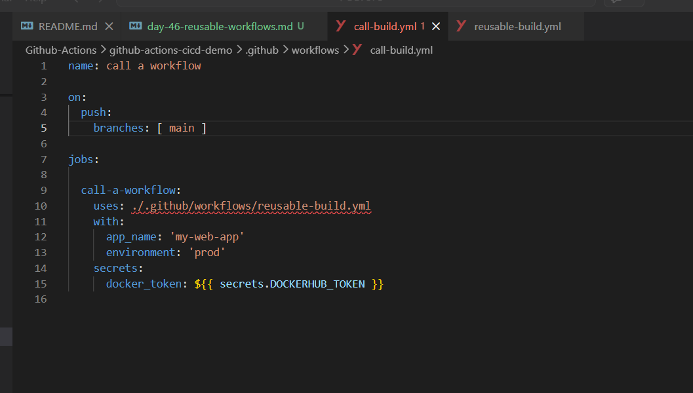
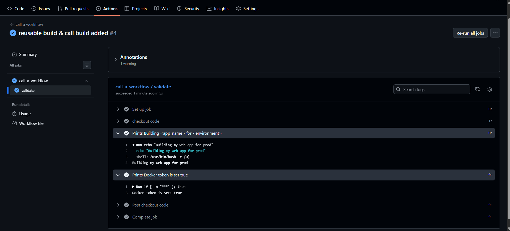
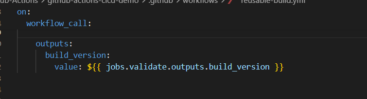
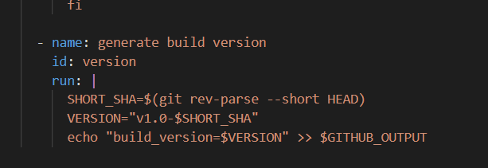
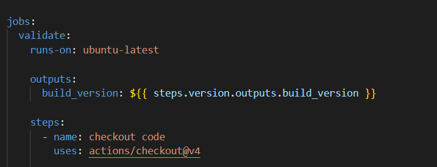
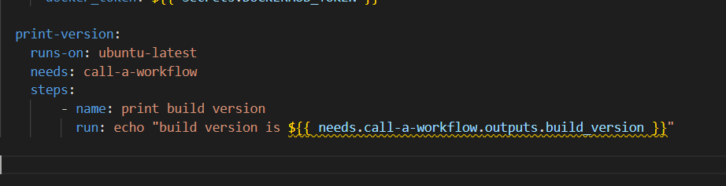
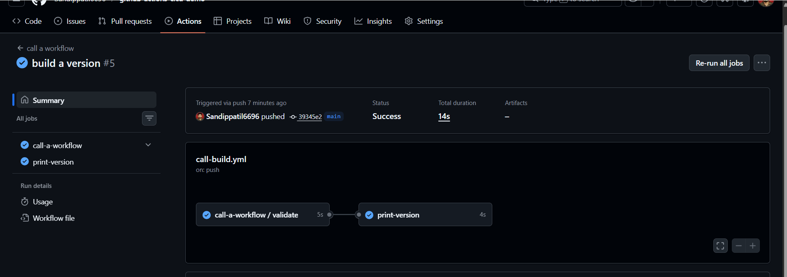
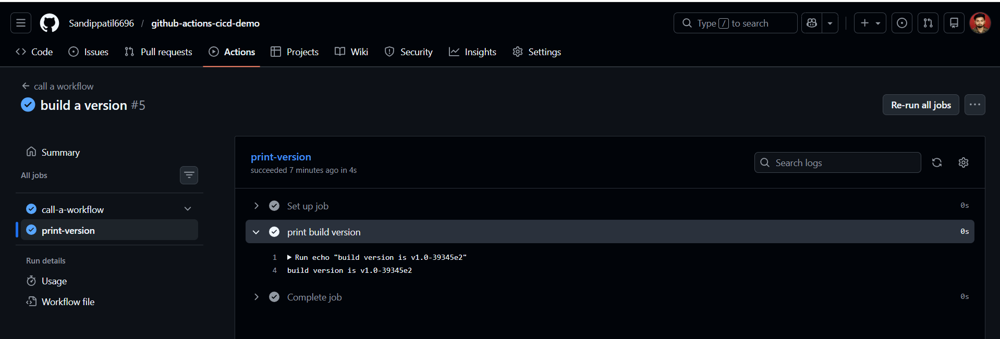

# Day 46 – Reusable Workflows & Composite Actions


# Task 1: Understand workflow_call

1. What is a reusable workflow

- A workflow you created & call them from other workflow & it avoid repeated CICD workflows 

2. What is the workflow_call trigger?

- If your workflow have trigger as on workflow call this workflow runs only when called by other workflow 

3. How is calling a reusable workflow different from using a regular action  (uses:)?

- In regular workflow *uses:* used *inside steps* 
- While in reusable workflow *uses:* used *after job name*

4. Where must a reusable workflow file live?

- reusable workflow file live inside *.github/workflows/* directory 

# Task 2 : Create Your First Reusable Workflow

Create `.github/workflows/reusable-build.yml`:
1. Set the trigger to `workflow_call`
2. Add an `inputs:` section with:
   - `app_name` (string, required)
   - `environment` (string, required, default: `staging`)
3. Add a `secrets:` section with:
   - `docker_token` (required)
4. Create a job that:
   - Checks out the code
   - Prints `Building <app_name> for <environment>`
   - Prints `Docker token is set: true` (never print the actual secret)

**Verify:** This file alone won't run — it needs a caller. That's next.

- It will not run untill it will call from other workflow




# Task 3: Create a Caller Workflow

Create `.github/workflows/call-build.yml`:

1. Trigger on push to `main`
2. Add a job that uses your reusable workflow:
   ```yaml
   jobs:
     build:
       uses: ./.github/workflows/reusable-build.yml
       with:
         app_name: "my-web-app"
         environment: "production"
       secrets:
         docker_token: ${{ secrets.DOCKER_TOKEN }}
   ```
3. Push to `main` and watch it run

**Verify:** In the Actions tab, do you see the caller triggering the reusable workflow? Click into the job — can you see the inputs printed?

- yes it will call a reusable-build workflow & printed input





# Task 4: Add Outputs to the Reusable Workflow
Extend `reusable-build.yml`:

1. Add an `outputs:` section that exposes a `build_version` value



2. Inside the job, generate a version string (e.g., `v1.0-<short-sha>`) and set it as output





3. In your caller workflow, add a second job that:
   - Depends on the build job (`needs:`)
   - Reads and prints the `build_version` output






**Verify:** Does the second job print the version from the reusable workflow?




# Task 6: Reusable Workflow vs Composite Action

Fill this in your notes:

| Feature | Reusable Workflow | Composite Action |
|--------|------------------|------------------|
| Triggered by | `workflow_call` | `uses:` in a step |
| Can contain jobs? | Yes (one or multiple jobs) | No |
| Can contain multiple steps? | Yes (inside jobs) | Yes |
| Lives where? | `.github/workflows/` | `.github/actions/<action-name>/` |
| Can accept secrets directly? | Yes (via `secrets:`) | No (must be passed as inputs) |
| Best for | Reusing full CI/CD pipelines | Reusing step logic / small automation |