# Day 50 – Kubernetes Architecture and Cluster Setup

### Task 1: Recall the Kubernetes Story

1. Why was Kubernetes created? What problem does it solve that Docker alone cannot?

    - k8s created to run a container by scaling & container healing when needed , it solve auto scaling & healing problem that docker cannot automatically scale or heal 

2. Who created Kubernetes and what was it inspired by?

    - k8s created by google & it is inspired by borg i.e google internal cluster management system

3. What does the name "Kubernetes" mean?

    - a ship steering 

### Task 2: Draw the Kubernetes Architecture
From memory, draw or describe the Kubernetes architecture. Your diagram should include:

**Control Plane (Master Node):**
- API Server — the front door to the cluster, every command goes through it
- etcd — the database that stores all cluster state
- Scheduler — decides which node a new pod should run on
- Controller Manager — watches the cluster and makes sure the desired state matches reality

**Worker Node:**
- kubelet — the agent on each node that talks to the API server and manages pods
- kube-proxy — handles networking rules so pods can communicate
- Container Runtime — the engine that actually runs containers (containerd, CRI-O)

- What happens when you run `kubectl apply -f pod.yaml`? Trace the request through each component.

    - When you run a cmd `kubectl apply -f pod.yaml` kubectl send a request to api server
    - api server writes pod object into etcd 
    - etcd stores the desired state of pod i.e pod must to be created 
    - scheduler contineously listen to api server & sees a new pod & unassign pod
    - schedular assign new pod to healthy node & again stored its desired state to etcd via api server 
    - then kubelet detects a pod assign to its node & kubelet begins Pod creation.
    - kubelet talks with container runtime like docker , containerd & create a container & started
    - kubeproxy is used to talks with your container to external users 
    - once container runs successfully , kubelet update pod status to api server to etcd 
    - & when you run a cmd kubectl get pods it will show running . 

- What happens if the API server goes down?

    - It is a main entrypoint of your cluster , if down , your cluster become unaccessible , last running state of your cluster contineous , no new assignment of pod , no update of desired states of your pod , kubectl stop working 

- What happens if a worker node goes down?

    - if it goes down , it stop serving traffic on that node , & that node become unrecheable , control plane marks node status not ready 

---

### Task 3: Install kubectl
`kubectl` is the CLI tool you will use to talk to your Kubernetes cluster.

Install it:

# Linux (amd64)
curl -LO "https://dl.k8s.io/release/$(curl -L -s https://dl.k8s.io/release/stable.txt)/bin/linux/amd64/kubectl"
chmod +x kubectl
sudo mv kubectl /usr/local/bin/

Verify:

kubectl version 

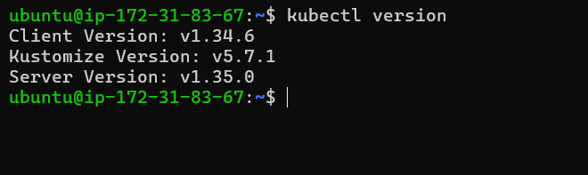

### Task 4: Set Up Your Local Cluster

**Option A: kind (Kubernetes in Docker)**

# Install kind

# Linux
curl -Lo ./kind https://kind.sigs.k8s.io/dl/latest/kind-linux-amd64
chmod +x ./kind
sudo mv ./kind /usr/local/bin/kind

# Create a cluster
kind create cluster --config kind-config.yml

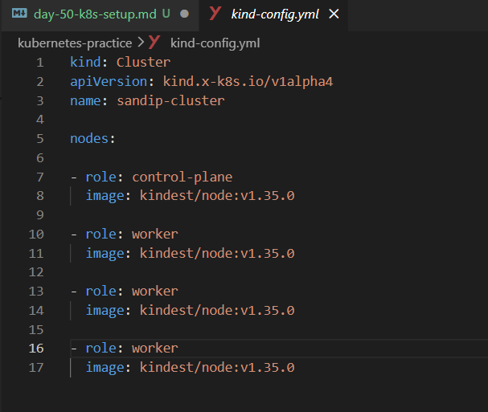

# Verify
kubectl cluster-info
kubectl get nodes

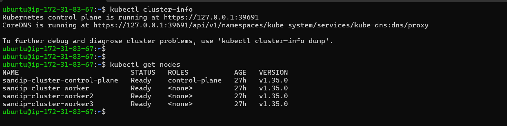

### Task 5: Explore Your Cluster
Now that your cluster is running, explore it:

# See cluster info
kubectl cluster-info

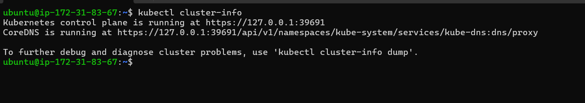

# List all nodes
kubectl get nodes

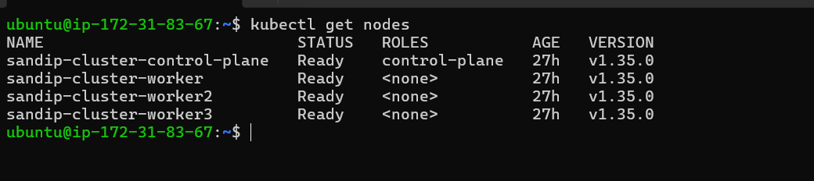

# Get detailed info about your node
kubectl describe node <node-name>

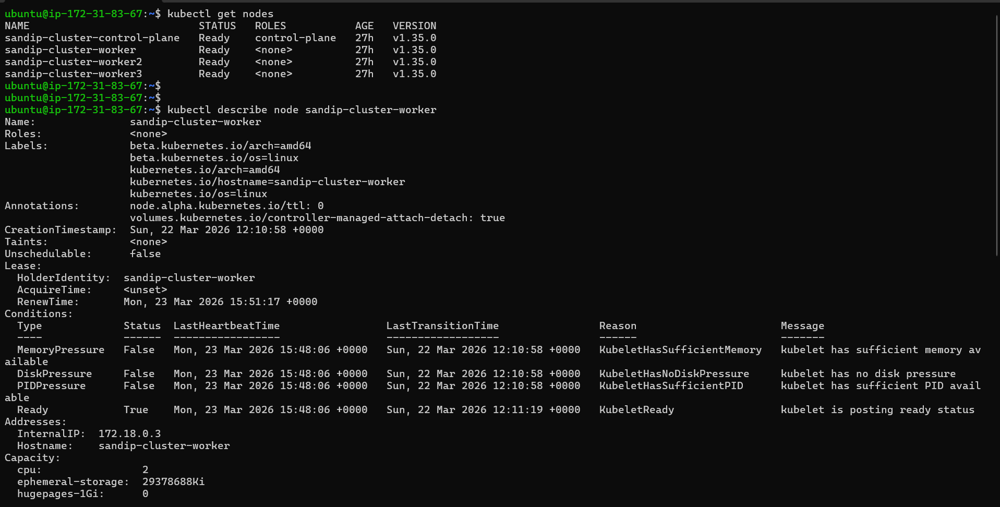

# List all namespaces
kubectl get namespaces

kubectl get ns

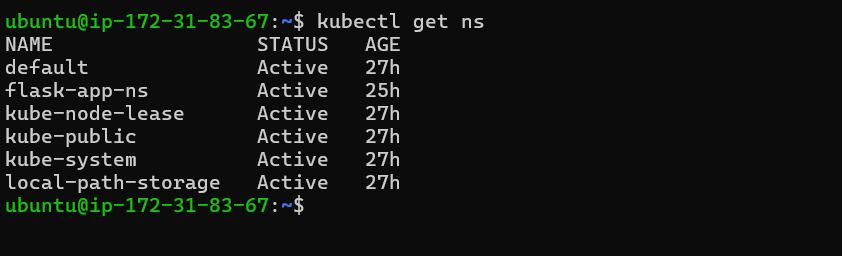

# See ALL pods running in the cluster (across all namespaces)
kubectl get pods -A

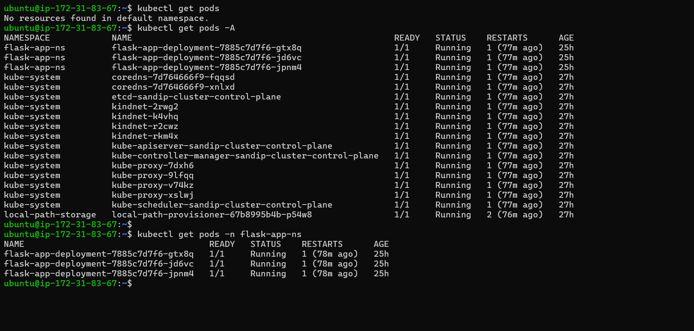

# Look at the pods running in the `kube-system` namespace:

kubectl get pods -n kube-system

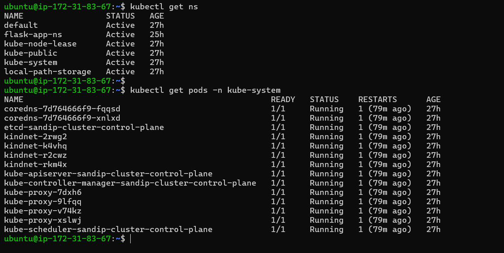

You should see pods like `etcd`, `kube-apiserver`, `kube-scheduler`, `kube-controller-manager`, `coredns`, and `kube-proxy`. These are the architecture components you drew in Task 2 — running as pods inside the cluster.

**Verify:** Can you match each running pod in `kube-system` to a component in your architecture diagram?

yes

---

### Task 6: Practice Cluster Lifecycle
Build muscle memory with cluster operations:

# Delete your cluster
kind delete cluster --name devops-cluster

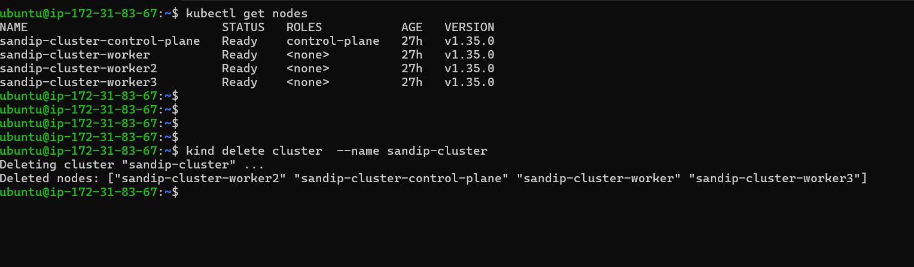

# Recreate it
kind create cluster --config kind-config.yml

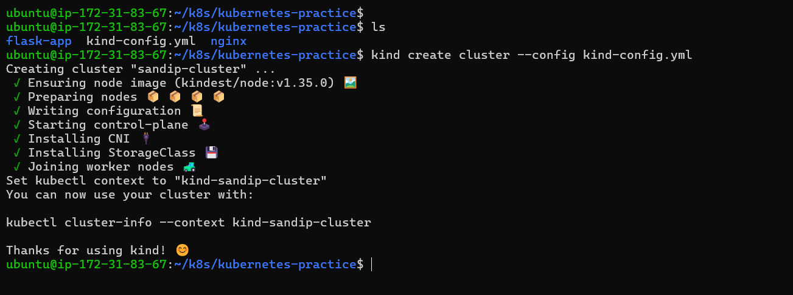

# Verify it is back
kubectl get nodes

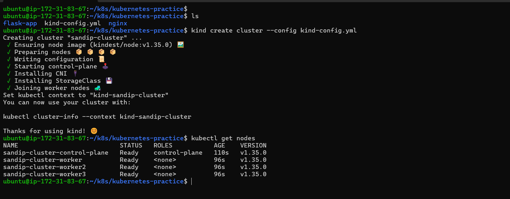

Try these useful commands:

# Check which cluster kubectl is connected to
kubectl config current-context

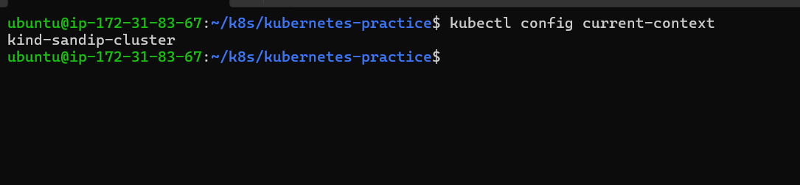

# List all available contexts (clusters)
kubectl config get-contexts

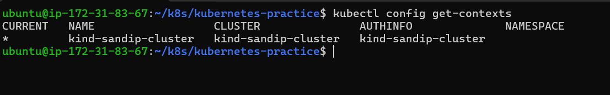

# See the full kubeconfig
kubectl config view

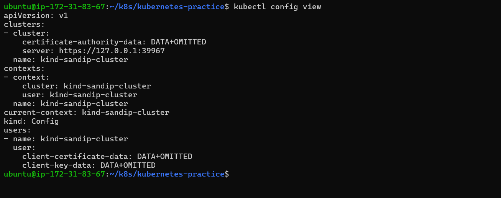

Write down: What is a kubeconfig? Where is it stored on your machine?

- A kubeconfig is a configuration file that tells kubectl how to connect to a Kubernetes cluster.

- it is stored in ~/.kube/config

---