# Day 51 – Kubernetes Manifests and Your First Pods

**Task 1: Create Your First Pod (Nginx)**

- Create a file called `nginx-pod.yaml`:

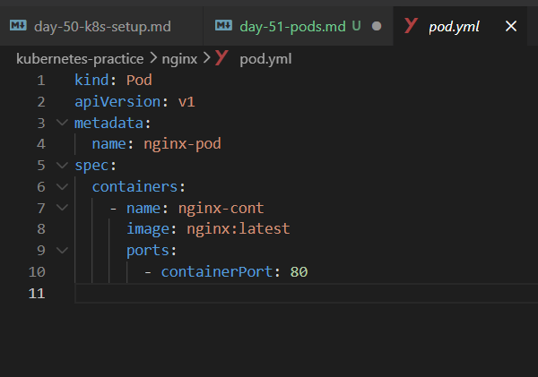

Apply it:
```bash
kubectl apply -f pod.yaml
```
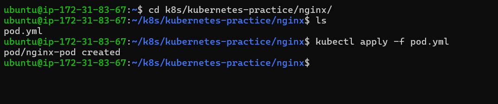


Verify:
```bash
kubectl get pods
kubectl get pods -o wide
```

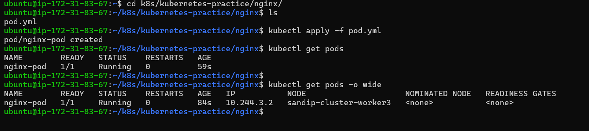


Wait until the STATUS shows `Running`. Then explore:

# Detailed info about the pod

`kubectl describe pod nginx-pod`

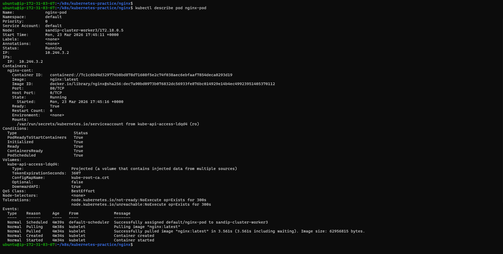

# Read the logs

`kubectl logs nginx-pod`

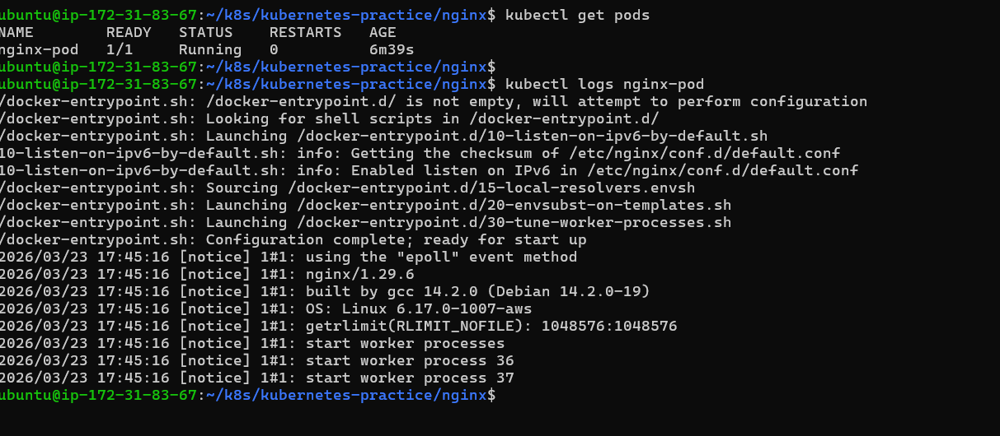

# Get a shell inside the container

`kubectl exec -it nginx-pod -- /bin/bash`


# Inside the container, run:
`curl localhost:80`
`exit`

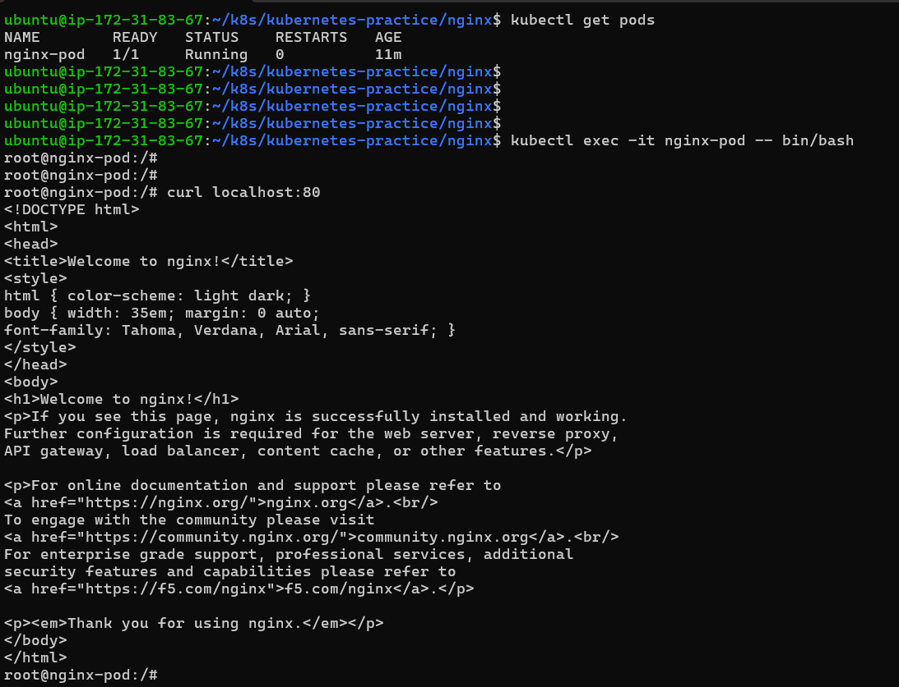

**Task 2: Create a Custom Pod (BusyBox)**

- Write a new manifest busybox-pod.yaml from scratch (do not copy-paste the nginx one):

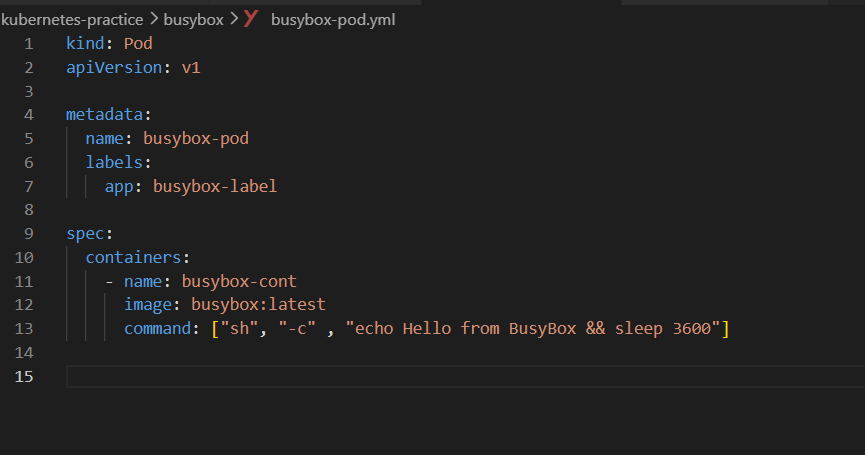

*Apply & verfiy*

```bash
kubectl apply -f busybox-pod.yaml
kubectl get pods
kubectl logs busybox-pod
```

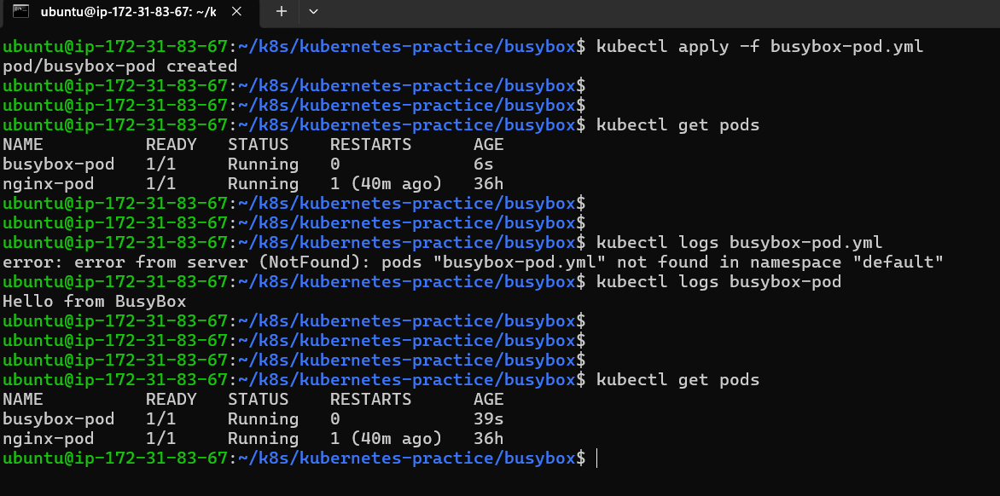

Notice the `command` field — BusyBox does not run a long-lived server like Nginx. Without a command that keeps it running, the container would exit immediately and the pod would go into `CrashLoopBackOff`.

- yes it wiil go in `CrashLoopBackOff` after cmd sleep 120 executes .


**Verify:** Can you see "Hello from BusyBox" in the logs?

- yes 

**Task 3: Imperative vs Declarative**

You have been using the declarative approach (writing YAML, then `kubectl apply`). Kubernetes also supports imperative commands:

```bash
# Create a pod without a YAML file
kubectl run redis-pod --image=redis:latest
```

```bash
# Check it
kubectl get pods
```
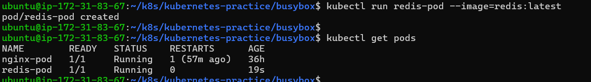

Now extract the YAML that Kubernetes generated:

```bash
kubectl get pod redis-pod -o yaml
```
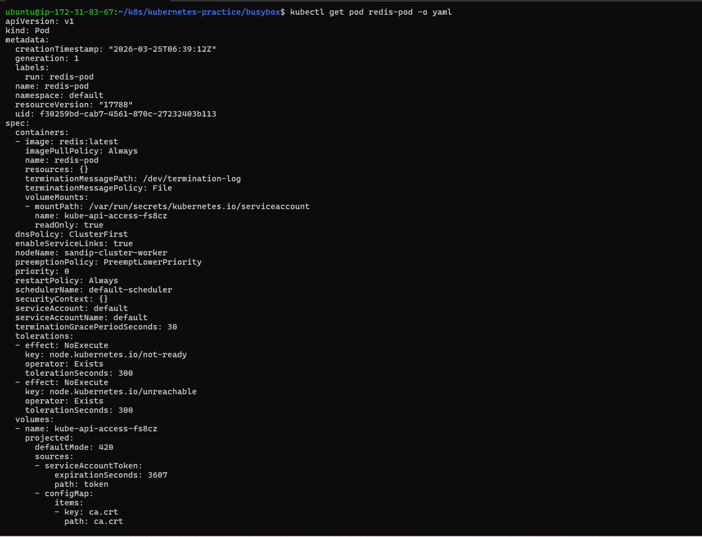

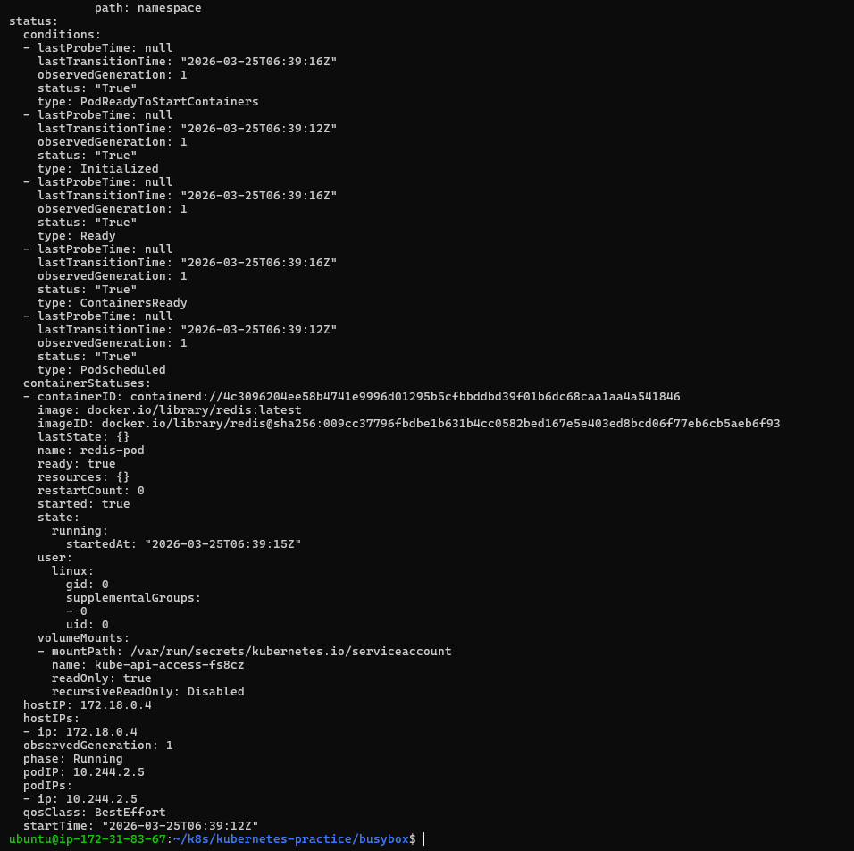

*Compare this output with your hand-written manifests. Notice how much extra metadata Kubernetes adds automatically (status, timestamps, uid, resource version).*

- metadata adds addition by imperative style is 

 - creationTimestamp
 - resourceVersion
 - uid
 - status

*You can also use dry-run to generate YAML without creating anything:*

- `kubectl run test-pod --image=nginx --dry-run=client -o yaml`

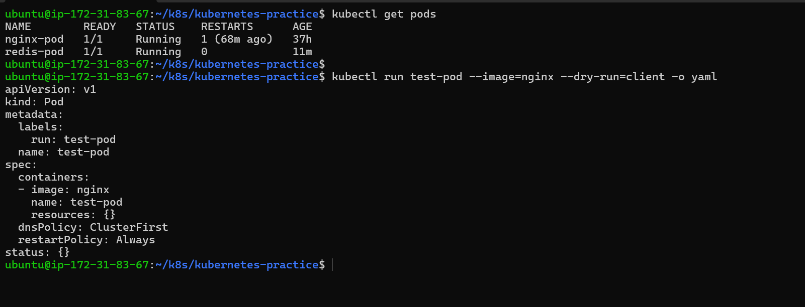

This is a powerful trick — use it to quickly scaffold a manifest, then customize it.

**Verify:** Save the dry-run output to a file and compare its structure with your nginx-pod.yaml. What fields are the same? What is different?

- Different fiels is 
 - run: test-pod
 - resources: {}
 - dnsPolicy: ClusterFirst
 - restartPolicy: Always
 - status: {}


**Task 4: Validate Before Applying**
Before applying a manifest, you can validate it:

```bash
# Check if the YAML is valid without actually creating the resource
kubectl apply -f nginx-pod.yaml --dry-run=client
```

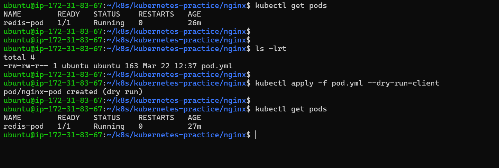

```bash
# Validate against the cluster's API (server-side validation)
kubectl apply -f nginx-pod.yaml --dry-run=server
```

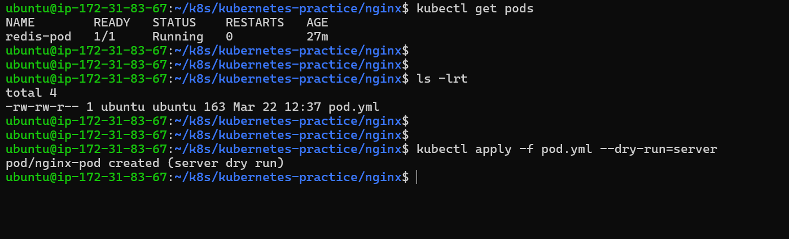


Now intentionally break your YAML (remove the `image` field or add an invalid field) and run dry-run again. See what error you get.

**Verify:** What error does Kubernetes give when the image field is missing?

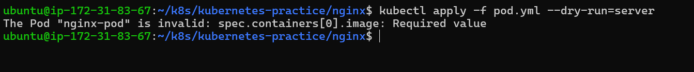


**Task 5: Pod Labels and Filtering**

Labels are how Kubernetes organizes and selects resources. You added labels in your manifests — now use them:

```bash
# List all pods with their labels
kubectl get pods --show-labels
```
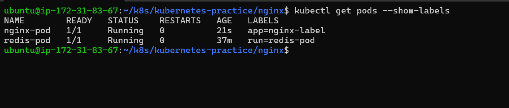

```bash
# Filter pods by label
kubectl get pods -l app=nginx
kubectl get pods -l environment=dev
```
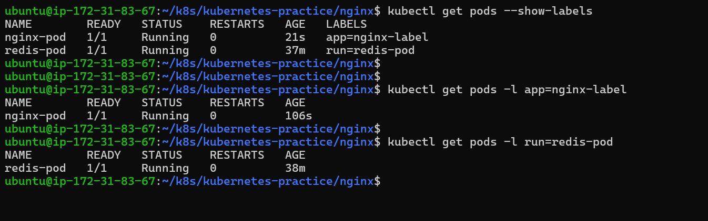

```bash
# Add a label to an existing pod
kubectl label pod nginx-pod environment=production
```
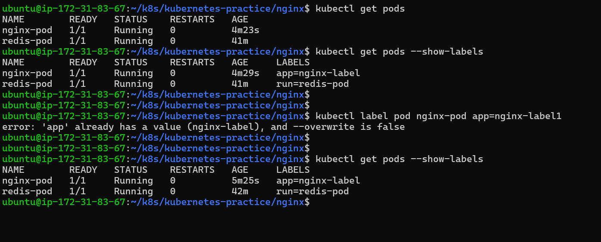

- it does not overwrite if it has already label

```bash
# Verify
kubectl get pods --show-labels
```

```bash
# Remove a label
kubectl label pod nginx-pod app-
```

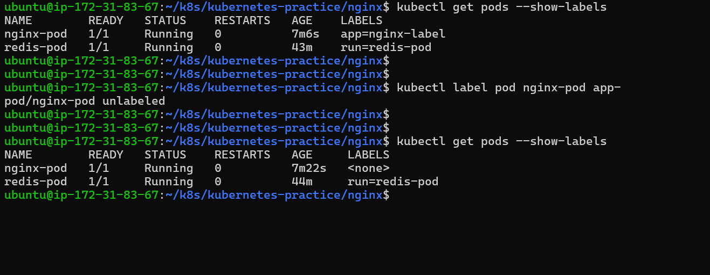

Write a manifest for a third pod with at least 3 labels (app, environment, team). Apply it and practice filtering.

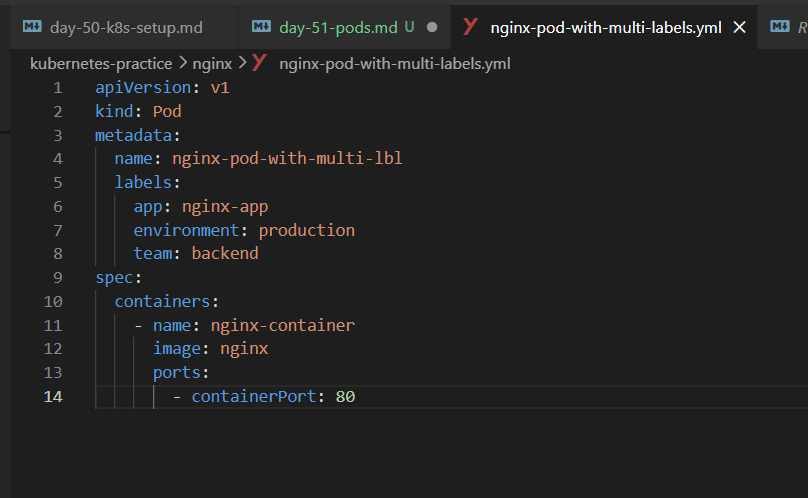

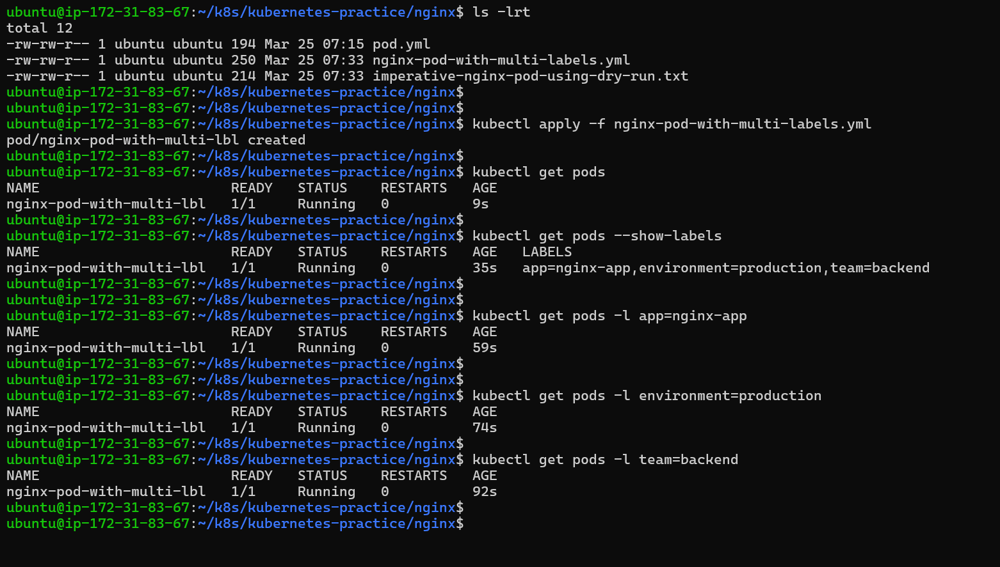

---

**Task 6: Clean Up**

Delete all the pods you created:

```bash
# Delete by name
kubectl delete pod nginx-pod
kubectl delete pod busybox-pod
kubectl delete pod redis-pod
```
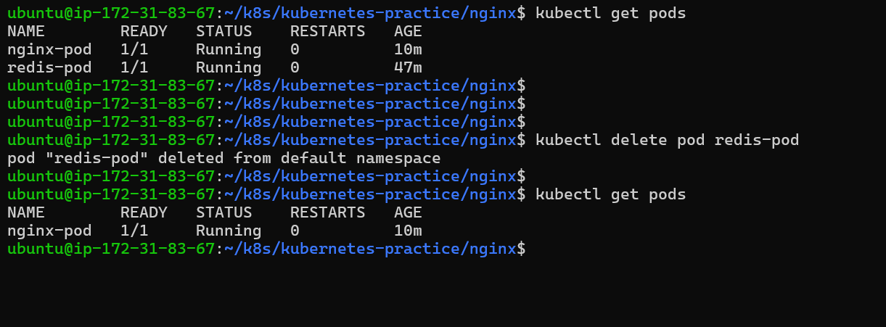


```bash
# Or delete using the manifest file
kubectl delete -f nginx-pod.yaml
```
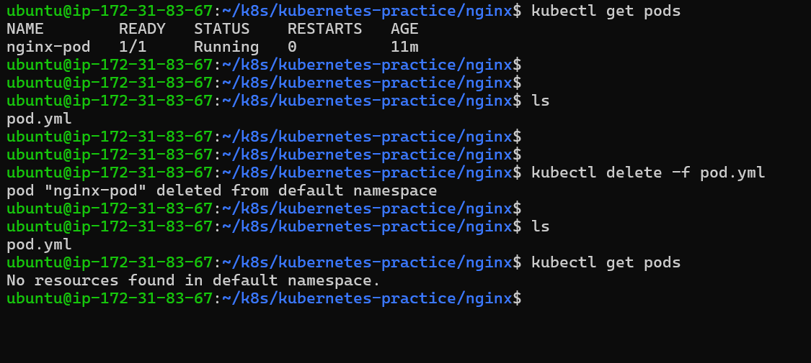


```bash
# Verify everything is gone
kubectl get pods
```

Notice that when you delete a standalone Pod, it is gone forever. There is no controller to recreate it. This is why in production you use Deployments (coming on Day 52) instead of bare Pods.

---