# Day 55 – Persistent Volumes (PV) and Persistent Volume Claims (PVC)

## Challenge Tasks

### Task 1: See the Problem — Data Lost on Pod Deletion
1. Write a Pod manifest that uses an `emptyDir` volume and writes a timestamped message to `/data/message.txt`

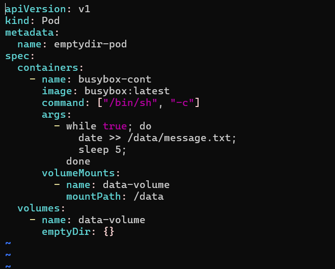

2. Apply it, verify the data exists with `kubectl exec`

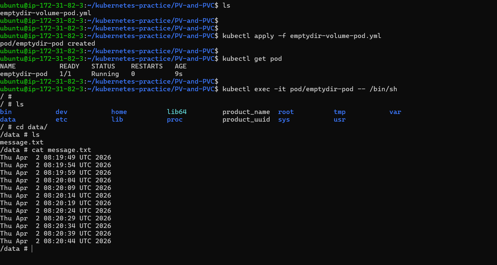

3. Delete the Pod, recreate it, check the file again — the old message is gone

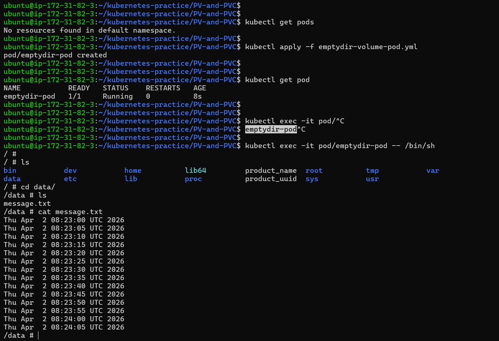

**Verify:** Is the timestamp the same or different after recreation?

- timestamp wiil be different after recreation of pod 

---

### Task 2: Create a PersistentVolume (Static Provisioning)
1. Write a PV manifest with `capacity: 1Gi`, `accessModes: ReadWriteOnce`, `persistentVolumeReclaimPolicy: Retain`, and `hostPath` pointing to `/tmp/k8s-pv-data`

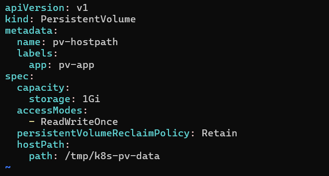

2. Apply it and check `kubectl get pv` — status should be `Available`

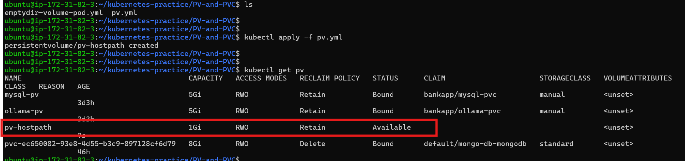

Access modes to know:
- `ReadWriteOnce (RWO)` — read-write by a single node
- `ReadOnlyMany (ROX)` — read-only by many nodes
- `ReadWriteMany (RWX)` — read-write by many nodes

`hostPath` is fine for learning, not for production.

**Verify:** What is the STATUS of the PV?

- Available

---

### Task 3: Create a PersistentVolumeClaim
1. Write a PVC manifest requesting `1Gi` of storage with `ReadWriteOnce` access

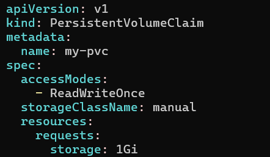

2. Apply it and check both `kubectl get pvc` and `kubectl get pv`
3. Both should show `Bound` — Kubernetes matched them by capacity and access mode

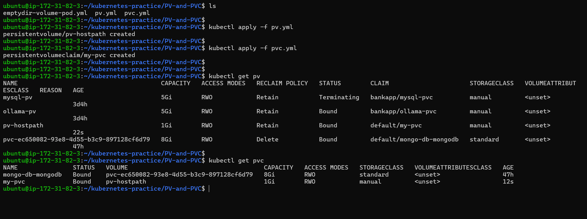

**Verify:** What does the VOLUME column in `kubectl get pvc` show?

- Volume column in `kubectl get pvc` shows that persitent volume claim bound to which persistent volume   

---

### Task 4: Use the PVC in a Pod — Data That Survives
1. Write a Pod manifest that mounts the PVC at `/data` using `persistentVolumeClaim.claimName`

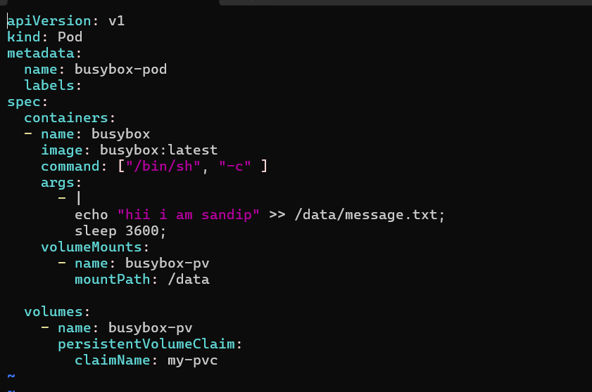

2. Write data to `/data/message.txt`, then delete and recreate the Pod
3. Check the file — it should contain data from both Pods

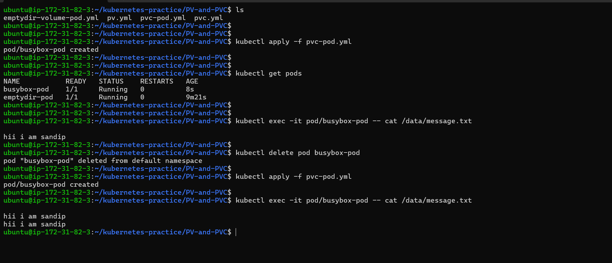

**Verify:** Does the file contain data from both the first and second Pod?

- Yes file conatins data from both the files

---

### Task 5: StorageClasses and Dynamic Provisioning
1. Run `kubectl get storageclass` and `kubectl describe storageclass`

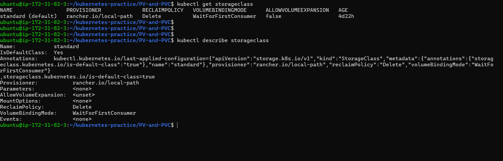

2. Note the provisioner, reclaim policy, and volume binding mode

- *provisioner: rancher.io/local-path - Uses local node path/storage to create volumes*
- *reclaim policy: Delete - deleted automatically when the PVC is deleted*
- *volume binding mode: WaitForFirstConsumer - volume is created only when a Pod actually uses it*

This is the automatically used storage when no class is specified in a PVC

3. With dynamic provisioning, developers only create PVCs — the StorageClass handles PV creation automatically

**Verify:** What is the default StorageClass in your cluster?

- *standard- automatically used storage when no class is specified in a PVC*

### Task 6: Dynamic Provisioning
1. Write a PVC manifest that includes `storageClassName: standard` (or your cluster's default)

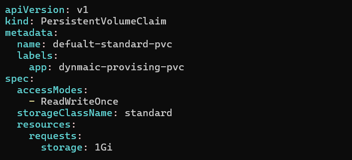

2. Apply it — a PV should appear automatically in `kubectl get pv`

3. Use this PVC in a Pod, write data, verify it works

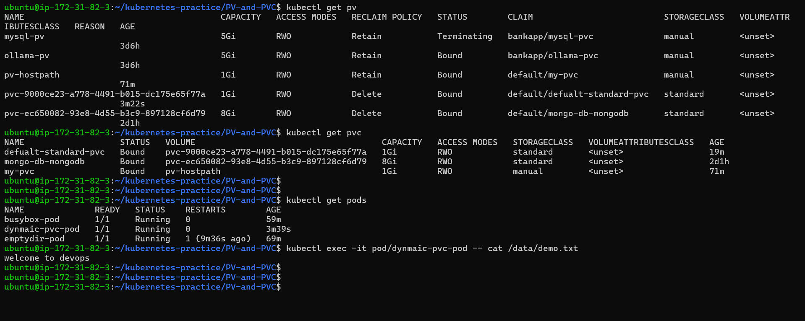

**Verify:** How many PVs exist now? Which was manual, which was dynamic?

- there is 2 standard and one manual pv exits for current day task

---

### Task 7: Clean Up
1. Delete all pods first
2. Delete PVCs — check `kubectl get pv` to see what happened
3. The dynamic PV is gone (Delete reclaim policy). The manual PV shows `Released` (Retain policy).
4. Delete the remaining PV manually

**Verify:** Which PV was auto-deleted and which was retained? Why?

- Auto-deleted pv - storageclass which has standard they are deleted automatically beacuse it has reclaim policy is delete so after deletion of pvc it associated pv gets deleted automatically . 

- storageclass which has manual got retained & reclaim policy is equal to retain so even after deletion of pvc it associated pv get retained . 