# Day 56 – Kubernetes StatefulSets

## Task
Deployments work great for stateless apps, but what about databases? You need stable pod names, ordered startup, and persistent storage per replica. Today you learn StatefulSets — the workload designed for stateful applications like MySQL, PostgreSQL, and Kafka.

### Task 1: Understand the Problem
1. Create a Deployment with 3 replicas using nginx

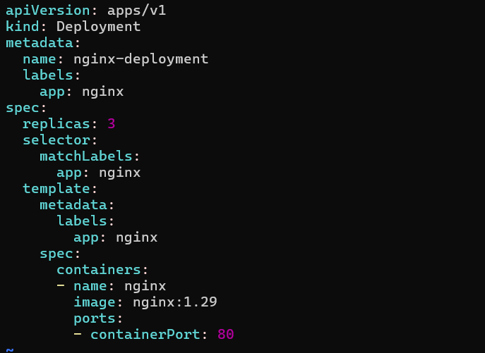

2. Check the pod names — they are random (`app-xyz-abc`)

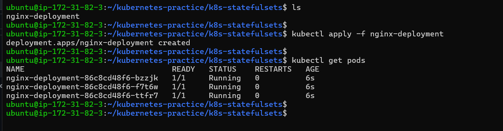

3. Delete a pod and notice the replacement gets a different random name

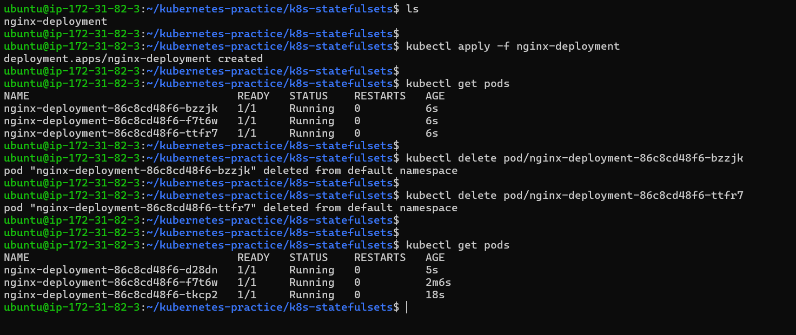

This is fine for web servers but not for databases where you need stable identity.

| Feature | Deployment | StatefulSet |
|---|---|---|
| Pod names | Random | Stable, ordered (`app-0`, `app-1`) |
| Startup order | All at once | Ordered: pod-0, then pod-1, then pod-2 |
| Storage | Shared PVC | Each pod gets its own PVC |
| Network identity | No stable hostname | Stable DNS per pod |

Delete the Deployment before moving on.

**Verify:** Why would random pod names be a problem for a database cluster?

- *because databases need stable identity and consistent storage mapping— this things random pod names break.*

---

### Task 2: Create a Headless Service
1. Write a Service manifest with `clusterIP: None` — this is a Headless Service
2. Set the selector to match the labels you will use on your StatefulSet pods

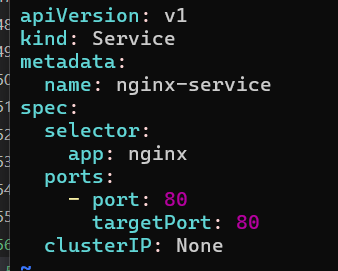

3. Apply it and confirm CLUSTER-IP shows `None`

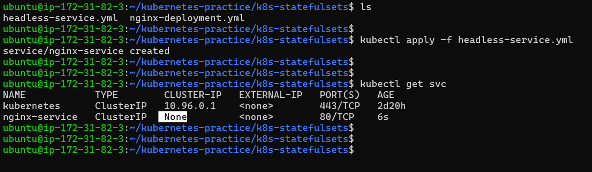

A Headless Service creates individual DNS entries for each pod instead of load-balancing to one IP. StatefulSets require this.

**Verify:** What does the CLUSTER-IP column show?

- *It shows none*

---

### Task 3: Create a StatefulSet
1. Write a StatefulSet manifest with `serviceName` pointing to your Headless Service
2. Set replicas to 3, use the nginx image
3. Add a `volumeClaimTemplates` section requesting 100Mi of ReadWriteOnce storage

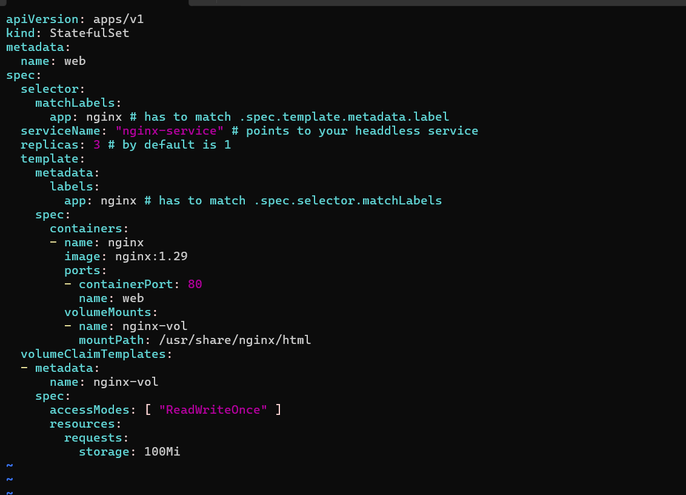

4. Apply and watch: `kubectl get pods -l <your-label> -w`

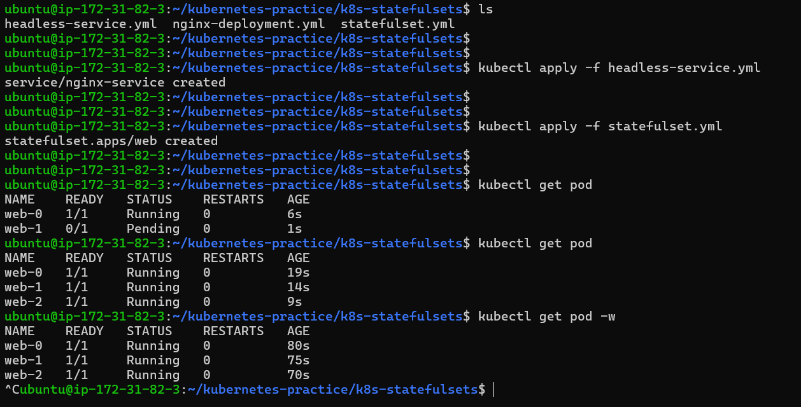

Observe ordered creation — `web-0` first, then `web-1` after `web-0` is Ready, then `web-2`.

Check the PVCs: `kubectl get pvc` — you should see `web-data-web-0`, `web-data-web-1`, `web-data-web-2` (names follow the pattern `<template-name>-<pod-name>`).

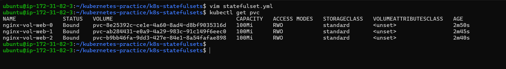

**Verify:** What are the exact pod names and PVC names?

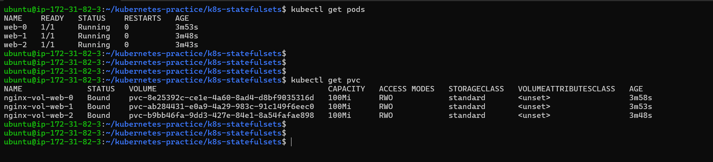

---

### Task 4: Stable Network Identity
Each StatefulSet pod gets a DNS name: `<pod-name>.<service-name>.<namespace>.svc.cluster.local`

1. Run a temporary busybox pod and use `nslookup` to resolve `web-0.<your-headless-service>.default.svc.cluster.local`

- `kubectl run dns-test --image=busybox:1.28 --rm -it --restart=Never -- sh`

2. Do the same for `web-1` and `web-2`

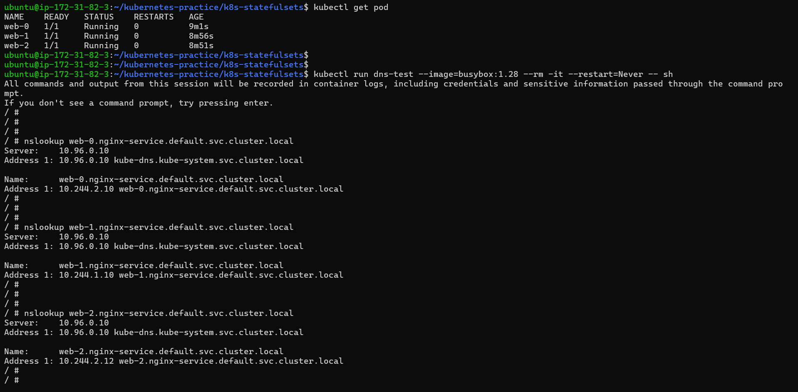

3. Confirm the IPs match `kubectl get pods -o wide`

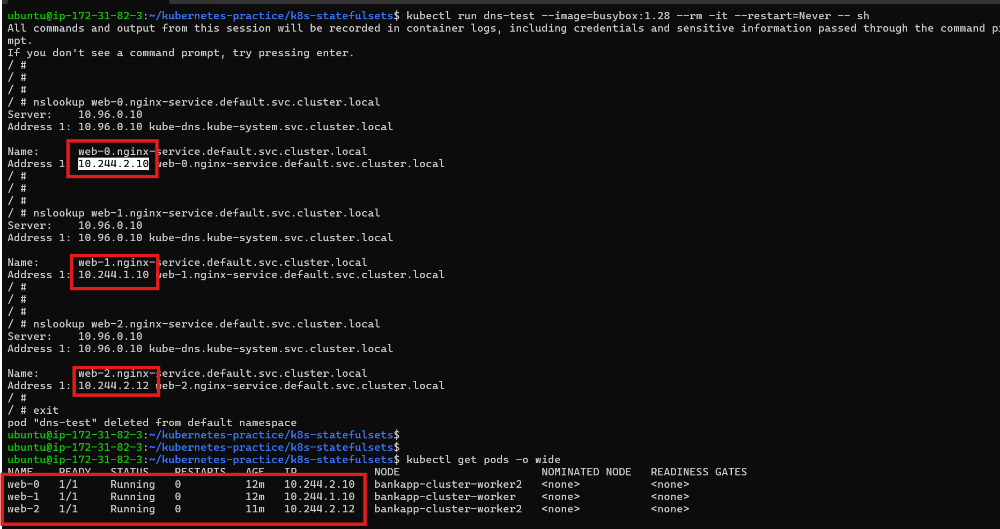

**Verify:** Does the nslookup IP match the pod IP?

 - yes 

---

### Task 5: Stable Storage — Data Survives Pod Deletion
1. Write unique data to each pod: `kubectl exec web-0 -- sh -c "echo 'Data from web-0' > /usr/share/nginx/html/index.html"`
2. Delete `web-0`: `kubectl delete pod web-0`
3. Wait for it to come back, then check the data — it should still be "Data from web-0"

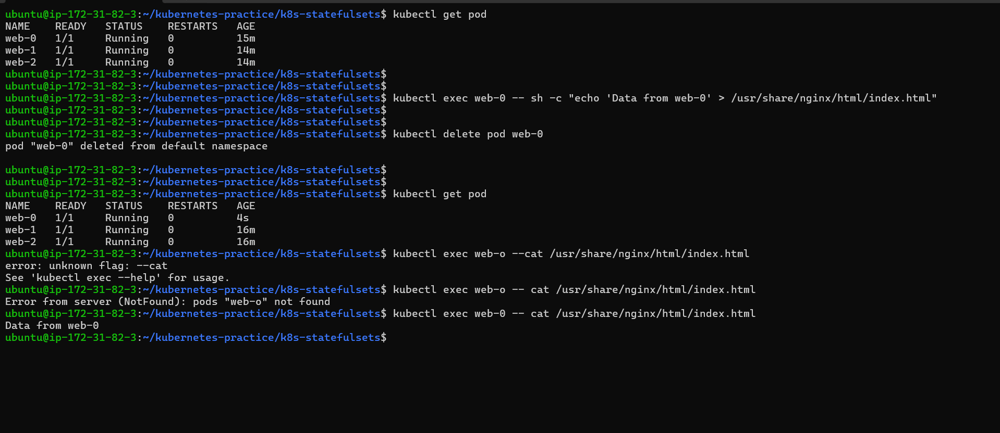

The new pod reconnected to the same PVC.

- yes

**Verify:** Is the data identical after pod recreation?

- yes 

---

### Task 6: Ordered Scaling
1. Scale up to 5: `kubectl scale statefulset web --replicas=5` — pods create in order (web-3, then web-4)

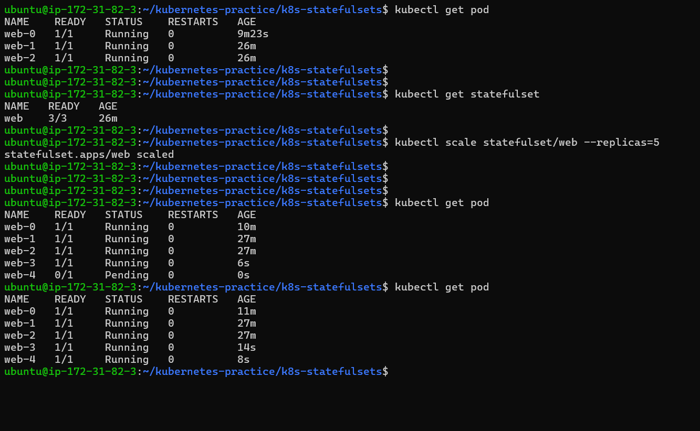

2. Scale down to 3 — pods terminate in reverse order (web-4, then web-3)

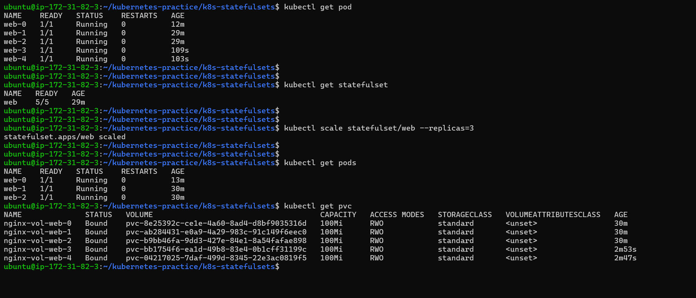

3. Check `kubectl get pvc` — all five PVCs still exist. Kubernetes keeps them on scale-down so data is preserved if you scale back up.

**Verify:** After scaling down, how many PVCs exist?

- 5 PVC there for all five pod

--- 

### Task 7: Clean Up
1. Delete the StatefulSet and the Headless Service
2. Check `kubectl get pvc` — PVCs are still there (safety feature)
3. Delete PVCs manually

**Verify:** Were PVCs auto-deleted with the StatefulSet?

- no pvc needs to be deleted manually 