# Day 59 – Helm — Kubernetes Package Manager

## Challenge Tasks

### Task 1: Install Helm
1. Install Helm (brew, curl script, or chocolatey depending on your OS)

- `sudo snap install helm --classic`

2. Verify with `helm version` and `helm env`

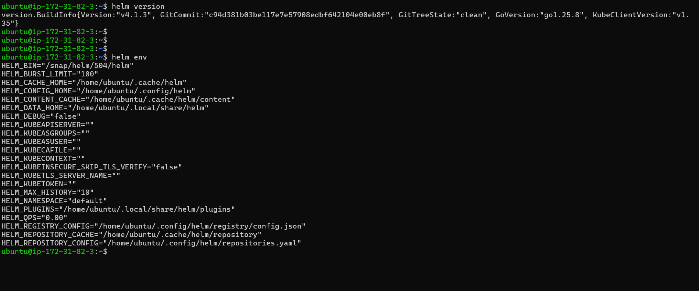

Three core concepts:
- **Chart** — a package of Kubernetes manifest templates
- **Release** — a specific installation of a chart in your cluster
- **Repository** — a collection of charts (like a package repo)

**Verify:** What version of Helm is installed?

- `v4.1.3` installed helm version

---

### Task 2: Add a Repository and Search
1. Add the Bitnami repository: `helm repo add bitnami https://charts.bitnami.com/bitnami`

`https://charts.bitnami.com/`

2. Update: `helm repo update`

3. Search: `helm search repo nginx` and `helm search repo bitnami`

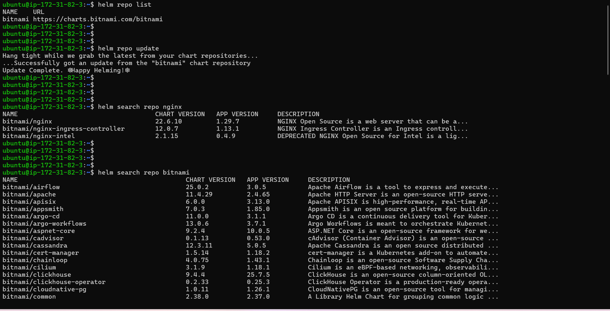

**Verify:** How many charts does Bitnami have?

- 144 charts

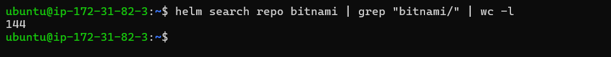

---

### Task 3: Install a Chart
1. Deploy nginx: `helm install my-nginx bitnami/nginx`

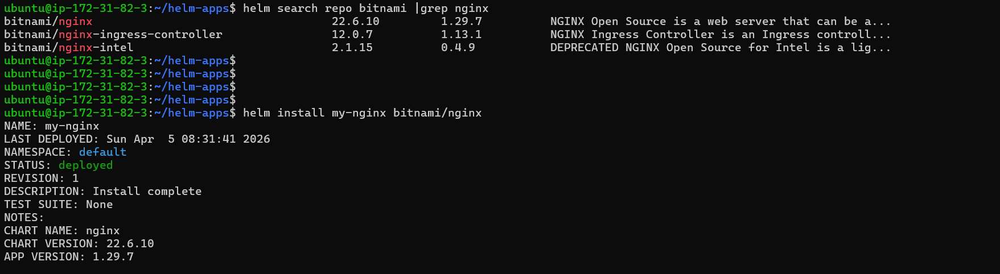

2. Check what was created: `kubectl get all`

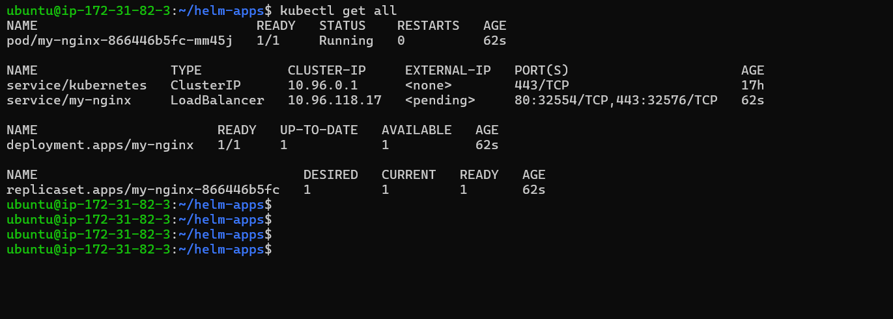

3. Inspect the release: `helm list`, `helm status my-nginx`, `helm get manifest my-nginx`

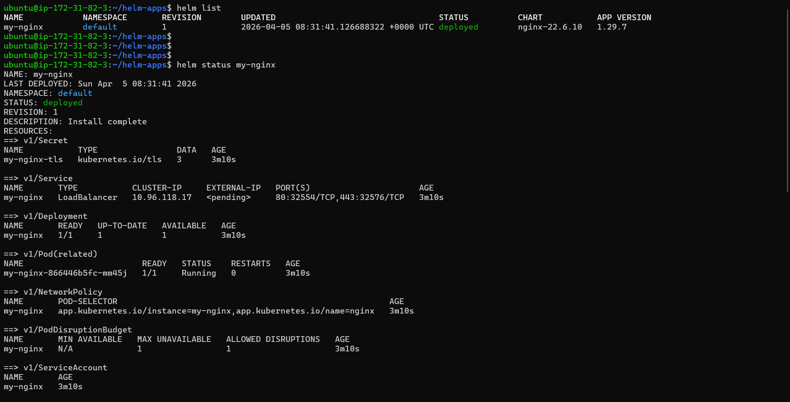

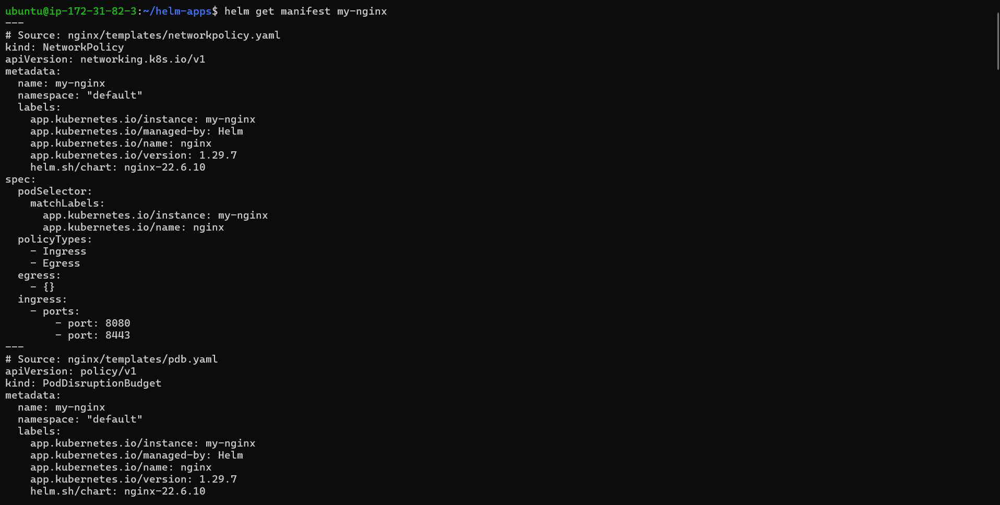

One command replaced writing a Deployment, Service, and ConfigMap by hand.

**Verify:** How many Pods are running? What Service type was created?

- one pod ruuning  , LoadBalancer type svc created

---

### Task 4: Customize with Values
1. View defaults: `helm show values bitnami/nginx`
2. Install a custom release with `--set replicaCount=3 --set service.type=NodePort`

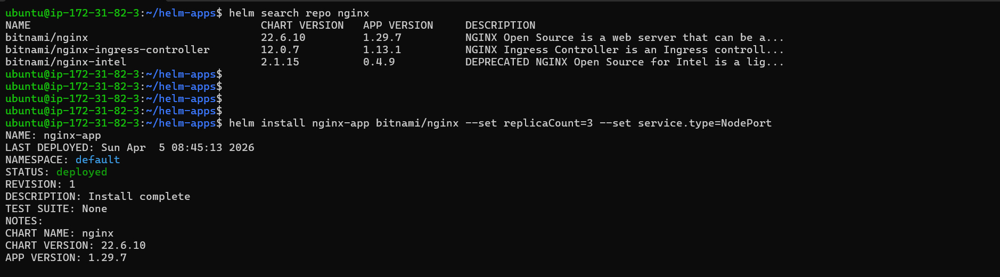

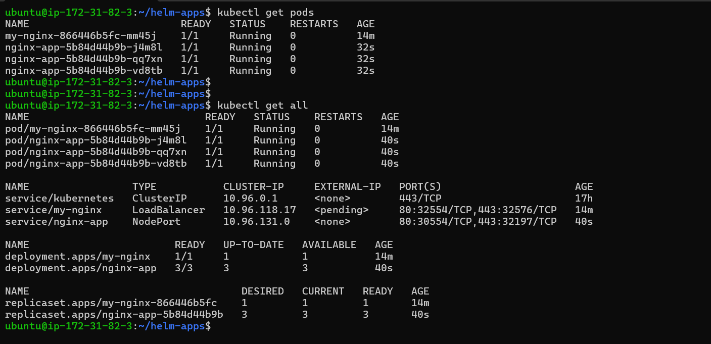

3. Create a `custom-values.yaml` file with replicaCount, service type, and resource limits

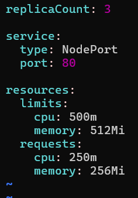

4. Install another release using `-f custom-values.yaml`

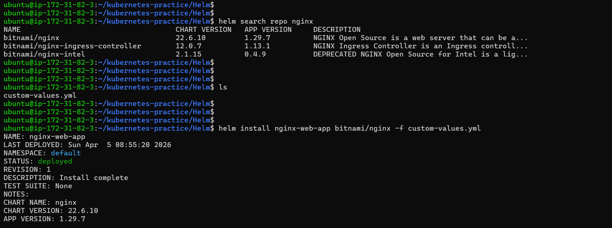

5. Check overrides: `helm get values <release-name>`

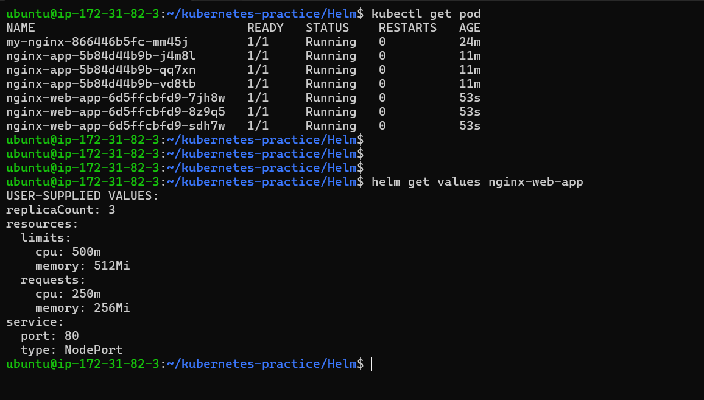

**Verify:** Does the values file release have the correct replicas and service type?

---

### Task 5: Upgrade and Rollback
1. Upgrade: `helm upgrade my-nginx bitnami/nginx --set replicaCount=5`

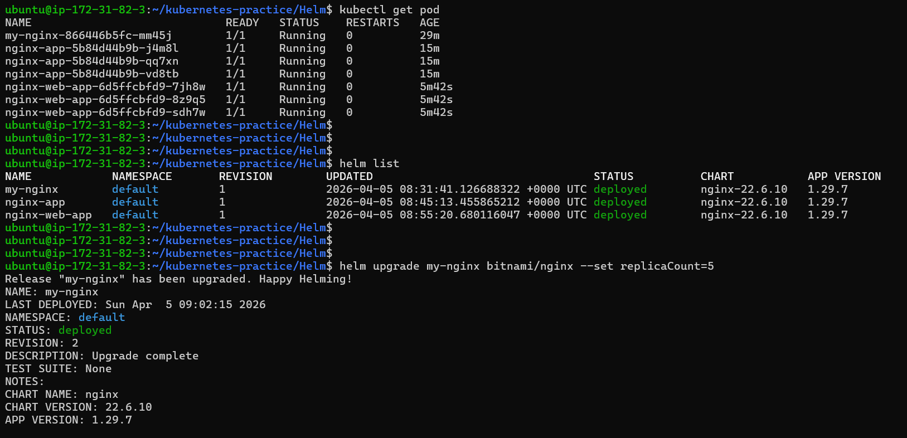

2. Check history: `helm history my-nginx`
3. Rollback: `helm rollback my-nginx 1`
4. Check history again — rollback creates a new revision (3), not overwriting revision 2

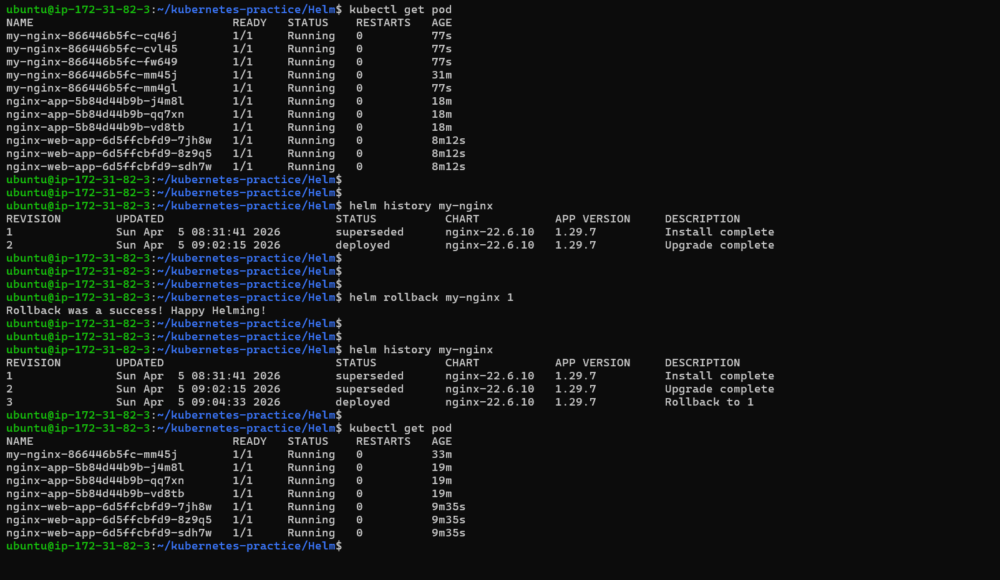

Same concept as Deployment rollouts from Day 52, but at the full stack level.

**Verify:** How many revisions after the rollback?
 
- 3 revision

---

### Task 6: Create Your Own Chart
1. Scaffold: `helm create my-app`
2. Explore the directory: `Chart.yaml`, `values.yaml`, `templates/deployment.yaml`
3. Look at the Go template syntax in templates: `{{ .Values.replicaCount }}`, `{{ .Chart.Name }}`
4. Edit `values.yaml` — set replicaCount to 3 and image to nginx:1.25
5. Validate: `helm lint my-app`
6. Preview: `helm template my-release ./my-app`
7. Install: `helm install my-release ./my-app`

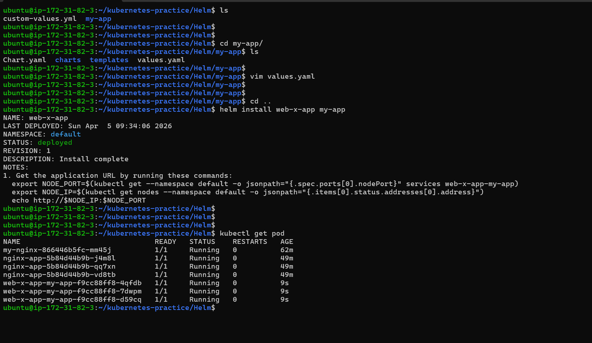

8. Upgrade: `helm upgrade my-release ./my-app --set replicaCount=5`

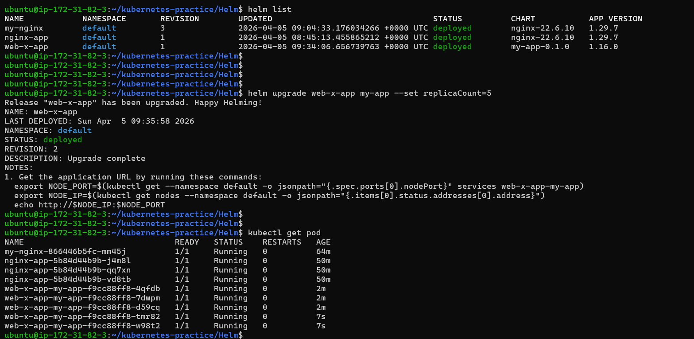

**Verify:** After installing, 3 replicas? After upgrading, 5?

- yes

---

### Task 7: Clean Up
1. Uninstall all releases: `helm uninstall <name>` for each
2. Remove chart directory and values file
3. Use `--keep-history` if you want to retain release history for auditing

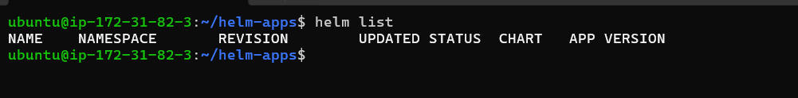

**Verify:** Does `helm list` show zero releases?

- yes it shows zero releases .