# Day 81 -- Introduction to Amazon EKS with Terraform

---

## Challenge Tasks

### Task 1: Understand EKS Architecture
Research and write notes on:

1. **What does "managed Kubernetes" mean?**
   - AWS manages the **control plane** (API server, etcd, scheduler, controller manager)
   - You manage the **data plane** (worker nodes where your pods run)
   - AWS handles control plane upgrades, patching, and high availability across multiple AZs

2. **EKS components:**
   - **EKS Control Plane** -- managed by AWS, runs in AWS-owned VPC, accessible via API endpoint
   - **Node Groups** -- EC2 instances that run your pods
     - **Managed Node Groups** -- AWS handles provisioning, scaling, and updates
     - **Self-Managed Nodes** -- you manage the EC2 instances yourself
     - **Fargate Profiles** -- serverless, no nodes to manage at all
   - **VPC and Networking** -- EKS runs inside your VPC with subnets across AZs
   - **IAM Integration** -- EKS uses IAM roles for cluster access and pod-level permissions (IRSA)

3. **EKS add-ons the AI-BankApp uses** (from `terraform/eks.tf`):
   - `coredns` -- DNS resolution inside the cluster
   - `kube-proxy` -- network routing for services
   - `vpc-cni` -- AWS VPC CNI plugin, assigns VPC IPs to pods
   - `eks-pod-identity-agent` -- enables pod-level IAM roles
   - `aws-ebs-csi-driver` -- allows pods to use EBS volumes (needed for MySQL and Ollama storage)
   - `metrics-server` -- enables `kubectl top` and HPA

---

### Task 2: Study the AI-BankApp Terraform Configuration
Clone the repo and examine the `terraform/` directory:

```bash
git clone -b feat/gitops https://github.com/TrainWithShubham/AI-BankApp-DevOps.git
cd AI-BankApp-DevOps/terraform
ls
```


```
argocd.tf           # ArgoCD Helm release
eks.tf              # EKS cluster + node group + IRSA
outputs.tf          # Cluster info and helper commands
provider.tf         # AWS + Helm providers, locals
terraform.tfvars    # Default variable values
variables.tf        # Input variables
vpc.tf              # VPC with public/private/intra subnets
```

**Study each file and understand what it provisions:**

**`variables.tf` and `terraform.tfvars`:**
```hcl
# The defaults:
aws_region         = "us-west-2"
cluster_name       = "bankapp-eks"
cluster_version    = "1.35"
node_instance_type = "t3.medium"
node_desired_count = 3
node_max_count     = 5
```

**`vpc.tf`** -- Networking foundation:
- Uses the `terraform-aws-modules/vpc/aws` module
- 3 Availability Zones with:
  - **Public subnets** (10.0.1-3.0/24) -- for load balancers, tagged with `kubernetes.io/role/elb`
  - **Private subnets** (10.0.4-6.0/24) -- for worker nodes, tagged with `kubernetes.io/role/internal-elb`
  - **Intra subnets** (10.0.7-9.0/24) -- for EKS control plane ENIs
- NAT Gateway enabled for outbound internet from private subnets

**`eks.tf`** -- The cluster itself:
- Uses the `terraform-aws-modules/eks/aws` module (version ~> 21.0)
- AL2023 AMI for nodes (Amazon Linux 2023)
- 3x `t3.medium` instances (min 3, max 5)
- All 6 EKS add-ons installed as cluster add-ons
- IRSA configured for the EBS CSI driver
- Public + private API endpoint access

**`argocd.tf`** -- ArgoCD via Helm:
- Installs ArgoCD using the `argo-cd` Helm chart
- Exposed as a LoadBalancer service
- Depends on the EKS module (created after the cluster is ready)

**`outputs.tf`** -- Helper commands:
- Outputs the `aws eks update-kubeconfig` command
- Outputs the ArgoCD initial password retrieval command

**Document:** Draw the architecture: VPC -> Subnets -> EKS Control Plane -> Node Group -> Pods

---

### Task 3: Provision the EKS Cluster
Make sure you have the required tools:
```bash
terraform --version    # >= 1.0
aws --version          # AWS CLI v2
kubectl version --client
helm version
```
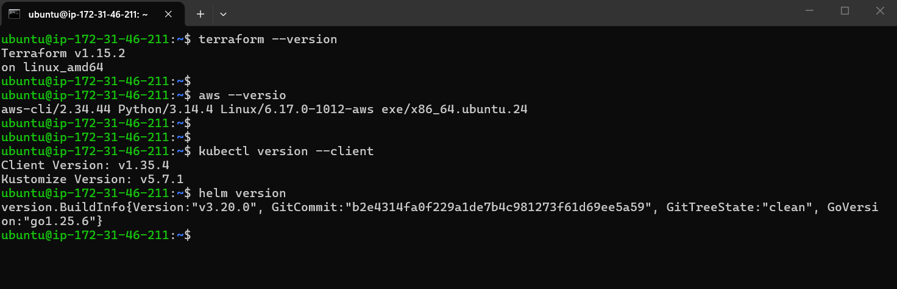

Configure AWS credentials:
```bash
aws configure
# Enter: Access Key ID, Secret Access Key, Region (us-west-2), Output (json)

# Verify
aws sts get-caller-identity
```
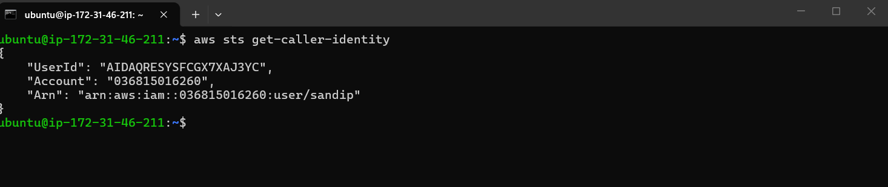

Initialize and apply:
```bash
cd terraform

terraform init
terraform plan
```
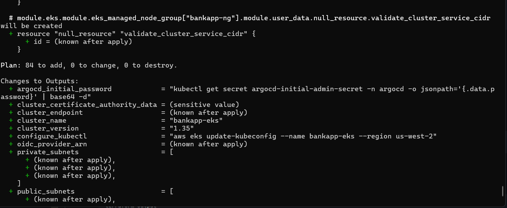

Review the plan carefully. It will create:
- 1 VPC with 9 subnets, NAT gateway, internet gateway
- 1 EKS cluster with control plane
- 1 managed node group (3x t3.medium)
- 6 EKS add-ons
- IAM roles and policies for the cluster, nodes, and EBS CSI driver
- ArgoCD Helm release

```bash
terraform apply
```

This takes 15-20 minutes. While waiting, review the Terraform output for CloudFormation-like progress.

After completion, note the outputs:
```bash
terraform output
```

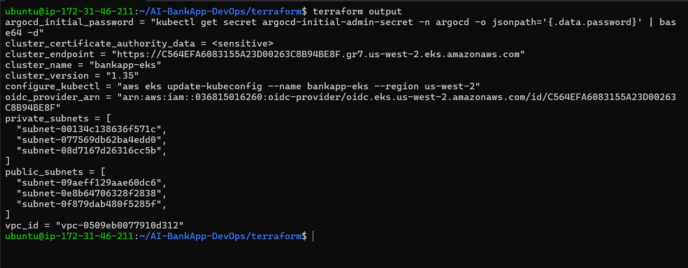

---

### Task 4: Connect to Your Cluster
Update kubeconfig using the Terraform output:
```bash
aws eks update-kubeconfig --name bankapp-eks --region us-west-2
```
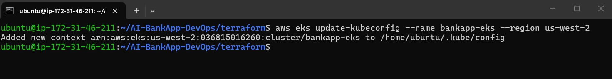

Verify the connection:
```bash
# Check context
kubectl config current-context
```

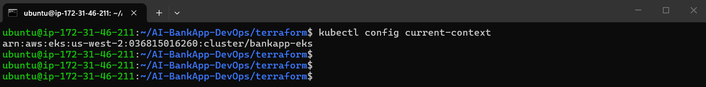

# Cluster info
```bash
kubectl cluster-info
```

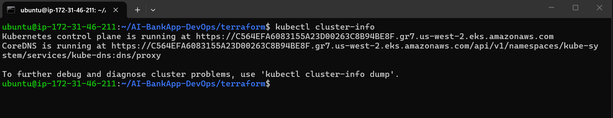

# List nodes
```bash
kubectl get nodes -o wide
```
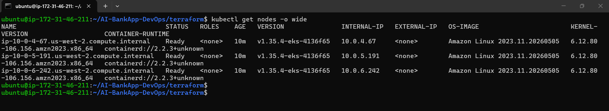

You should see 3 nodes with status `Ready`, instance type `t3.medium`, spread across 3 AZs.

Explore the cluster:
```bash
# System pods
kubectl get pods -n kube-system
```
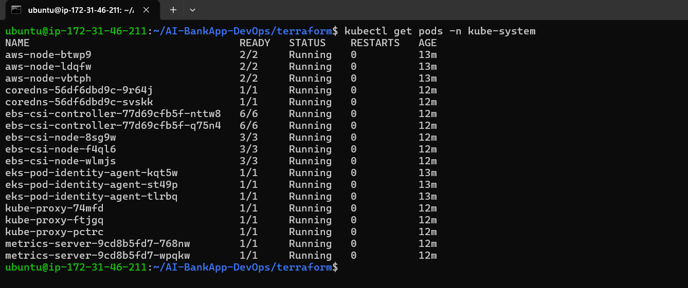

# All the add-ons are running
```bash
kubectl get daemonsets -n kube-system
```
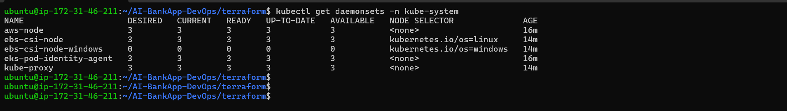

# EBS CSI driver
```bash
kubectl get pods -n kube-system -l app.kubernetes.io/name=aws-ebs-csi-driver
```
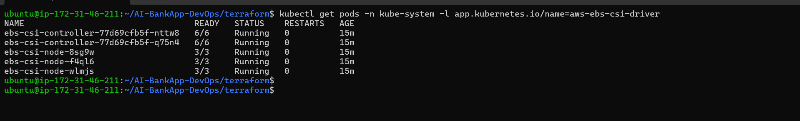

# Metrics server (enables kubectl top and HPA)
```bash
kubectl top nodes
```
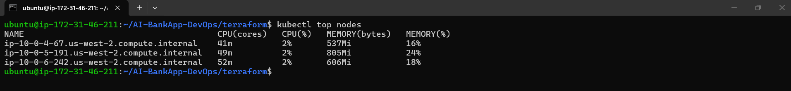

Check ArgoCD is running:
```bash
kubectl get pods -n argocd
kubectl get svc -n argocd
```


Get the ArgoCD admin password:
```bash
kubectl -n argocd get secret argocd-initial-admin-secret -o jsonpath="{.data.password}" | base64 -d
```
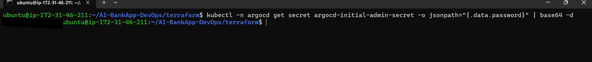

Get the ArgoCD LoadBalancer URL:
```bash
kubectl get svc -n argocd argocd-server -o jsonpath='{.status.loadBalancer.ingress[0].hostname}'
```
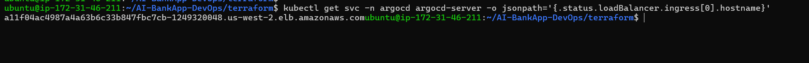

Open the URL in your browser and log in with `admin` and the password from above. You will use ArgoCD on Days 84-86.

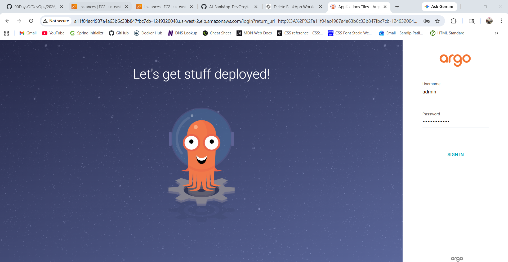

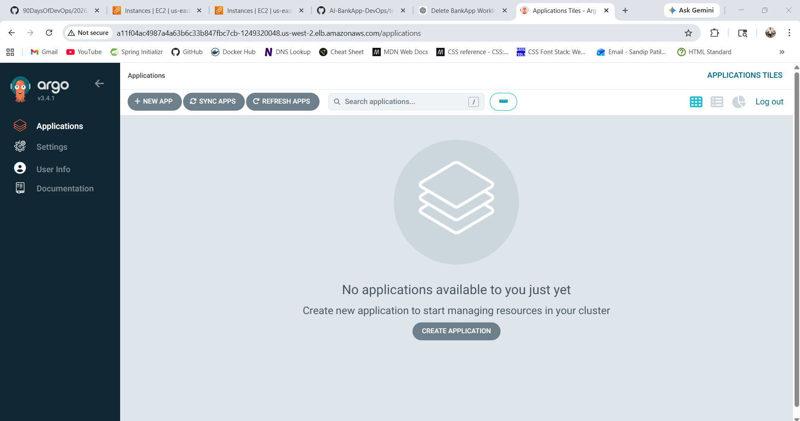

---

### Task 5: Deploy the AI-BankApp Manually (Before ArgoCD)
Before setting up GitOps, deploy the app manually to validate the cluster works.

Apply the raw manifests from the `k8s/` directory:
```bash
cd ../  # Back to the repo root

kubectl apply -f k8s/namespace.yml
kubectl apply -f k8s/pv.yml
kubectl apply -f k8s/pvc.yml
kubectl apply -f k8s/configmap.yml
kubectl apply -f k8s/secrets.yml
kubectl apply -f k8s/mysql-deployment.yml
kubectl apply -f k8s/service.yml
kubectl apply -f k8s/ollama-deployment.yml
kubectl apply -f k8s/bankapp-deployment.yml
kubectl apply -f k8s/hpa.yml
```
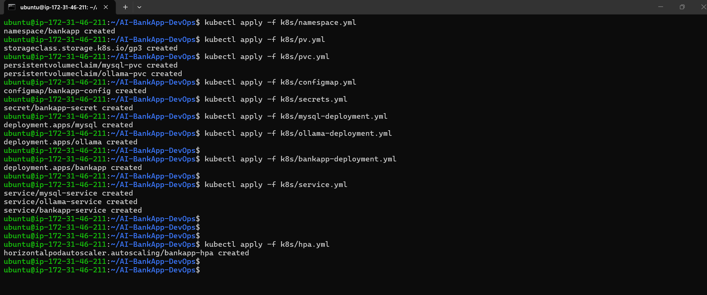

Watch the pods come up:
```bash
kubectl get pods -n bankapp -w
```
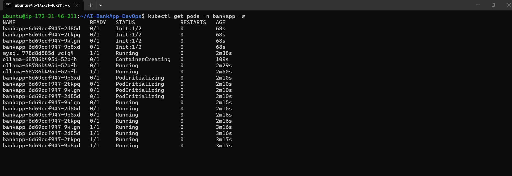

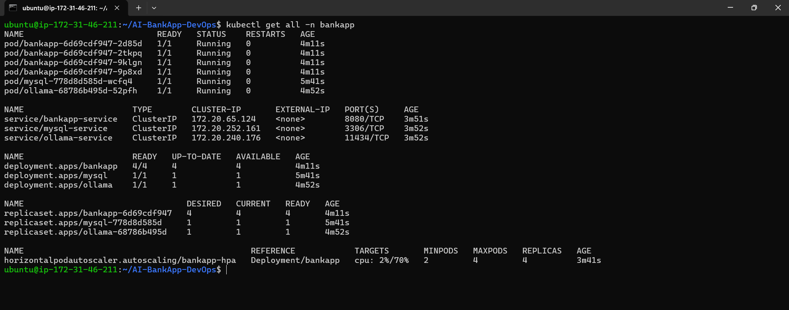

The startup order is:
1. MySQL starts and becomes healthy (15-30 seconds)
2. Ollama starts and pulls the TinyLlama model (2-5 minutes)
3. BankApp init containers wait for both, then the app starts (30-60 seconds after dependencies)

Check PVCs are bound to EBS volumes:
```bash
kubectl get pvc -n bankapp
kubectl get pv
```
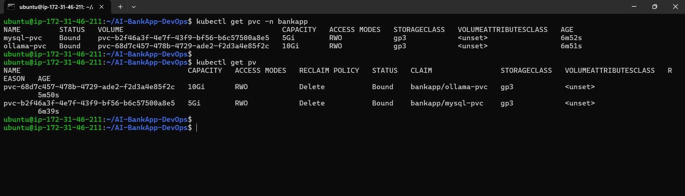

You should see 5Gi and 10Gi EBS volumes in the correct AZs.

Once all pods are running, access the app:
```bash
kubectl port-forward svc/bankapp-service -n bankapp 8080:8080 --address 0.0.0.0
```
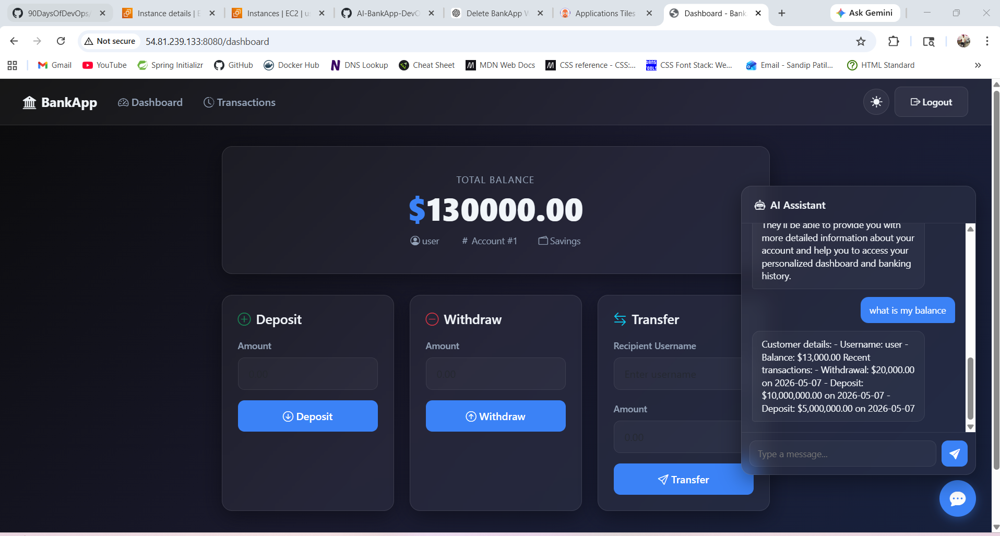


Open `http://localhost:8080` -- you should see the AI-BankApp login page. Register an account, log in, and try the AI chatbot.

**Verify the HPA:**
```bash
kubectl get hpa -n bankapp
```
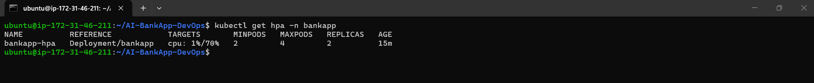

---

### Task 6: Understand EKS Costs and Clean Up Strategy
EKS is not free. The AI-BankApp cluster costs:

| Component | Cost (approximate) |
|-----------|-------------------|
| EKS Control Plane | $0.10/hr (~$73/month) |
| t3.medium nodes (3x) | ~$0.042/hr each (~$91/month total) |
| NAT Gateway | ~$0.045/hr + data transfer (~$33/month) |
| EBS volumes (15Gi total) | ~$1.50/month |
| LoadBalancer (ArgoCD) | ~$0.025/hr (~$18/month) |
| **Total for this lab** | **~$220/month (~$7/day)** |

**Important:** Do NOT leave the cluster running when you are not using it.

Delete the BankApp workload (keep the cluster for Days 82-83):
```bash
kubectl delete -f k8s/hpa.yml
kubectl delete -f k8s/bankapp-deployment.yml
kubectl delete -f k8s/ollama-deployment.yml
kubectl delete -f k8s/mysql-deployment.yml
kubectl delete -f k8s/service.yml
kubectl delete -f k8s/secrets.yml
kubectl delete -f k8s/configmap.yml
kubectl delete -f k8s/pvc.yml
kubectl delete -f k8s/pv.yml
kubectl delete -f k8s/namespace.yml
```
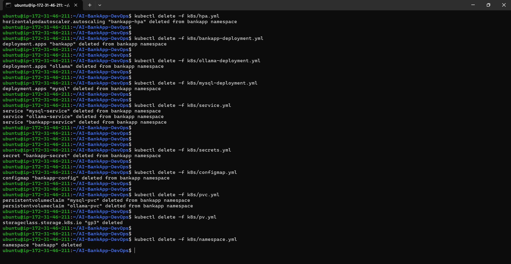

To destroy everything (do this at the end of Day 83 or if taking a break):
```bash
cd terraform
terraform destroy
```
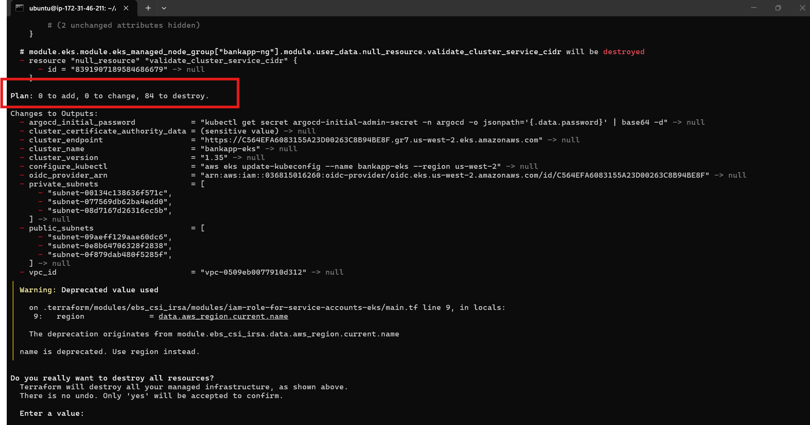

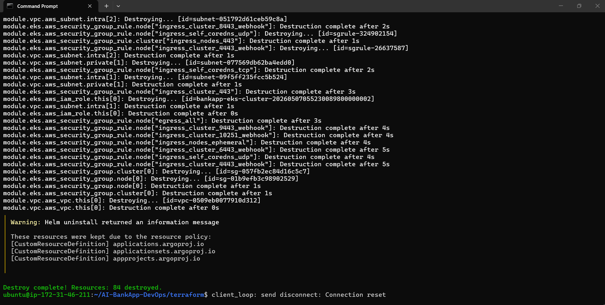

**Document:** What are the cost components of the AI-BankApp EKS setup? Why is the NAT Gateway surprisingly expensive?

---
