# Day 85 -- ArgoCD Deep Dive: Sync Strategies, Rollbacks, and Multi-App Management

### Task 1: Understand Sync Strategies
ArgoCD offers multiple ways to sync:

**Automated sync** (what the AI-BankApp uses):
```yaml
syncPolicy:
  automated:
    prune: true      # Delete resources removed from Git
    selfHeal: true   # Revert manual cluster changes
```
- Every Git change syncs automatically within 3 minutes
- No human approval needed
- Good for dev/staging environments

**Manual sync** (for production):
```yaml
syncPolicy: {}   # No automated section
```
- ArgoCD detects drift but does NOT auto-correct
- A human must click "Sync" or run `argocd app sync`
- Good for production where you want a review gate

**Try switching to manual sync:**
```bash
argocd app set bankapp --sync-policy none
```
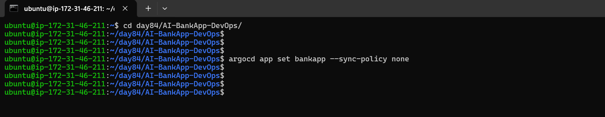

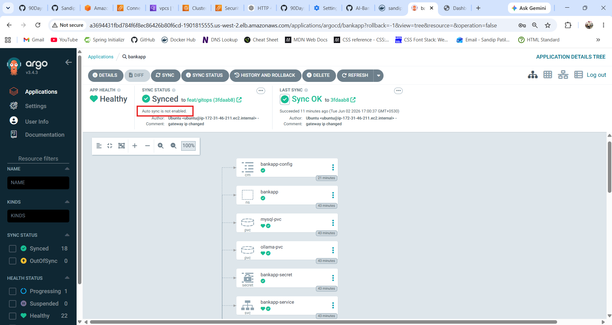

Now make a change in Git (edit `k8s/configmap.yml` in your fork -- change `APP_NAME` or add a new key). Push the commit.

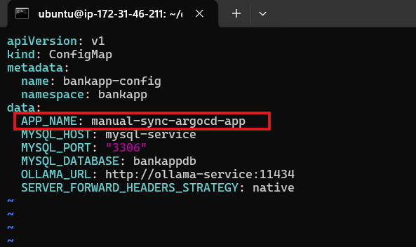

Wait 3 minutes and check:
```bash
argocd app get bankapp
```

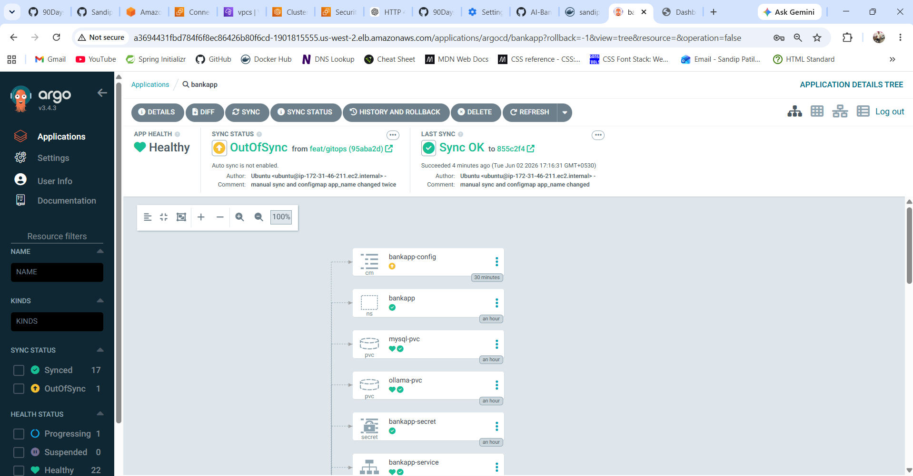

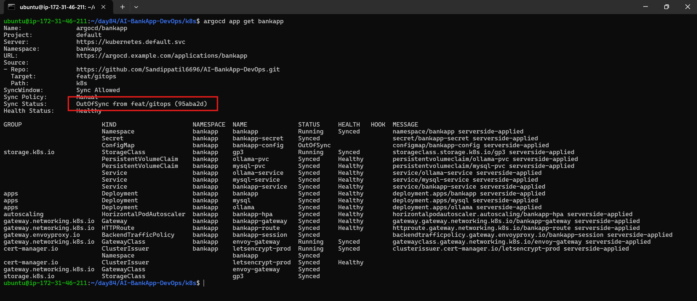


The status will show `OutOfSync` but ArgoCD will NOT apply the change. You can see exactly what differs:
```bash
argocd app diff bankapp
```
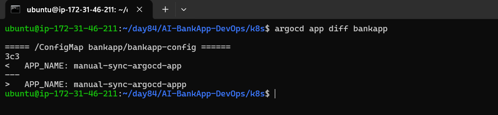

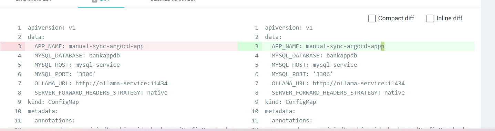

**Preview before syncing:**
```bash
# Dry run -- show what would change
argocd app sync bankapp --dry-run
```

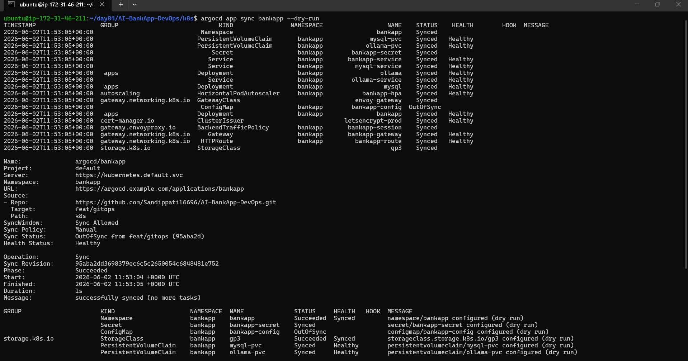

# Sync for real
```bash
argocd app sync bankapp
```
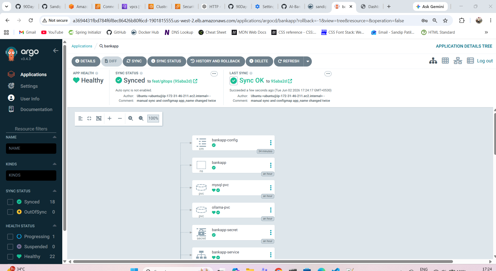

In the UI, clicking "Sync" shows a preview dialog listing all resources that will change.

**Switch back to automated:**
```bash
argocd app set bankapp --sync-policy automated --self-heal --auto-prune
```
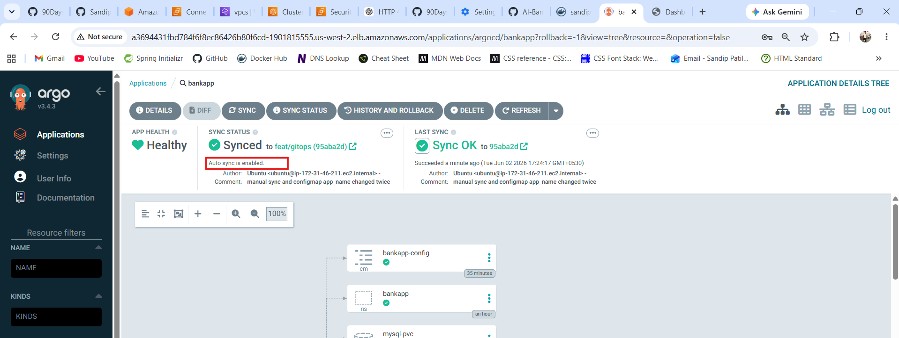

---

### Task 2: Sync Waves and Resource Ordering
The AI-BankApp has dependencies: MySQL must be running before the BankApp starts. ArgoCD handles this with **sync waves** -- annotations that control the order of resource creation.

**Add sync wave annotations to the AI-BankApp manifests in your fork:**

Edit `k8s/namespace.yml`:
```yaml
apiVersion: v1
kind: Namespace
metadata:
  name: bankapp
  annotations:
    argocd.argoproj.io/sync-wave: "-2"
```

Edit `k8s/pv.yml` (StorageClass):
```yaml
metadata:
  name: gp3
  annotations:
    argocd.argoproj.io/sync-wave: "-2"
```

Edit `k8s/pvc.yml` (both PVCs):
```yaml
metadata:
  annotations:
    argocd.argoproj.io/sync-wave: "-1"
```

Edit `k8s/configmap.yml` and `k8s/secrets.yml`:
```yaml
metadata:
  annotations:
    argocd.argoproj.io/sync-wave: "-1"
```

Edit `k8s/mysql-deployment.yml`:
```yaml
metadata:
  annotations:
    argocd.argoproj.io/sync-wave: "0"
```

Edit `k8s/ollama-deployment.yml`:
```yaml
metadata:
  annotations:
    argocd.argoproj.io/sync-wave: "0"
```

Edit `k8s/service.yml` (all three services):
```yaml
metadata:
  annotations:
    argocd.argoproj.io/sync-wave: "0"
```

Edit `k8s/bankapp-deployment.yml`:
```yaml
metadata:
  annotations:
    argocd.argoproj.io/sync-wave: "1"
```

Edit `k8s/hpa.yml`:
```yaml
metadata:
  annotations:
    argocd.argoproj.io/sync-wave: "2"
```

**The sync order becomes:**
```
Wave -2: Namespace, StorageClass          (infrastructure)
Wave -1: PVCs, ConfigMap, Secret          (configuration)
Wave  0: MySQL, Ollama, Services          (databases and networking)
Wave  1: BankApp Deployment               (application)
Wave  2: HPA                              (scaling)
```

ArgoCD processes each wave in order. Resources in the same wave sync in parallel. ArgoCD waits for each wave to be healthy before moving to the next.

Commit and push these changes. ArgoCD will re-sync and you will see the ordered deployment in the UI.

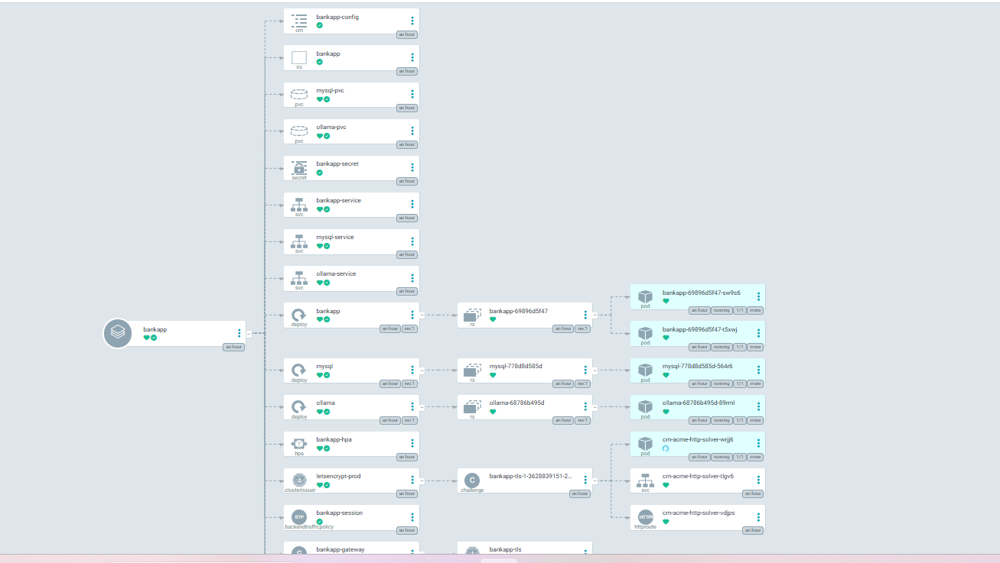

---

### Task 3: ArgoCD Rollbacks
ArgoCD tracks every sync as a revision. You can rollback to any previous state.

**Check the sync history:**
```bash
argocd app history bankapp
```

Output:
```
ID  DATE                 REVISION
1   2026-04-10 10:00:00  abc1234
2   2026-04-10 10:15:00  def5678   (sync wave annotations)
```
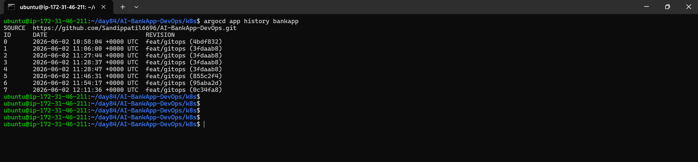

**Rollback to a previous revision:**

Via CLI:
```bash
argocd app rollback bankapp 1
```

Via UI: Click the application > History > select a revision > "Rollback".

After rollback:
```bash
argocd app get bankapp
```

The status will show `OutOfSync` because the cluster now matches an older Git commit, not the latest.

**Important:** Rollback is a temporary fix. It does not change Git. The proper GitOps rollback is:
```bash
# In your fork
git revert HEAD
git push
```

This creates a new commit that undoes the last change. ArgoCD syncs the revert and the cluster is updated. The Git history shows the full audit trail: deploy, then revert.

**Document:** What is the difference between ArgoCD rollback and `git revert`? Which is the GitOps-correct approach?

- **ArgoCD Rollback:** Temporarily reverts the cluster state to a previous ArgoCD sync revision. Does not change the Git repository.
- **git revert:** Creates a new commit that undoes the changes from a previous commit. Updates the Git repository and propagates the change through ArgoCD.

The GitOps-correct approach is to use `git revert` because it maintains the audit trail in the Git repository and ensures consistency between the desired state (Git) and the actual state (cluster).

---

### Task 4: App of Apps Pattern
In production, you do not manage one application -- you manage dozens. The **App of Apps** pattern uses one parent ArgoCD Application that creates child Applications.

Create a directory for the pattern:
```bash
mkdir -p argocd-apps/
```

Create `argocd-apps/bankapp.yaml` (the BankApp application):
```yaml
apiVersion: argoproj.io/v1alpha1
kind: Application
metadata:
  name: bankapp
  namespace: argocd
  finalizers:
    - resources-finalizer.argocd.argoproj.io
spec:
  project: default
  source:
    repoURL: https://github.com/<your-username>/AI-BankApp-DevOps.git
    targetRevision: feat/gitops
    path: k8s
  destination:
    server: https://kubernetes.default.svc
    namespace: bankapp
  syncPolicy:
    automated:
      prune: true
      selfHeal: true
    syncOptions:
      - CreateNamespace=true
      - ServerSideApply=true
```

Create `argocd-apps/monitoring.yaml` (Prometheus + Grafana):
```yaml
apiVersion: argoproj.io/v1alpha1
kind: Application
metadata:
  name: monitoring
  namespace: argocd
  finalizers:
    - resources-finalizer.argocd.argoproj.io
spec:
  project: default
  source:
    repoURL: https://prometheus-community.github.io/helm-charts
    chart: kube-prometheus-stack
    targetRevision: "65.*"
    helm:
      values: |
        grafana:
          adminPassword: admin123
        prometheus:
          prometheusSpec:
            retention: 3d
            resources:
              requests:
                memory: 256Mi
                cpu: 100m
  destination:
    server: https://kubernetes.default.svc
    namespace: monitoring
  syncPolicy:
    automated:
      prune: true
      selfHeal: true
    syncOptions:
      - CreateNamespace=true
      - ServerSideApply=true
```

Create `argocd-apps/envoy-gateway.yaml`:
```yaml
apiVersion: argoproj.io/v1alpha1
kind: Application
metadata:
  name: envoy-gateway
  namespace: argocd
  finalizers:
    - resources-finalizer.argocd.argoproj.io
spec:
  project: default
  source:
    repoURL: docker.io/envoyproxy
    chart: gateway-helm
    targetRevision: "v1.4.*"
  destination:
    server: https://kubernetes.default.svc
    namespace: envoy-gateway-system
  syncPolicy:
    automated:
      prune: true
      selfHeal: true
    syncOptions:
      - CreateNamespace=true
```

**Create the parent Application** that manages all child apps:
```yaml
# argocd-apps/root-app.yaml
apiVersion: argoproj.io/v1alpha1
kind: Application
metadata:
  name: root-app
  namespace: argocd
spec:
  project: default
  source:
    repoURL: https://github.com/<your-username>/AI-BankApp-DevOps.git
    targetRevision: feat/gitops
    path: argocd-apps
  destination:
    server: https://kubernetes.default.svc
    namespace: argocd
  syncPolicy:
    automated:
      prune: true
      selfHeal: true
```

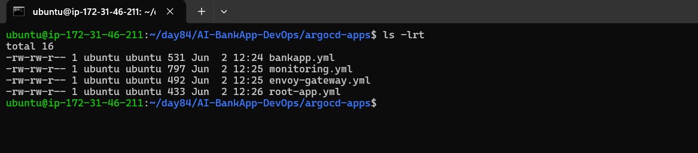

Push the `argocd-apps/` directory to your fork and apply the root app:
```bash
kubectl apply -f argocd-apps/root-app.yaml
```
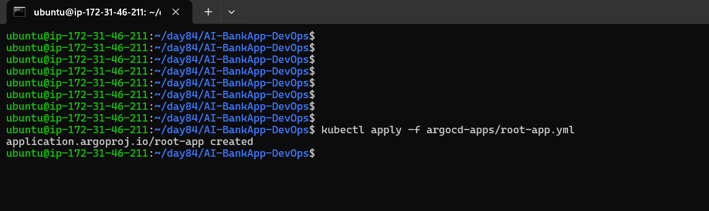

ArgoCD will:
1. Read the `argocd-apps/` directory from Git
2. Find `bankapp.yaml`, `monitoring.yaml`, and `envoy-gateway.yaml`
3. Create three child Applications
4. Each child Application syncs independently

**In the ArgoCD UI,** you now see 4 applications: `root-app`, `bankapp`, `monitoring`, `envoy-gateway`. Adding a new app to the cluster is as simple as adding a new YAML file to the `argocd-apps/` directory.

```bash
argocd app list
```
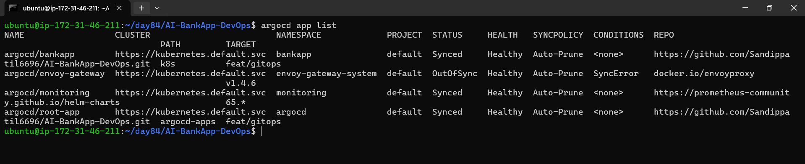

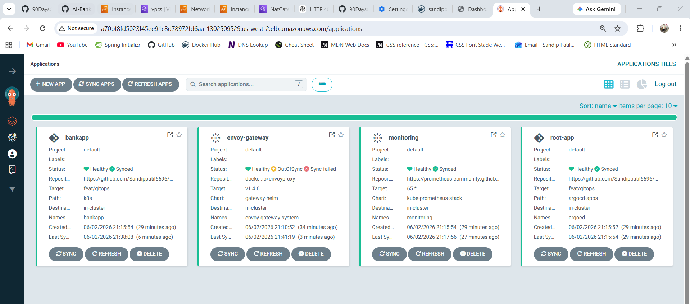
---

```bash
# port forward for grafana beacuse we did not expose it with a LoadBalancer 
kubectl port-forward svc/monitoring-grafana -n monitoring 3000:80 --address 0.0.0.0 
```

### Task 5: ArgoCD Notifications
Get notified when deployments succeed, fail, or drift.

Install ArgoCD Notifications (included in modern ArgoCD versions):
```bash
# Check if notifications controller is running
kubectl get pods -n argocd -l app.kubernetes.io/component=notifications-controller
```
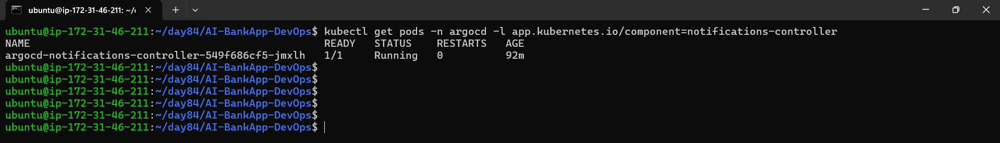

**Configure a Slack or webhook notification** (using a generic webhook example):

Create a notification config:
```bash
kubectl apply -n argocd -f - <<EOF
apiVersion: v1
kind: ConfigMap
metadata:
  name: argocd-notifications-cm
  namespace: argocd
data:
  trigger.on-sync-succeeded: |
    - when: app.status.operationState.phase in ['Succeeded']
      send: [app-sync-succeeded]
  trigger.on-sync-failed: |
    - when: app.status.operationState.phase in ['Error', 'Failed']
      send: [app-sync-failed]
  trigger.on-health-degraded: |
    - when: app.status.health.status == 'Degraded'
      send: [app-health-degraded]
  template.app-sync-succeeded: |
    message: "Application {{.app.metadata.name}} sync succeeded. Revision: {{.app.status.sync.revision}}"
  template.app-sync-failed: |
    message: "Application {{.app.metadata.name}} sync FAILED! Check ArgoCD for details."
  template.app-health-degraded: |
    message: "Application {{.app.metadata.name}} health is DEGRADED. Investigate immediately."
EOF
```


**Subscribe an application to notifications:**
```bash
kubectl annotate application bankapp -n argocd \
  notifications.argoproj.io/subscribe.on-sync-succeeded.webhook="" \
  notifications.argoproj.io/subscribe.on-sync-failed.webhook="" \
  notifications.argoproj.io/subscribe.on-health-degraded.webhook=""
```
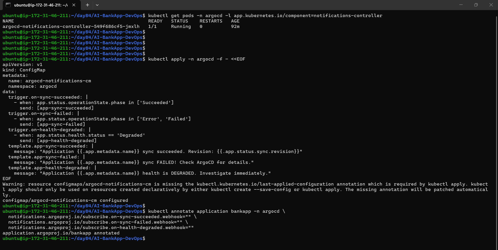

For Slack integration, you would add a Slack service to the ConfigMap with your webhook URL. The pattern is the same -- triggers fire on events, templates format the message, services deliver it.

**View notification history:**
```bash
kubectl get applications bankapp -n argocd -o jsonpath='{.status.operationState.message}'
```
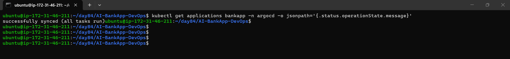

---

### Task 6: ArgoCD Projects and RBAC
In production, you do not give every team access to every application. ArgoCD **Projects** provide multi-tenancy.

Create a project for the BankApp team:
```bash
argocd proj create bankapp-team \
  --description "AI-BankApp team project" \
  --src "https://github.com/<your-username>/AI-BankApp-DevOps.git" \
  --dest "https://kubernetes.default.svc,bankapp" \
  --dest "https://kubernetes.default.svc,monitoring"
```

This project:
- Can only source from the AI-BankApp repo
- Can only deploy to the `bankapp` and `monitoring` namespaces
- Cannot deploy to `kube-system`, `argocd`, or other namespaces

Move the bankapp Application to this project:
```bash
argocd app set bankapp --project bankapp-team
```

**Verify restrictions work:**
```bash
# This should fail -- cert-manager namespace is not allowed
argocd proj add-destination bankapp-team https://kubernetes.default.svc kube-system 2>&1 || echo "Restricted!"
```

**RBAC policies** (in `argocd-rbac-cm` ConfigMap):
```yaml
policy.csv: |
  p, role:bankapp-dev, applications, get, bankapp-team/*, allow
  p, role:bankapp-dev, applications, sync, bankapp-team/*, allow
  p, role:bankapp-dev, applications, rollback, bankapp-team/*, deny
  g, bankapp-developers, role:bankapp-dev
```
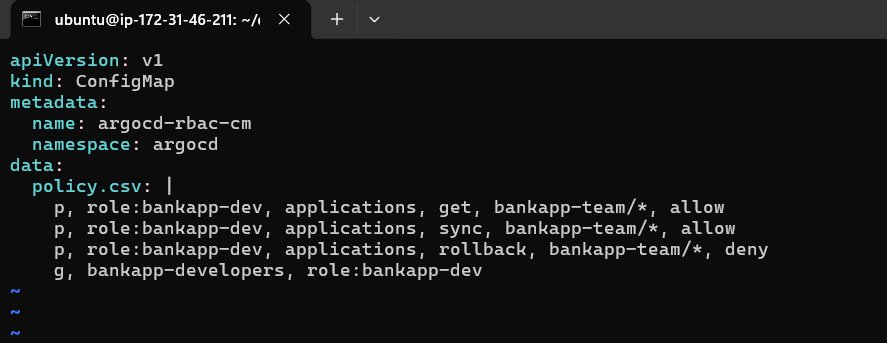

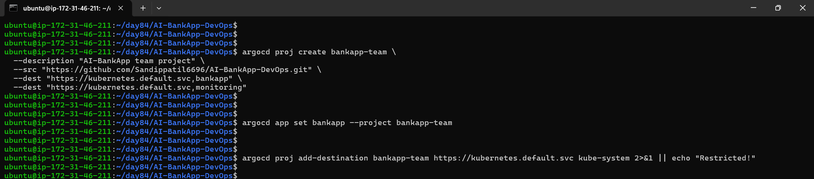

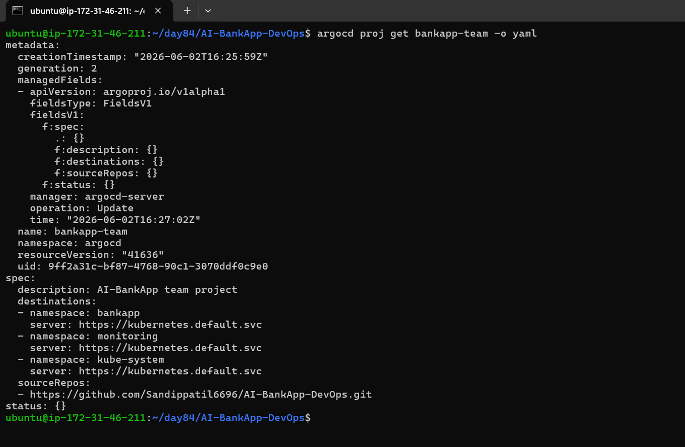

This gives the `bankapp-developers` group permission to view and sync but NOT rollback. Rollback requires a senior team member.

**Document:** How do Projects and RBAC prevent one team from accidentally affecting another team's applications?

- Projects restrict which Git repos and cluster namespaces an application can use, preventing cross-team interference.
- RBAC policies control which users/groups can perform actions (view, sync, rollback) on applications within a project, ensuring that only authorized personnel can make changes.

---

## Hints
- Sync waves use integers -- negative numbers run first, then zero, then positive. Resources in the same wave sync in parallel
- ArgoCD rollback changes the cluster but NOT Git -- always follow up with `git revert` for a proper GitOps rollback
- The App of Apps pattern is the standard for managing multiple applications. The parent app watches a directory of Application manifests
- ArgoCD can deploy from Git repos (raw manifests), Helm charts (with values), and Kustomize overlays -- all in the same cluster
- `finalizers: resources-finalizer.argocd.argoproj.io` ensures ArgoCD deletes the Kubernetes resources when you delete the Application
- The default sync interval is 3 minutes. Change it with `--app-resync` flag on the application controller, or set `timeout.reconciliation` in `argocd-cm`
- For immediate sync after a push, configure GitHub webhooks to notify ArgoCD directly
- Reference: https://github.com/TrainWithShubham/AI-BankApp-DevOps (branch: `feat/gitops`)

---
